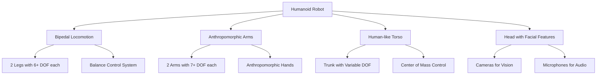
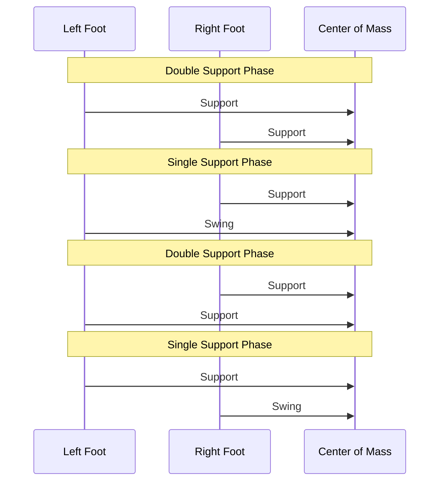

# Humanoid Robotics Overview

## Learning Objectives

By the end of this chapter, students will be able to:
- Define humanoid robotics and understand its key characteristics
- Explain the challenges and advantages of humanoid robot design
- Identify the main applications of humanoid robots
- Describe key biomechanical principles underlying humanoid locomotion

## Introduction to Humanoid Robotics

Humanoid robotics is a specialized field of robotics focused on creating robots with human-like characteristics and capabilities. These robots typically feature bipedal locomotion, anthropomorphic limbs, and often human-like heads with facial features for social interaction.

The field of humanoid robotics sits at the intersection of several disciplines: mechanical engineering, control systems, artificial intelligence, cognitive science, and human-robot interaction. Successfully developing humanoid robots requires expertise across all these areas.

## Key Characteristics of Humanoid Robots

Humanoid robots are distinguished by several key characteristics:

### Anthropomorphic Design
- **Bipedal locomotion**: Walking on two legs like humans
- **Anthropomorphic limbs**: Two arms with hands and fingers for manipulation
- **Human-like torso**: Trunk structure with similar proportions to humans
- **Head with facial features**: For communication and social interaction

### Human-Scale Dimensions
- **Size**: Typically designed to operate in human environments
- **Reach**: Arm length appropriate for human-scale manipulation
- **Step length**: Leg length appropriate for human-scale environments

## Diagrams

### Humanoid Robot Architecture

The above diagram illustrates the key components of a humanoid robot design.

## Applications of Humanoid Robots

Humanoid robots are being developed for various applications:

### Research Platforms
- Understanding human locomotion and cognition
- Testing theories of embodiment and intelligence
- Developing new control algorithms
- Studying human-robot interaction

### Assistive Technologies
- Caregiving for elderly or disabled individuals
- Physical therapy and rehabilitation
- Assisting in households
- Personal companionship

### Industrial and Service Applications
- Working in human environments where traditional robots cannot operate
- Customer service and reception
- Inspection tasks in human-accessible areas
- Complex manipulation in unstructured environments

### Entertainment and Social Applications
- Theme park attractions
- Interactive exhibits
- Performances and art installations
- Educational tools

## Challenges in Humanoid Robotics

Developing functional humanoid robots presents numerous technical challenges:

### Balance and Locomotion
- Maintaining balance during dynamic movement
- Navigating complex terrain
- Handling external disturbances
- Achieving human-like walking efficiency

### Control Complexity
- Managing many degrees of freedom (DOF)
- Coordinating multiple limbs simultaneously
- Real-time control with computational constraints
- Robustness to modeling errors

### Power and Energy
- Achieving sufficient energy autonomy
- Managing heat dissipation
- Optimizing for energy efficiency
- Ensuring safety with high-power systems

### Cost and Complexity
- High manufacturing costs
- Complex maintenance requirements
- Sophisticated calibration procedures
- Specialized expertise requirements

## Biomechanical Principles

Understanding human biomechanics is crucial for successful humanoid robot design:

### Bipedal Locomotion
Human walking is fundamentally a controlled falling process, where the center of mass moves in an inverted pendulum motion. Key principles include:

- **Zero-Moment Point (ZMP)**: A point where the sum of all moments of contact forces equals zero
- **Center of Mass (CoM)**: Must be maintained within the support polygon for stability
- **Double Support Phase**: When both feet are in contact with the ground
- **Single Support Phase**: When only one foot is in contact with the ground

### Diagram: Bipedal Locomotion Phases

### Degrees of Freedom
Humanoid robots require many degrees of freedom to achieve human-like capabilities:
- **Legs**: Usually 6 DOF each for locomotion (3 at hip, 1 at knee, 2 at ankle)
- **Arms**: Usually 7 DOF each for manipulation (3 at shoulder, 1 at elbow, 3 at wrist)
- **Trunk**: Variable DOF depending on design (0 to 6)
- **Head**: 2-3 DOF for gaze control

### Anthropomorphic Joints
- **Revolute joints**: Rotating joints similar to human joints
- **Range of motion**: Mimicking human joint limitations
- **Back-drivability**: Allowing the joint to be moved by external forces
- **Compliance**: Ability to adapt to environmental contacts

## Control Frameworks for Humanoid Robots

### Operational Space Control
This approach separates task control (e.g., hand position) from posture control (e.g., elbow position), making it easier to achieve complex behaviors.

### Whole-Body Control
This framework considers all the robot's degrees of freedom simultaneously, optimizing for multiple tasks and constraints at once.

### Walking Pattern Generation
Approaches to generate stable walking patterns:
- **Precomputed trajectories**: Fixed walking patterns
- **Online planning**: Adapting to terrain in real-time
- **Model-based control**: Using dynamic models for balance

## Safety Considerations

Humanoid robots must operate safely around humans:

### Mechanical Safety
- **Compliance**: Using compliant joints and structures to reduce impact forces
- **Collision detection**: Sensing and responding to unintended contact
- **Emergency stops**: Rapid shutdown of systems when necessary

### Behavioral Safety
- **Predictability**: Robot behavior should be understandable to humans
- **Fail-safe behaviors**: Safe fallback behaviors when systems fail
- **Social protocols**: Following social norms for interaction

## Notable Humanoid Robots

### Research Platforms
- **Honda ASIMO**: Early commercial humanoid robot
- **Boston Dynamics Atlas**: High-mobility research robot
- **Toyota HRP-2**: Research platform for human-interactive tasks
- **NAO**: Small humanoid for research and education

### Commercial Systems
- **SoftBank Pepper**: Social robot for customer service
- **SoftBank NAO**: Robot for education and research
- **ABB YuMi**: Collaborative robot with humanoid-like arms

## Future Directions

The field of humanoid robotics is rapidly advancing:

### Technology Trends
- **Improved actuators**: More efficient, back-drivable actuators
- **Advanced sensing**: Better perception and environmental understanding
- **AI integration**: More autonomous and intelligent behavior
- **Materials science**: Lighter, stronger, more compliant materials

### Applications Evolution
- **Healthcare**: More sophisticated care and therapy applications
- **Education**: Personalized learning companions
- **Domestic use**: Household assistance and companionship
- **Exploration**: Operating in dangerous or inaccessible environments

## Exercises

1. Compare the advantages and disadvantages of anthropomorphic vs. non-anthropomorphic robot designs for different applications.
2. Explain the concept of Zero-Moment Point and its importance in humanoid balance control.
3. Design a simple control strategy for maintaining balance in a humanoid robot during single support phase.

## Quiz

1. What does ZMP stand for in humanoid robotics?
   - A) Zero Moment Point
   - B) Zero Motion Phase
   - C) Zero Mass Position
   - D) Zero Motor Power

2. Which is NOT a challenge in humanoid robotics?
   - A) Balance and locomotion
   - B) Control complexity
   - C) Simple manufacturing
   - D) Power and energy

3. What does DOF stand for?
   - A) Degrees of Freedom
   - B) Dynamic Operational Framework
   - C) Direct Object Following
   - D) Digital Operation Factor

## Reflection

Consider the implications of humanoid robots becoming more prevalent in human society. What ethical, social, and technical considerations arise? How might humanoid robots change the way humans interact with technology? What are the risks and benefits of this technology?