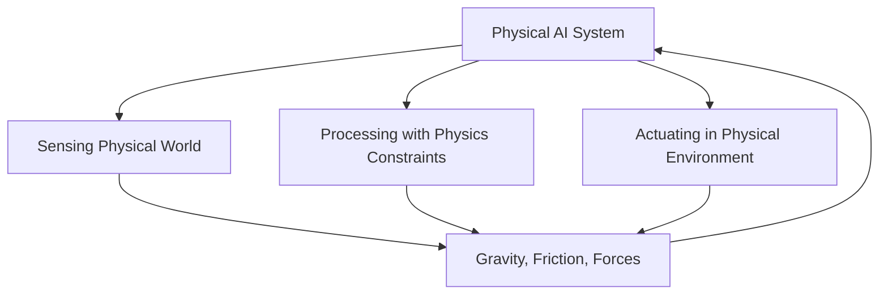

# Physical AI and Embodied Intelligence

## Learning Objectives

By the end of this chapter, students will be able to:
- Define Physical AI and distinguish it from traditional digital AI
- Explain the concept of embodied intelligence and its importance in robotics
- Understand the role of physics in AI systems
- Identify why humanoids are well-suited for human environments

## Introduction to Physical AI

Physical AI represents a paradigm shift from traditional digital AI systems to AI that operates within physical environments. Unlike digital AI systems that process abstract data and symbols, Physical AI systems must interact with the real world, responding to and manipulating physical objects while navigating complex physical constraints such as gravity, friction, balance, and force.

In traditional AI, the system operates on data representations that are abstracted from the physical world. Physical AI, in contrast, must process and act upon information in the context of physical laws and environmental constraints. This creates a fundamentally different set of challenges and opportunities for AI systems.

## Embodied Intelligence

Embodied intelligence is the principle that intelligence emerges from the interaction between an agent and its environment. Rather than intelligence being purely computational and abstract, embodied intelligence suggests that the physical form of an agent, its sensors, and its actuators are crucial to its cognitive abilities.

This concept challenges the traditional view of AI as purely computational. Instead of running AI algorithms on abstract data, an embodied AI system must integrate sensing, computation, and action in a continuous loop with the physical world. The body and the environment become computational resources, not just targets for AI commands.

### Key Principles of Embodied Intelligence

1. **Morphological Computation**: The idea that the physical form of a robot contributes to its computation, reducing the burden on the controller.
2. **Situatedness**: The robot's behavior emerges from the continuous interaction with its environment.
3. **Emergence**: Complex behaviors arise from simple local interactions with the environment.

## Difference between Digital and Physical AI

| Digital AI | Physical AI |
|------------|-------------|
| Operates on abstract data | Interacts with physical world |
| No physical constraints | Subject to physics (gravity, friction, etc.) |
| Perfect repeatability | Subject to environmental variations |
| Fast iteration cycles | Physical constraints on testing |
| Predictable inputs | Noisy, uncertain sensors |
| Software-only deployment | Hardware integration required |
| Virtual environment | Real-world deployment |

## Physics Role in Physical AI

Physical AI systems must account for fundamental physical forces and properties:

- **Gravity**: A constant downward force that affects everything with mass
- **Balance**: Maintaining center of mass within support polygons
- **Force**: How robots apply and respond to forces during interaction
- **Friction**: Resistance between surfaces in contact
- **Inertia**: Resistance to changes in motion
- **Kinematics**: The geometry of motion (position, velocity, acceleration)
- **Dynamics**: The relationship between motion and forces

These physical laws cannot be ignored or abstracted away in Physical AI systems - they form the foundation upon which all robot behavior must be built.

## Diagrams

The above diagram illustrates the continuous cycle of sensing, processing, and acting in Physical AI systems, all subject to physical constraints.

## Why Humanoids Fit Human Environments

Humanoid robots are designed with human-like characteristics, and this design choice is driven by practical considerations:

1. **Environment Compatibility**: Human environments (buildings, tools, transportation) are designed for human dimensions and capabilities.
2. **Social Acceptance**: Human-like appearance enhances social interaction and acceptance.
3. **Task Compatibility**: Many tasks were designed for humans, making humanoid robots more capable of using existing tools and infrastructure.
4. **Intuitive Control**: Human operators find it easier to teleoperate or program humanoid robots.

### Biomechanical Considerations

Humanoid robots must solve complex biomechanical challenges:

- **Locomotion**: Walking, running, and moving efficiently on two legs
- **Manipulation**: Using anthropomorphic hands for dexterity
- **Balance**: Maintaining stability during dynamic movements
- **Energy Efficiency**: Operating with power constraints similar to biological systems

## Exercises

1. Compare and contrast three key differences between digital and physical AI systems.
2. Explain how morphological computation reduces the computational burden on a controller using a specific example.
3. Discuss why gravity is both a challenge and an opportunity in physical AI systems.

## Quiz

1. What is embodied intelligence?
   - A) Intelligence stored in the cloud
   - B) Intelligence that emerges from interaction between agent and environment
   - C) Intelligence that uses physical storage
   - D) Intelligence that only exists in robots

2. Which physical force is NOT mentioned as relevant to Physical AI?
   - A) Gravity
   - B) Electromagnetism
   - C) Friction
   - D) Force

3. Why are humanoid robots specifically advantageous?
   - A) They are always cheaper
   - B) Human environments are designed for human dimensions and capabilities
   - C) They move faster than other robots
   - D) They require less programming

## Reflection

Consider how your understanding of Physical AI differs from your previous understanding of AI. How might the physical constraints of the real world shape the development of truly intelligent systems differently than digital-only AI?