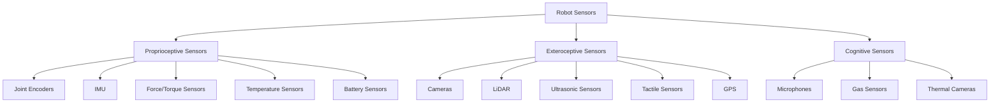

# Sensors in Physical AI Systems

## Learning Objectives

By the end of this chapter, students will be able to:
- Identify and explain the different types of sensors used in robotics
- Understand how sensor data is processed and interpreted
- Recognize the role of sensors in embodied intelligence
- Analyze sensor limitations and noise characteristics

## Introduction to Robot Sensors

Sensors form the bridge between the physical world and the computational processes of a robot. In Physical AI systems, sensors are critical components that allow robots to perceive their environment, monitor their own state, and interact with objects and beings in their surroundings.

The quality and capabilities of a robot's sensors directly impact its ability to operate successfully in the physical world. A robot with poor or inadequate sensing will struggle to understand its environment and will have limited ability to perform complex tasks.

## Categories of Sensors

Robot sensors can be broadly categorized into several types based on their function and the information they provide:

### Proprioceptive Sensors

These sensors monitor the robot's own state:

- **Joint encoders**: Measure joint angles and positions
- **IMU (Inertial Measurement Unit)**: Provide information about acceleration, angular velocity, and sometimes orientation
- **Force/torque sensors**: Measure forces and torques at joints or fingertips
- **Temperature sensors**: Monitor component temperatures to prevent overheating
- **Battery sensors**: Track power levels and consumption

### Exteroceptive Sensors

These sensors perceive the external world:

- **Cameras**: Capture visual information in 2D or 3D
- **LiDAR**: Provide 3D range measurements of the environment
- **Ultrasonic sensors**: Measure distances using sound waves
- **Tactile sensors**: Detect contact, pressure, and texture
- **GPS**: Provide global position information

### Cognitive Sensors

These may not directly measure physical quantities but provide higher-level information:

- **Microphones**: Capture audio for speech recognition and environmental sound analysis
- **Gas sensors**: Detect chemical signatures in the environment
- **Thermal cameras**: Measure heat signatures

## Diagrams

### Sensor Categories Overview

The above diagram categorizes the different types of sensors used in robotics based on their function.

## Sensor Characteristics and Limitations

### Resolution and Precision

Every sensor has inherent limitations in the precision and resolution of its measurements. Understanding these limitations is crucial for developing robust perception systems:

- **Quantization**: Digital sensors discretize continuous measurements
- **Noise**: All sensors introduce some level of random error
- **Bias**: Sensors may have systematic errors in their measurements
- **Drift**: Sensor characteristics may change over time

### Accuracy vs. Precision

- **Accuracy**: How close a measurement is to the true value
- **Precision**: How consistent repeated measurements are

A sensor can be precise but inaccurate (consistently wrong), or accurate but imprecise (sometimes right, sometimes wrong).

## Sensor Fusion

Physical AI systems often rely on multiple sensors to create a comprehensive understanding of their environment. Sensor fusion combines information from multiple sensors to:

- Improve accuracy and reliability
- Compensate for individual sensor limitations
- Provide redundancy for safety-critical applications
- Enable perception capabilities beyond what any single sensor can provide

### Common Fusion Techniques

- **Kalman filters**: Optimal estimation combining measurements with uncertainty
- **Particle filters**: Probabilistic filtering for non-linear, non-Gaussian systems
- **Deep learning**: Data-driven approaches to combining sensor information

## Sensors in Humanoid Robotics

Humanoid robots require specialized sensing approaches to enable human-like interaction:

### Vision Systems
- Stereo cameras for depth perception
- RGB-D cameras for combined color and depth information
- Wide-angle cameras for enhanced peripheral vision
- Eye tracking systems for attention and interaction

### Balance and Locomotion Sensors
- IMUs for measuring robot orientation and angular velocity
- Force/torque sensors in feet for balance control
- Joint encoders for precise control of limb positions
- Tactile sensors on feet for surface contact detection

### Manipulation Sensors
- Tactile sensors on fingertips for grasping feedback
- Force/torque sensors at wrist joints for manipulation control
- Proximity sensors for object detection near hands

## Time Considerations in Sensing

### Sensor Latency
The time delay between a physical event occurring and the sensor detecting it can impact robot behavior:

- High-frequency sensors for fast-reacting systems
- Buffering and prediction to compensate for latency
- Temporal synchronization across sensor modalities

### Sensor Rates
Different sensors operate at different frequencies:
- Joint encoders: Often 100Hz or higher
- IMUs: 100-1000Hz
- Cameras: 30-60Hz typically
- LiDAR: 5-20Hz depending on model and settings

## Handling Sensor Noise and Uncertainty

All sensors are subject to noise, and Physical AI systems must be designed to handle this uncertainty:

- **Filtering**: Digital filters to reduce noise in sensor signals
- **Statistical models**: Probabilistic representations of sensor uncertainty
- **Robust control**: Controllers that can handle sensor uncertainty

### Statistical Approaches

- **Gaussian noise models**: Representing sensor uncertainty as normal distributions
- **Covariance matrices**: Representing correlation between sensor measurements
- **Bayesian inference**: Updating beliefs based on uncertain sensor information

## Exercises

1. Compare the advantages and disadvantages of LiDAR vs. cameras for robot perception in indoor environments.
2. Explain how proprioceptive sensors contribute to embodied intelligence.
3. Design a simple sensor fusion algorithm to combine IMU and encoder data to estimate a robot's orientation more accurately than with either sensor alone.

## Quiz

1. What are proprioceptive sensors?
   - A) Sensors that measure external environment
   - B) Sensors that measure the robot's own state
   - C) Sensors that measure cognitive functions
   - D) Sensors that measure temperature only

2. What is the difference between accuracy and precision?
   - A) Accuracy is about cost, precision is about quality
   - B) Accuracy is closeness to true value, precision is consistency of measurements
   - C) Accuracy is speed, precision is reliability
   - D) Accuracy and precision are the same thing

3. Why is sensor fusion important in robotics?
   - A) It makes robots cheaper
   - B) It improves accuracy and reliability by combining multiple sources
   - C) It makes robots faster
   - D) It removes the need for programming

## Reflection

Consider how the limitations of sensors affect the design of Physical AI systems. How might a robot's behavior change if it had perfect sensors versus realistic, noisy sensors? How does sensor uncertainty relate to human perception and decision-making?