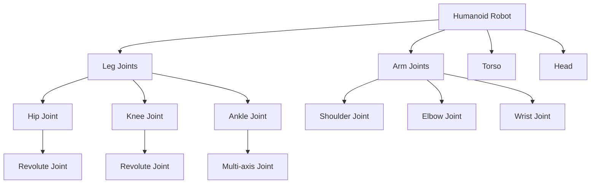

# Humanoid Development Overview

## Learning Objectives

By the end of this chapter, students will be able to:
- Understand the fundamental challenges in humanoid robot development
- Analyze the design considerations for creating stable and efficient humanoid robots
- Identify key components and subsystems of humanoid robots
- Explain the control challenges unique to bipedal locomotion
- Evaluate different approaches to humanoid robot development

## Introduction to Humanoid Development

Humanoid robots represent one of the most challenging and ambitious areas in robotics. These robots are designed with anthropomorphic characteristics, typically featuring a head, torso, two arms, and two legs. The goal is to create robots that can operate in human environments and potentially interact with humans in a natural way.

The development of humanoid robots involves integrating multiple complex systems including mechanical design, control systems, perception, and artificial intelligence. This creates a unique set of challenges that don't exist in other types of robots.

### Historical Context

The development of humanoid robots has evolved over several decades:

- **1960s-1970s**: Early research focused on basic walking patterns
- **1980s-1990s**: Introduction of ZMP (Zero Moment Point) control for stable walking
- **2000s**: Development of more advanced control algorithms and hardware
- **2010s-Present**: Focus on autonomy, interaction, and practical applications

### Applications of Humanoid Robots

Humanoid robots have potential applications in several areas:

#### Research and Development
- Platforms for studying human locomotion and cognition
- Testing human-robot interaction theories
- Developing new control algorithms
- Understanding embodiment and physical intelligence

#### Service Applications
- Elderly care and assistance
- Customer service in human-populated environments
- Educational tools
- Entertainment and social interaction

#### Specialized Tasks
- Working in human-designed spaces and using human tools
- Search and rescue in human-accessible areas
- Space exploration and maintenance
- Hazardous environment operations

## Design Principles for Humanoid Robots

### Anthropomorphic Design Considerations

Creating robots with human-like form requires careful consideration of several factors:

#### Proportional Design
- Maintaining human-like proportions for effective interaction in human environments
- Ensuring the robot can use human tools and equipment
- Balancing form with functional requirements

#### Degrees of Freedom (DOF)
Humanoid robots typically require many degrees of freedom:
- **Legs**: 6 DOF each (3 at hip, 1 at knee, 2 at ankle) for stable locomotion
- **Arms**: 7 DOF each (3 at shoulder, 1 at elbow, 3 at wrist) for dexterity
- **Torso**: Variable DOF (0-6) depending on design requirements
- **Head**: 2-3 DOF for gaze control and communication

#### Center of Mass Management
- Positioning the center of mass (CoM) for stability
- Managing CoM during dynamic movements
- Distributing mass for optimal locomotion

### Mechanical Design Challenges

#### Structural Design
- Creating lightweight yet strong structures
- Managing power and data transmission through joints
- Ensuring sufficient space for actuators and electronics
- Designing for maintenance and repair

#### Actuator Selection and Placement
- Choosing appropriate actuators for different joints
- Balancing torque, speed, and power requirements
- Managing heat dissipation
- Ensuring back-drivability for safe human interaction

#### Material Selection
- Balancing strength, weight, and cost considerations
- Selecting materials for specific environmental conditions
- Considering wear and aging of materials
- Ensuring safety for human interaction

## Key Components and Subsystems

### Mechanical Components

#### Joints and Linkages


#### Actuators
Common actuator types for humanoid robots:

1. **Servo Motors**: Precise position control
2. **Series Elastic Actuators (SEA)**: Compliance and force control
3. **Variable Stiffness Actuators (VSA)**: Adjustable compliance
4. **Pneumatic Muscles**: Human-like compliance and power density

### Sensory Systems

#### Proprioceptive Sensors
- Joint encoders for position feedback
- Force/torque sensors in joints and limbs
- Accelerometers and gyroscopes for balance
- Tactile sensors for contact detection

#### Exteroceptive Sensors
- Cameras for visual perception
- LiDAR for environment mapping
- Microphones for audio input
- Range sensors for proximity detection

### Control Systems

#### Hardware Architecture
- Central control unit with real-time processing
- Distributed control for joint servoing
- Real-time communication networks (e.g., EtherCAT)
- Power management systems

#### Software Architecture
- Real-time operating system
- Control framework (e.g., ROS/ROS2)
- Middleware for communication
- Safety and emergency systems

## Control Challenges in Humanoid Robots

### Balance Control

Maintaining balance in humanoid robots is one of the most critical challenges:

#### Static vs. Dynamic Balance
- **Static balance**: CoM within support polygon at all times
- **Dynamic balance**: CoM may be outside support polygon during movement
- Human walking is fundamentally dynamic balance

#### Control Approaches
1. **Zero Moment Point (ZMP) Control**: Maintaining ZMP within support area
2. **Capture Point Control**: Using capture point for balance recovery
3. **Whole-Body Control**: Optimizing all joints simultaneously
4. **Model Predictive Control**: Predicting and optimizing future states

### Locomotion Control

#### Walking Pattern Generation
Creating stable walking patterns requires:

##### Inverted Pendulum Model
```python
# Simplified inverted pendulum model
def calculate_zmp(omega, px, py, pz):
    """
    Calculate ZMP position for inverted pendulum model
    omega: natural frequency
    px, py: center of mass position
    pz: center of mass height
    """
    zmp_x = px - (pz / omega**2) * (d2px / dt2)  # Simplified
    zmp_y = py - (pz / omega**2) * (d2py / dt2)
    return zmp_x, zmp_y
```

##### Gait Parameters
- Step length and width
- Swing height and timing
- Double support duration
- Foot placement strategy

#### Walking Control Strategies
1. **Open-loop**: Pre-computed trajectories
2. **Feedback control**: Adjusting based on sensor data
3. **Learning-based**: Adapting from experience
4. **Model-based**: Using dynamic models for planning

### Manipulation Challenges

#### Dual-Purpose Design
Humanoid robots must balance walking and manipulation requirements:
- Stable walking vs. dexterous manipulation
- Upper body involvement in balance
- Coordination between walking and manipulation tasks

#### Compliance Control
- Adapting to uncertain environments
- Safe human interaction
- Tool use with appropriate compliance

## Development Approaches

### Research Platforms vs. Commercial Systems

#### Research Platforms
- Focus on advancing research frontiers
- Modular designs for easy experimentation
- Detailed documentation and support for researchers
- Example: NASA Valkyrie, SCHAFT, TEAM IHMC systems

#### Commercial Systems
- Focus on practical applications
- Cost-effective solutions
- User-friendly interfaces
- Example: Honda ASIMO, SoftBank NAO, Boston Dynamics Atlas

### Development Methodologies

#### Iterative Development
- Prototyping and testing
- Gradual complexity increase
- Feedback-driven improvements
- Risk mitigation through early testing

#### Simulation-to-Reality Transfer
- Extensive simulation testing
- Physics-accurate simulation environments
- Domain randomization to handle sim-to-real gap
- Gradual deployment from simulation to hardware

## Safety Considerations

### Physical Safety
- Emergency stop mechanisms
- Collision detection and avoidance
- Safe fall strategies
- Power limiting for human safety

### Behavioral Safety
- Fail-safe behaviors
- Predictable robot responses
- Human-robot distance management
- Social behavior protocols

## Development Tools and Frameworks

### Simulation Environments
- **Gazebo**: Physics simulation with ROS integration
- **Webots**: Robot simulation with built-in AI tools
- **MuJoCo**: High-fidelity physics simulation
- **Isaac Sim**: NVIDIA's simulation platform

### Control Frameworks
- **ROS/ROS2**: Middleware for robotics development
- **DART**: Dynamic Animation and Robotics Toolkit
- **OpenRAVE**: Environment for robotic manipulation
- **PyBullet**: Physics simulation and robotics platform

### Hardware Platforms

#### Open-Source Humanoid Platforms
- **NAO**: Small humanoid for research and education
- **Pepper**: Social humanoid robot
- **Darwin OP**: Advanced humanoid research platform
- **REEM-C**: Service-oriented humanoid robot

#### Advanced Research Platforms
- **ATLAS**: Boston Dynamics humanoid robot
- **HRP-4**: AIST humanoid robot
- **K-MAX**: Kawasaki humanoid robot
- **JAXON**: JSK humanoid robot

## Technical Challenges and Open Problems

### Stability and Dynamic Balance
- Achieving stable dynamic walking on challenging terrain
- Handling unexpected disturbances and perturbations
- Balancing energy efficiency with stability
- Real-time stability control algorithms

### Energy Efficiency
- Reducing power consumption for longer operation
- Optimal control for energy-efficient movement
- Efficient actuator design and control
- Energy recovery during movement

### Robustness and Reliability
- Handling mechanical wear and degradation
- Maintaining performance across environmental changes
- Fault detection and recovery
- Long-term operational reliability

### Integration Complexity
- Managing interactions between multiple subsystems
- Real-time system integration challenges
- Communication bandwidth and latency concerns
- Software complexity management

## Humanoid Development Process

### Requirements Analysis
1. Define intended application and tasks
2. Determine environmental constraints
3. Establish performance requirements
4. Consider safety and regulatory requirements

### Design Phase
1. Conceptual design and kinematic analysis
2. Dynamic modeling and simulation
3. Actuator and sensor selection
4. Control architecture design

### Implementation Phase
1. Mechanical prototyping and testing
2. Control system development
3. Integration and system testing
4. Iterative improvement based on testing results

### Validation and Deployment
1. Performance validation against requirements
2. Safety and reliability verification
3. User acceptance testing
4. Deployment and field testing

## Future Directions

### Technological Advancements
- More efficient and powerful actuators
- Advanced artificial intelligence integration
- Improved energy storage systems
- Better human-robot interaction technologies

### Applications Evolution
- Healthcare and assisted living
- Industrial collaborative robots
- Educational and research platforms
- Entertainment and social robotics

### Research Frontiers
- Cognitive architectures for humanoid robots
- Developmental robotics and learning
- Social robotics and interaction
- Bio-inspired design and control

## Exercises

1. Design a simple humanoid robot kinematic structure with appropriate DOF for each body part.
2. Calculate the ZMP for a simplified walking pattern using the inverted pendulum model.
3. Create a block diagram showing the control architecture for a humanoid robot's walking system.
4. Compare the advantages and disadvantages of different actuator types for humanoid robot joints.

## Quiz

1. What does ZMP stand for in humanoid robotics?
   - A) Zero Moment Point
   - B) Zero Motion Parameter
   - C) Zero Mass Position
   - D) Z-axis Motion Pattern

2. How many degrees of freedom do human legs typically have in humanoid robot design?
   - A) 4 DOF per leg
   - B) 5 DOF per leg
   - C) 6 DOF per leg
   - D) 7 DOF per leg

3. What is the primary purpose of Series Elastic Actuators (SEA)?
   - A) To provide high-speed motion
   - B) To add compliance and enable force control
   - C) To reduce power consumption
   - D) To increase torque output

4. Which approach is commonly used for dynamic balance in humanoid robots?
   - A) Static balance with wide stance
   - B) Zero Moment Point control
   - C) Fixed-step walking patterns
   - D) Continuous double support

## Reflection

Consider the complexity of creating a human-like robot and the challenges that must be addressed. How do the multiple systems in a humanoid robot (mechanical, control, perception, AI) need to work together for successful operation? What are the trade-offs in design decisions, such as sacrificing some mobility for stability? How might humanoid robots evolve in the future as technology advances?

What ethical considerations arise as humanoid robots become more capable and human-like in appearance and behavior? How should we approach the development of robots that are designed to closely resemble humans?