# Vision-Language-Action Systems

## Learning Objectives

By the end of this chapter, students will be able to:
- Explain the concept and architecture of Vision-Language-Action (VLA) systems
- Understand how VLA systems integrate perception, language understanding, and robotic control
- Design and implement basic VLA system components
- Analyze the challenges and opportunities in VLA system development
- Evaluate the performance of VLA systems in robotic applications

## Introduction to Vision-Language-Action (VLA) Systems

Vision-Language-Action (VLA) systems represent a significant advancement in robotics and artificial intelligence, enabling robots to understand, interpret, and respond to complex real-world scenarios through a unified perception-language-action framework. These systems combine:

1. **Vision Processing**: Understanding visual information from the environment
2. **Language Understanding**: Interpreting natural language commands and providing responses
3. **Action Execution**: Performing physical tasks based on vision and language inputs

VLA systems are crucial for developing robots that can interact naturally with humans and operate in unstructured environments. They enable robots to receive high-level commands in natural language and execute them in physical space based on visual understanding.

### The VLA Pipeline

The VLA system operates in a continuous pipeline:

```
Perception → Understanding → Planning → Action → Feedback
```

Where:
- **Perception**: Vision systems process the environment
- **Understanding**: Language models interpret commands and contextualize visual data
- **Planning**: Generate sequences of actions to achieve goals
- **Action**: Execute physical operations through robotic systems
- **Feedback**: Sensory feedback to adjust ongoing actions

## Architecture of VLA Systems

### Core Components

A typical VLA system architecture consists of several interconnected modules:

```mermaid
graph TB
    subgraph "Input Modalities"
        A[Visual Input]
        B[Language Input]
    end
    
    subgraph "Processing Modules"
        C[Visual Encoder]
        D[Language Encoder]
        E[Multimodal Fusion]
        F[Action Generator]
        G[Robot Controller]
    end
    
    subgraph "Output"
        H[Physical Action]
        I[Language Response]
    end
    
    A --> C
    B --> D
    C --> E
    D --> E
    E --> F
    F --> G
    G --> H
    G --> I
```



### Visual Processing Module

The visual processing module handles perception of the environment:

#### Visual Encoder
- Processes images, videos, or point clouds from robot sensors
- Extracts relevant features for downstream processing
- Maintains spatial understanding of the environment

```python
class VisualEncoder:
    def __init__(self, model_type='clip'):
        if model_type == 'clip':
            from transformers import CLIPVisionModel
            self.model = CLIPVisionModel.from_pretrained("openai/clip-vit-base-patch32")
        elif model_type == 'dinov2':
            from transformers import AutoModel
            self.model = AutoModel.from_pretrained("facebook/dinov2-base")
    
    def encode_image(self, image):
        """Encode an image into a feature representation"""
        with torch.no_grad():
            features = self.model(pixel_values=image)
        return features.last_hidden_state
```

#### Scene Understanding
- Object detection and segmentation
- Spatial relationships and affordances
- Dynamic scene analysis

### Language Processing Module

The language processing module interprets natural language commands:

#### Language Encoder
- Transforms natural language into semantic representations
- Interfaces with large language models (LLMs)
- Maintains context across interactions

```python
class LanguageEncoder:
    def __init__(self, model_name='gpt-3.5-turbo'):
        self.tokenizer = AutoTokenizer.from_pretrained(model_name)
        self.model = AutoModel.from_pretrained(model_name)
    
    def encode_command(self, command):
        """Encode a language command into semantic representation"""
        tokens = self.tokenizer(command, return_tensors="pt")
        with torch.no_grad():
            embeddings = self.model(**tokens)
        return embeddings.last_hidden_state
```

#### Natural Language Understanding
- Command parsing and semantic analysis
- Intent recognition
- Context maintenance

### Multimodal Fusion

The fusion module combines visual and linguistic information:

#### Cross-Modal Attention
- Attends to relevant visual elements based on language commands
- Maintains alignment between language and vision modalities
- Handles grounding of language in visual context

```python
import torch.nn.functional as F

class CrossModalAttention(torch.nn.Module):
    def __init__(self, hidden_dim=512):
        super().__init__()
        self.hidden_dim = hidden_dim
        self.query_layer = torch.nn.Linear(hidden_dim, hidden_dim)
        self.key_layer = torch.nn.Linear(hidden_dim, hidden_dim)
        self.value_layer = torch.nn.Linear(hidden_dim, hidden_dim)
        
    def forward(self, visual_features, language_features):
        # Compute attention between visual and language features
        queries = self.query_layer(language_features)
        keys = self.key_layer(visual_features)
        values = self.value_layer(visual_features)
        
        attention_scores = torch.matmul(queries, keys.transpose(-2, -1)) / (self.hidden_dim ** 0.5)
        attention_weights = F.softmax(attention_scores, dim=-1)
        
        attended_features = torch.matmul(attention_weights, values)
        return attended_features
```

## VLA System Implementations

### End-to-End VLA Models

Modern VLA systems often use end-to-end trainable architectures:

#### RT-1 (Robotics Transformer 1)
- Transforms vision and language inputs directly to robot actions
- Uses transformer architecture for sequence modeling
- Trained on large-scale robot data

```python
class RT1(torch.nn.Module):
    def __init__(self, vocab_size, hidden_dim=512, action_dim=10):
        super().__init__()
        self.visual_encoder = VisualEncoder()
        self.language_encoder = LanguageEncoder()
        self.fusion_transformer = torch.nn.TransformerEncoder(
            torch.nn.TransformerEncoderLayer(d_model=hidden_dim, nhead=8),
            num_layers=6
        )
        self.action_head = torch.nn.Linear(hidden_dim, action_dim)
        
    def forward(self, image, language_command):
        # Encode visual and language inputs
        visual_features = self.visual_encoder.encode_image(image)
        language_features = self.language_encoder.encode_command(language_command)
        
        # Concatenate features
        combined_features = torch.cat([visual_features, language_features], dim=1)
        
        # Process through fusion transformer
        fused_features = self.fusion_transformer(combined_features)
        
        # Generate actions
        actions = self.action_head(fused_features[:, 0, :])  # Use first token for action
        return actions
```

#### BC-Zero (Behavior Cloning with Zero-shot Generalization)
- Combines imitation learning with language conditioning
- Generalizes to new tasks through language instructions
- Uses pre-trained vision and language models

### Modular VLA Systems

Modular approaches separate concerns and allow for specialized optimization:

#### Perception Module
- Processes sensory data from robot cameras and other sensors
- Extracts relevant objects and their properties
- Provides structured representations to the language interface

#### Language Interface Module
- Interprets commands using natural language processing
- Converts commands into structured robot programs
- Interfaces with knowledge bases for complex tasks

#### Planning and Control Module
- Generates robot trajectories based on perceived state and goals
- Handles motion planning, obstacle avoidance, and control
- Integrates feedback for closed-loop control

```python
class ModularVLA:
    def __init__(self):
        self.perception = PerceptionModule()
        self.language_processor = LanguageProcessor()
        self.planner = ActionPlanner()
        self.robot_controller = RobotController()
    
    def execute_command(self, image, command):
        # Perceive the environment
        scene = self.perception.process_image(image)
        
        # Understand the command
        program = self.language_processor.parse_command(command, scene)
        
        # Generate action sequence
        actions = self.planner.generate_plan(program, scene)
        
        # Execute actions
        self.robot_controller.execute(actions)
        
        return actions
```

## Training VLA Systems

### Data Requirements

VLA systems require diverse, multimodal datasets that combine:
- Visual observations (images, videos, point clouds)
- Language descriptions (commands, intents, narratives)
- Action sequences (robot trajectories, grasp poses)

#### Popular Datasets
- **RT-1X**: Large-scale robot dataset with diverse tasks
- **Bridge Data**: Human demonstration data for manipulation tasks
- **Open X-Embodiment**: Multi-robot dataset for generalization

### Training Approaches

#### Imitation Learning
- Learn from human demonstrations
- Map visual and language inputs to demonstrated actions
- Requires large amounts of high-quality demonstration data

#### Reinforcement Learning
- Learn through trial and error with reward signals
- Can handle complex, long-horizon tasks
- Requires careful reward engineering

#### Foundation Model Integration
- Leverage pre-trained vision and language models
- Fine-tune on robotic tasks
- Enable zero-shot and few-shot learning

## Challenges in VLA Systems

### Multimodal Alignment

One of the key challenges is ensuring proper alignment between visual and linguistic modalities:

#### Grounding Language in Perception
- Associating language references with visual objects
- Handling ambiguous language descriptions
- Dealing with out-of-vocabulary concepts

#### Temporal Alignment
- Synchronizing visual and language processing
- Handling variable-length inputs
- Maintaining temporal context

### Long-Horizon Planning

VLA systems must handle complex, multi-step tasks:

#### Hierarchical Planning
- Breaking down complex commands into subgoals
- Maintaining context across multiple steps
- Handling task failure and recovery

#### Memory and Context
- Maintaining state across long sequences
- Handling changing environments
- Managing partial observability

### Robustness and Safety

VLA systems must operate reliably in real-world environments:

#### Adversarial Examples
- Handling unexpected visual inputs
- Robust language understanding
- Safe failure modes

#### Safety Constraints
- Ensuring physical safety during action execution
- Handling uncertainty in perception and language
- Graceful degradation when systems fail

## Applications of VLA Systems

### Service Robotics

VLA systems enable robots to perform complex service tasks:

#### Domestic Assistance
- Following natural language instructions
- Manipulating objects based on visual understanding
- Adapting to changing home environments

#### Customer Service
- Understanding and responding to natural language queries
- Navigating to relevant locations or objects
- Performing requested tasks based on visual context

### Industrial Automation

#### Flexible Manufacturing
- Adapting to new tasks through natural language programming
- Handling variable object types and arrangements
- Collaborating with human workers using natural language

#### Quality Inspection
- Understanding inspection requirements through language
- Identifying defects based on visual analysis
- Reporting findings in natural language

### Healthcare and Assistive Robotics

#### Patient Assistance
- Following personalized care instructions
- Manipulating medical equipment safely
- Communicating with patients and caregivers

## Human-Robot Interaction with VLA Systems

### Natural Interaction

VLA systems enable more natural human-robot interaction:

#### Spoken Language Interface
- Accepting commands in natural language
- Providing verbal feedback and status updates
- Handling conversation and clarification requests

#### Multimodal Interaction
- Combining speech with gestures and visual cues
- Understanding context from multiple modalities
- Providing feedback through multiple channels

### Trust and Transparency

#### Explainable VLA Systems
- Providing explanations for robot decisions
- Making robot reasoning transparent to humans
- Allowing humans to understand robot capabilities and limitations

## Technical Implementation Considerations

### Real-Time Performance

VLA systems must operate within real-time constraints:

#### Efficient Architectures
- Optimized models for fast inference
- Efficient attention mechanisms
- Model compression and quantization

#### Pipeline Optimization
- Parallel processing of different modalities
- Asynchronous processing where appropriate
- Caching and memoization of intermediate results

### Hardware Requirements

#### Computational Demands
- High-performance GPU for vision processing
- Sufficient memory for transformer models
- Real-time processing capabilities

#### Sensor Requirements
- High-resolution cameras for detailed visual input
- Microphones for speech input
- Additional sensors for safety and control

## Evaluation Metrics

### Performance Metrics

VLA systems are evaluated on multiple dimensions:

#### Task Success Rate
- Percentage of tasks completed successfully
- Handling of edge cases and failures
- Robustness to environmental variations

#### Language Understanding Accuracy
- Correct interpretation of commands
- Handling of ambiguous language
- Context maintenance over time

#### Interaction Quality
- Naturalness of interaction
- User satisfaction
- Time to task completion

## Future Directions

### Advanced VLA Architectures

#### Neuro-Symbolic Approaches
- Combining neural networks with symbolic reasoning
- Leveraging structured knowledge representations
- Enabling more systematic generalization

#### Emergent Reasoning
- Developing reasoning capabilities from training data
- Performing complex logical operations
- Understanding abstract concepts

### Improved Generalization

#### Cross-Task Generalization
- Applying knowledge from one task to another
- Learning from fewer examples
- Handling novel combinations of tasks

#### Cross-Embodiment Generalization
- Transferring skills across different robot platforms
- Adapting to various physical constraints
- Handling different manipulation capabilities

## Exercises

1. Implement a simple multimodal fusion module that combines visual and language features.
2. Design a VLA system for a specific robot task (e.g., picking up objects based on natural language commands).
3. Create a simulation environment to train a basic VLA system.
4. Evaluate the performance of a simple VLA approach on a basic manipulation task.

## Quiz

1. What are the three main components of a VLA (Vision-Language-Action) system?
   - A) Vision, Language, Learning
   - B) Perception, Processing, Planning
   - C) Vision, Language, Action
   - D) Seeing, Hearing, Moving

2. What is the primary challenge in multimodal alignment for VLA systems?
   - A) Processing speed
   - B) Ensuring proper correspondence between visual and linguistic information
   - C) Storage requirements
   - D) Network connectivity

3. Which of the following is a key application of VLA systems?
   - A) Text-only chatbots
   - B) Robots following natural language commands to manipulate objects
   - C) Image classification systems
   - D) Audio processing systems

4. What does RT-1 stand for in robotics?
   - A) Real-time 1
   - B) Robotics Transformer 1
   - C) Robot Task 1
   - D) Reinforcement Learning 1

## Reflection

Consider how VLA systems bridge the gap between human communication and robot action. How do these systems handle the complexity of natural language understanding combined with physical world interaction? What are the challenges in ensuring that robots interpret human commands correctly and safely execute actions in dynamic environments? How might VLA systems evolve to become more intuitive and reliable in human-robot collaboration?