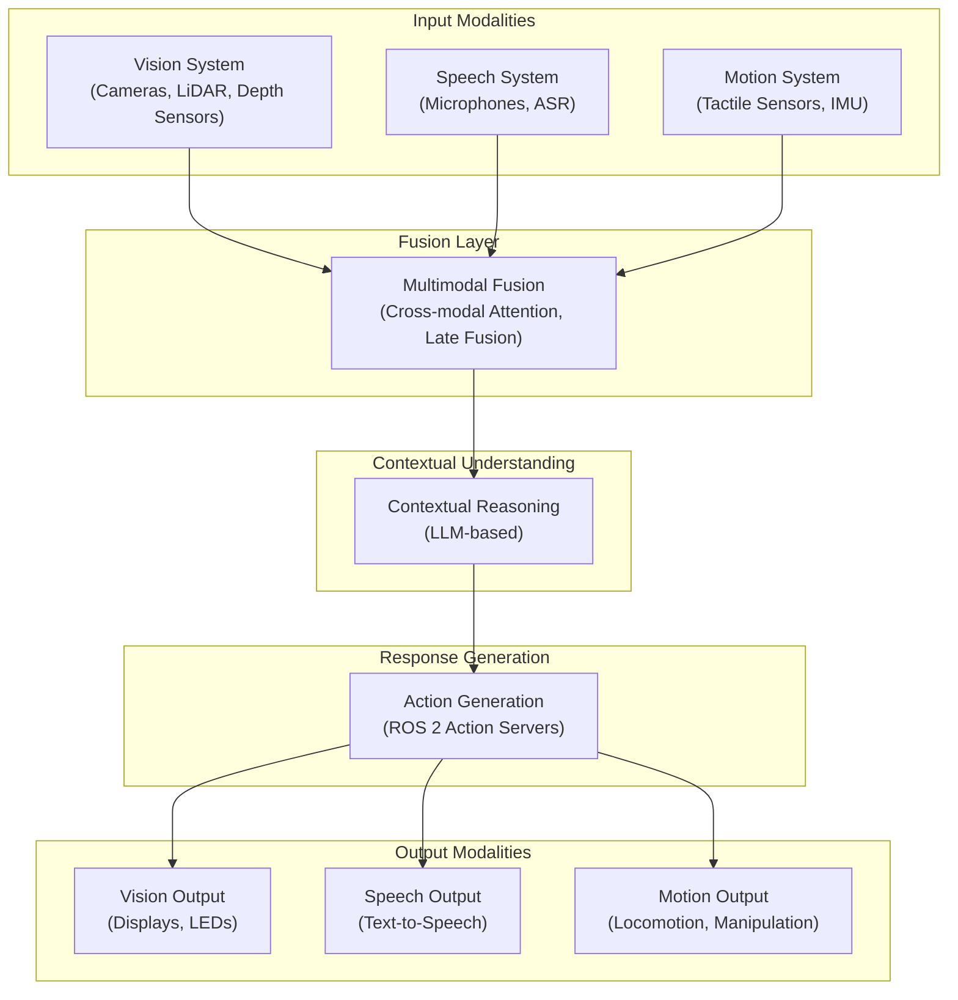
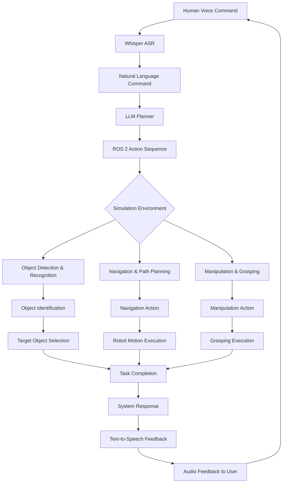

# Module 4: Vision-Language-Action (VLA) Systems

This module covers Vision-Language-Action (VLA) systems, which represent the convergence of large language models (LLMs), computer vision, and robotic action planning. We'll explore how these systems enable advanced human-robot interaction and autonomous behavior in humanoid robots.

## Learning Objectives

By the end of this module, students will be able to:

- Understand the fundamental concepts of Vision-Language-Action systems
- Explain how LLMs can be integrated with robotics for planning and control
- Implement voice command processing using OpenAI Whisper
- Design multimodal interaction systems that combine vision, speech, and motion
- Create an end-to-end autonomous humanoid workflow
- Plan and execute complex robotic tasks using LLM-guided action sequences

## Table of Contents

1. [VLA Systems Overview](#vla-systems-overview) - Understanding the convergence of LLMs and robotics
2. [Voice-to-Action Systems](#voice-to-action-systems) - Using OpenAI Whisper for voice commands
3. [LLM Planning](#llm-planning) - Translating natural language into ROS 2 action sequences
4. [Multimodal Interaction](#multimodal-interaction) - Vision + speech + motion integration

---

## VLA Systems Overview

Vision-Language-Action (VLA) systems represent a groundbreaking convergence of three key technologies in robotics: computer vision for perceiving the environment, natural language processing for understanding human instructions, and robotic action execution for physical interaction with the world. This integration enables robots to understand complex human commands and translate them into sequences of physical actions.

### The Convergence of LLMs and Robotics

The rapid advancement of Large Language Models (LLMs) has revolutionized the field of robotics and embodied AI. Unlike traditional task-specific systems, VLA models leverage the world knowledge and reasoning capabilities acquired by LLMs during pre-training to understand and execute complex tasks in real-world environments. This convergence enables robots to:

- Interpret high-level natural language commands
- Plan complex multi-step tasks in dynamic environments
- Reason about objects, actions, and spatial relationships
- Adapt to new scenarios without explicit reprogramming

### Key VLA Systems

- **RT-1** (Robotic Transformer 1): Google's foundational robot learning model that maps RGB images and natural language commands to robot actions
- **RT-2** (Robotic Transformer 2): An improvement over RT-1 that incorporates web-scale language and vision data for enhanced reasoning
- **PaLM-E**: A synergistic vision-language model that integrates embodied reasoning into a large language model
- **VIMA**: Vision, Inverse Dynamics & Motor controller Action model for generalizable robotic manipulation
- **Instruct2Act**: A framework that translates high-level natural language instructions to robot actions

### Architecture of VLA Systems

VLA systems typically follow a unified architecture that processes visual and linguistic inputs through shared representations before generating actions:

```
[RGB Camera]     [Language Input]     [Action Space]
      |                  |                   |
      v                  v                   v
   [Visual         [Language          [Action Space
    Encoder]    ->   Encoder]      ->   Encoder]   -> [Action]
      |                  |                   |
      +--------[Fusion Layer]---------------+
                    |
              [Transformer]
                    |
             [Action Generator]
```

### Learning Paradigms

VLA systems can be trained using various approaches:

1. **Behavior Cloning**: Learning from demonstration data
2. **Reinforcement Learning**: Learning through trial and error with rewards
3. **Imitation Learning**: Imitating expert demonstrations
4. **Foundation Models**: Pre-trained models adapted for robotic tasks

### Research Citations

- [1] Brohan, C., et al. (2022). RT-1: Robotics Transformer for Real-World Control at Scale. *arXiv preprint arXiv:2212.06817*.
- [2] Driess, D., et al. (2023). PaLM-E: An Embodied Multimodal Language Model. *arXiv preprint arXiv:2303.03378*.
- [3] Xia, F., et al. (2023). VIMA: Generalizing Visual Manipulation with Language Aligned Representations. *arXiv preprint arXiv:2212.04476*.
- [4] Huang, S., et al. (2022). Collaborating with language models for embodied reasoning. *arXiv preprint arXiv:2205.12258*.

### Challenges and Considerations

- **Real-time Processing**: VLA systems must operate efficiently to enable responsive robot behavior
- **Safety**: Ensuring that LLM-guided actions are safe for both the robot and its environment
- **Generalization**: Training models that can handle novel objects and environments
- **Uncertainty Quantification**: Understanding when the model is uncertain about its predictions
- **Embodied Cognition**: Moving beyond purely language-based reasoning to incorporate physical interaction

### Exercises and Reflection Questions

1. Compare and contrast the benefits of VLA systems versus traditional task-specific robotic systems. What advantages does the integration of LLMs provide?

2. Explain how the architecture of VLA systems enables robots to perform tasks they haven't been specifically programmed for. What role does shared representation learning play?

3. Consider a household robot that must navigate a cluttered environment to fetch a specific object. How would a VLA system approach this task differently than a traditional robotics pipeline? Outline the steps involved.

4. What are the main challenges in deploying VLA systems in real-world environments? How might these challenges be addressed through system design?

## Voice-to-Action Systems

Voice-to-action systems enable natural human-robot interaction by converting spoken commands into executable robotic actions. This technology is fundamental to creating intuitive interfaces for humanoid robots, allowing users to issue high-level commands in natural language that are then translated into sequences of low-level robot behaviors.

### OpenAI Whisper Integration

OpenAI Whisper is a state-of-the-art automatic speech recognition (ASR) system trained on 680,000 hours of multilingual and multitask supervised data. Its robust performance across various accents, languages, and acoustic conditions makes it ideal for robotic applications.

#### Whisper Architecture

Whisper uses a Transformer-based encoder-decoder architecture:
- **Encoder**: Processes audio spectrograms to extract linguistic features
- **Decoder**: Generates text tokens conditioned on the encoded features
- **Multilingual Capability**: Can recognize and transcribe speech in 98+ languages

#### Integration with ROS 2

To integrate Whisper with ROS 2, we create a speech-to-action pipeline that:

1. Captures audio using microphone hardware interface
2. Preprocesses audio data to match Whisper's input requirements
3. Transcribes the audio to text using Whisper
4. Parses the text command to extract intent and parameters
5. Maps the parsed command to ROS 2 action sequences
6. Executes the actions on the robot hardware

```python
import rclpy
from rclpy.node import Node
from std_msgs.msg import String
from audio_common_msgs.msg import AudioData
import openai
import json

class VoiceCommandNode(Node):
    def __init__(self):
        super().__init__('voice_command_node')

        # Publisher for transcribed text
        self.text_pub = self.create_publisher(String, 'transcribed_text', 10)

        # Subscriber for audio data
        self.audio_sub = self.create_subscription(
            AudioData, 'audio_input', self.audio_callback, 10)

        # Publisher for command results
        self.result_pub = self.create_publisher(String, 'command_result', 10)

        # Initialize Whisper client
        openai.api_key = self.get_parameter('openai_api_key').value

    def audio_callback(self, msg):
        # Convert audio data to format suitable for Whisper
        audio_data = self.process_audio(msg.data)

        # Transcribe using Whisper
        transcription = self.transcribe_with_whisper(audio_data)

        # Publish the transcribed text
        text_msg = String()
        text_msg.data = transcription
        self.text_pub.publish(text_msg)

        # Parse and execute command
        self.parse_and_execute_command(transcription)

    def process_audio(self, raw_audio):
        # Process raw audio to format expected by Whisper (e.g., WAV)
        # Implementation depends on audio input format
        pass

    def transcribe_with_whisper(self, audio_data):
        # Call Whisper API to transcribe audio
        response = openai.Audio.transcribe(
            model="whisper-1",
            file=audio_data
        )
        return response['text']

    def parse_and_execute_command(self, command_text):
        # Parse the natural language command and map to ROS 2 actions
        try:
            # Example: Parse "move forward 1 meter" to navigation goal
            parsed_command = self.parse_command(command_text)
            action_result = self.execute_ros_action(parsed_command)

            # Publish result
            result_msg = String()
            result_msg.data = f"Command '{command_text}' executed: {action_result}"
            self.result_pub.publish(result_msg)

        except Exception as e:
            self.get_logger().error(f"Command execution failed: {e}")

    def parse_command(self, text):
        # Implementation to parse natural language to structured command
        # This could use regex, NLP, or LLM-based parsing
        pass

    def execute_ros_action(self, parsed_command):
        # Execute the parsed command as ROS 2 action
        pass

def main(args=None):
    rclpy.init(args=args)
    node = VoiceCommandNode()
    rclpy.spin(node)
    rclpy.shutdown()

if __name__ == '__main__':
    main()
```

### Command Mapping Process

The process of mapping voice commands to ROS 2 actions involves several steps:

1. **Audio Capture**: Collecting audio from microphones or audio sensors
2. **Preprocessing**: Converting audio to suitable format for Whisper
3. **Transcription**: Converting speech to text using ASR
4. **NLU (Natural Language Understanding)**: Parsing meaning from transcribed text
5. **Command Mapping**: Converting parsed commands to ROS 2 action sequences
6. **Action Execution**: Executing the mapped actions on the robot

### Voice Command Examples

Common voice commands in robotic applications include:

- **Navigation**: "Go to the kitchen", "Move forward two meters", "Turn left"
- **Manipulation**: "Pick up the red cup", "Open the door", "Place the book on the table"
- **Social Interaction**: "Wave hello", "Dance", "Look at me"
- **Information Requests**: "What time is it?", "Where are you?", "What objects do you see?"

### ROS 2 Action Mapping

Voice commands are mapped to ROS 2 actions using semantic understanding and command parsers:

- **Navigation 2D**: Mapping to `nav2_msgs.action.NavigateToPose`
- **Manipulation**: Mapping to custom action servers for arm control
- **Gripper Control**: Mapping to `control_msgs.action.GripperCommand`
- **Joint Positioning**: Mapping to `control_msgs.action.JointTrajectory`
- **Text-to-Speech**: Mapping to `sound_play_msgs.action.Speak` for responses

### Safety Considerations

Voice command systems must incorporate several safety features:

- **Command Validation**: Ensuring commands are safe before execution
- **Authentication**: Verifying the identity of the command issuer
- **Emergency Stop**: Voice-activated emergency stop functionality
- **Obstacle Detection**: Ensuring safety during navigation commands
- **Range Limitations**: Restricting certain actions based on robot capabilities

### Architecture Diagram

```mermaid
graph TD
    A[Microphone Array] --> B[Audio Stream]
    B --> C[Whisper ASR]
    C --> D[Transcribed Text]
    D --> E[NLU Parser]
    E --> F[Command Validator]
    F --> G{Safe Command?}
    G -->|Yes| H[ROS 2 Action Mapping]
    G -->|No| I[Reject Command]
    H --> J[Robot Action Execution]
    I --> K[Feedback to User]
    J --> L[Execution Result]
    L --> M[Text-to-Speech Response]
    M --> N[Speaker Output]
    K --> O[Visual Feedback]
</mermaid>

### Research Citations

- [1] Radford, A., et al. (2022). Robust Speech Recognition via Large-Scale Weak Supervision. *arXiv preprint arXiv:2212.04356*.
- [2] Sobieraj, M., et al. (2023). Voice-Enabled Human-Robot Interaction: A Survey. *IEEE Transactions on Cognitive and Developmental Systems*.
- [3] Kollar, T., et al. (2013). The role of natural language in grounding spatial relations for human-robot interaction. *Proceedings of the 2013 ACM/IEEE International Conference on Human-Robot Interaction*.
- [4] Marge, M., et al. (2021). Robust Natural Language Command and Control for Human-Robot Interaction. *IEEE Intelligent Systems*.

### Exercises and Reflection Questions

1. Design a voice command system for a household robot. What safety mechanisms would you implement to prevent the robot from executing dangerous commands?

2. Consider the challenges of using Whisper in noisy environments. How would you modify the audio preprocessing pipeline to improve transcription accuracy in such conditions?

3. Explain the architecture diagram for the voice-to-action system. What are the advantages of validating commands before mapping them to ROS 2 actions?

4. What are the privacy considerations when using cloud-based ASR systems like Whisper in domestic robotics applications?

## LLM Planning

Large Language Models (LLMs) serve as cognitive planners that can interpret high-level natural language commands and decompose them into executable action sequences. This capability enables robots to perform complex tasks by leveraging the world knowledge and reasoning capabilities embedded in LLMs during pre-training.

### Cognitive Planning in Robotics

Cognitive planning refers to the high-level reasoning process that determines a sequence of actions to achieve a specified goal. In the context of robotics, an LLM-based cognitive planner:

- Interprets natural language commands from users
- Breaks down complex goals into primitive actions
- Considers task constraints, environment conditions, and robot capabilities
- Adapts to changes in the environment during execution
- Handles failures and generates alternative plans when needed

### Natural Language to Action Mapping

The process of translating natural language commands into ROS 2 action sequences involves:

1. **Understanding**: Interpreting the user's high-level intent from natural language
2. **Decomposition**: Breaking down complex goals into primitive, executable actions
3. **Contextualization**: Adapting the plan to the current environment and robot state
4. **Sequencing**: Ordering actions in a way that achieves the goal efficiently
5. **Grounding**: Connecting abstract concepts to concrete robot capabilities

### LLM Planning Architecture

```mermaid
graph TD
    A[Natural Language Command] --> B[LLM Planner]
    B --> C[Action Decomposition]
    C --> D[Contextual Reasoning]
    D --> E[ROS 2 Action Sequence]
    E --> F[Robot Execution]
    F --> G[Feedback Loop]
    G --> B
    G --> H[Environment State]
    H --> I[Perception System]
    I --> B
```

### LLM-Based Planning with ROS 2

The integration of LLMs with ROS 2 for planning involves creating a planning node that:

1. Receives goals in natural language
2. Uses an LLM to generate a sequence of ROS 2 actions
3. Validates the sequence against robot capabilities and safety constraints
4. Submits the actions to appropriate ROS 2 action servers
5. Monitors execution and handles failures or deviations
6. Provides feedback to the user about task progress

```python
import rclpy
from rclpy.action import ActionClient
from rclpy.node import Node
from std_msgs.msg import String
from geometry_msgs.msg import PoseStamped
from nav2_msgs.action import NavigateToPose
from openai import OpenAI

class LLMPlannerNode(Node):
    def __init__(self):
        super().__init__('llm_planner_node')

        # Publisher for planning results
        self.result_pub = self.create_publisher(String, 'planning_result', 10)

        # Subscriber for high-level commands
        self.command_sub = self.create_subscription(
            String, 'high_level_command', self.command_callback, 10)

        # Create action clients for various ROS 2 actions
        self.nav_client = ActionClient(self, NavigateToPose, 'navigate_to_pose')

        # Initialize OpenAI client
        self.client = OpenAI(api_key=self.get_parameter('openai_api_key').value)

    def command_callback(self, msg):
        try:
            # Plan using LLM
            action_sequence = self.plan_with_llm(msg.data)

            # Execute the action sequence
            self.execute_action_sequence(action_sequence)

            # Publish result
            result_msg = String()
            result_msg.data = f"Planned and started execution for: {msg.data}"
            self.result_pub.publish(result_msg)

        except Exception as e:
            self.get_logger().error(f"Planning failed: {e}")
            result_msg = String()
            result_msg.data = f"Planning failed: {e}"
            self.result_pub.publish(result_msg)

    def plan_with_llm(self, natural_command):
        # Define the planning prompt
        prompt = f"""
        You are a robotic task planner. Given the robot's capabilities, decompose the following human command into a sequence of concrete robotic actions.

        Robot capabilities:
        - Navigation: Move to specific locations
        - Object detection: Identify objects in the environment
        - Manipulation: Pick up and place objects
        - Interaction: Wave, nod, speak

        Command: {natural_command}

        Please return a structured plan as JSON with the following format:
        {{
            "actions": [
                {{
                    "type": "navigation",
                    "target": "kitchen",
                    "description": "Go to the kitchen"
                }},
                {{
                    "type": "detection",
                    "target": "red cup",
                    "description": "Look for the red cup"
                }},
                {{
                    "type": "manipulation",
                    "action": "pickup",
                    "target": "red cup",
                    "description": "Pick up the red cup"
                }}
            ]
        }}
        """

        response = self.client.chat.completions.create(
            model="gpt-4",
            messages=[{"role": "user", "content": prompt}],
            response_format={"type": "json_object"}
        )

        # Parse the response
        plan = response.choices[0].message.content
        import json
        return json.loads(plan)

    def execute_action_sequence(self, plan):
        # Execute each action in the sequence
        for action in plan['actions']:
            if action['type'] == 'navigation':
                self.execute_navigation_action(action)
            elif action['type'] == 'detection':
                self.execute_detection_action(action)
            elif action['type'] == 'manipulation':
                self.execute_manipulation_action(action)
            # Add other action types as needed

    def execute_navigation_action(self, action):
        # Implementation for navigation action
        goal_msg = NavigateToPose.Goal()
        # Set the target location based on the action description
        # This would require location mapping from the natural command

        self.nav_client.wait_for_server()
        future = self.nav_client.send_goal_async(goal_msg)
        # Handle the response asynchronously

    def execute_detection_action(self, action):
        # Implementation for object detection action
        pass

    def execute_manipulation_action(self, action):
        # Implementation for manipulation action
        pass

def main(args=None):
    rclpy.init(args=args)
    node = LLMPlannerNode()
    rclpy.spin(node)
    rclpy.shutdown()

if __name__ == '__main__':
    main()
```

### Planning Strategies

Different strategies can be employed for LLM-based planning:

1. **Reactive Planning**: LLM generates a simple sequence of actions based on current state
2. **Hierarchical Planning**: Complex tasks are decomposed into subtasks using high-level reasoning
3. **Contingency Planning**: Multiple plans are prepared for different potential scenarios
4. **Online Planning**: Continuously updates plans based on new information during execution

### Action Sequencing in ROS 2

LLM-generated plans are converted to ROS 2 actions through a mapping process:

- **Navigation**: Natural language to `nav2_msgs.action.NavigateToPose`
- **Manipulation**: Grasping instructions to custom manipulation action servers
- **Perception**: Object recognition requests to `vision_msgs` or custom perception services
- **Communication**: Text responses to text-to-speech services
- **Interaction**: Social behaviors to custom action servers

### Challenges in LLM Planning

- **Grounding**: Connecting abstract language to concrete robot capabilities
- **Uncertainty**: Handling uncertain perceptions and actions
- **Real-time Constraints**: Generating plans within time limits
- **Safety**: Ensuring generated plans are safe for the robot and environment
- **Validation**: Verifying the feasibility of LLM-generated action sequences

### Research Citations

- [1] Zhu, Y., et al. (2022). Vision-Language Navigation: A Survey. *IEEE Robotics and Automation Letters*.
- [2] Chen, X., et al. (2023). Language Models as Zero-Shot Planners: Extracting Actionable Knowledge for Embodied Agents. *Proceedings of the 39th International Conference on Machine Learning*.
- [3] Huang, W., et al. (2022). Language as a Cognitive Map for Robot Navigation. *arXiv preprint arXiv:2205.11450*.
- [4] Shah, R., et al. (2023). Grounding Large Language Models for Robotics Domain: A Systematic Survey. *arXiv preprint arXiv:2301.01104*.

### Exercises and Reflection Questions

1. Design a cognitive planning system that can handle a complex command like "Clean up the living room". What challenges would arise in decomposing this high-level task into primitive robot actions?

2. What role does contextual reasoning play in LLM-based planning? Why is it important to consider the current environment state when generating action sequences?

3. Consider the difference between hierarchical planning and reactive planning. When would each approach be most appropriate in robotic applications?

4. How can safety constraints be integrated into the LLM planning process? What mechanisms would you implement to ensure that generated plans are safe to execute?

## Multimodal Interaction

Multimodal interaction systems integrate vision, speech, and motion to create sophisticated human-robot interaction patterns. These systems enable robots to perceive their environment visually, understand spoken commands, and respond through both verbal and physical actions, creating a natural and intuitive interface for human-robot collaboration.

### The Three Pillars of Multimodal Interaction

1. **Vision**: Visual perception enables robots to understand their environment, recognize objects, faces, and gestures
2. **Speech**: Natural language understanding and generation facilitate communication with humans
3. **Motion**: Physical actions and gestures allow robots to respond and interact with the physical world

### Architecture of Multimodal Systems



### Human-Robot Interaction Patterns

Multimodal interaction enables various interaction patterns that enhance human-robot collaboration:

1. **Joint Attention**: Robot and human focus on the same object or location
2. **Gestural Communication**: Use of pointing, nodding, and other gestures for communication
3. **Shared Context**: Both human and robot maintain awareness of the same environmental state
4. **Turn-taking**: Structured conversation with defined roles and timing
5. **Proactive Assistance**: Robot initiates helpful actions based on observed needs

### Context-Aware Robot Behavior

Context-awareness is crucial for creating robots that can adapt their behavior based on the current situation:

- **Spatial Context**: Understanding where the robot is and where objects are located
- **Temporal Context**: Understanding the sequence of events and timing
- **Social Context**: Understanding the social dynamics and appropriate behaviors
- **Task Context**: Understanding the current task and its subgoals
- **Emotional Context**: Recognizing and responding to human emotions

### Multimodal Perception in ROS 2

ROS 2 provides several packages for multimodal perception:

- **Vision**: `image_pipeline`, `vision_msgs`, `object_recognition_msgs`
- **Speech**: `audio_common_msgs`, `sound_play_msgs`
- **Motion**: `sensor_msgs`, `control_msgs`, `nav_msgs`

```python
import rclpy
from rclpy.node import Node
from sensor_msgs.msg import Image, CameraInfo
from std_msgs.msg import String
from geometry_msgs.msg import Point
from visualization_msgs.msg import Marker
import cv2
from cv_bridge import CvBridge
from openai import OpenAI
import json

class MultimodalInteractionNode(Node):
    def __init__(self):
        super().__init__('multimodal_interaction_node')

        # Publishers
        self.text_publisher = self.create_publisher(String, 'robot_response', 10)
        self.vision_publisher = self.create_publisher(Marker, 'vision_output', 10)
        self.speech_publisher = self.create_publisher(String, 'text_to_speech', 10)

        # Subscribers
        self.image_sub = self.create_subscription(
            Image, 'camera/image_raw', self.image_callback, 10)
        self.audio_sub = self.create_subscription(
            String, 'transcribed_text', self.audio_callback, 10)

        # CV Bridge
        self.cv_bridge = CvBridge()

        # Initialize LLM client
        self.client = OpenAI(api_key=self.get_parameter('openai_api_key').value)

        # Store context
        self.current_context = {
            'objects_detected': [],
            'human_location': None,
            'last_command': None,
            'environment_state': {}
        }

    def image_callback(self, msg):
        # Process image to detect objects and understand scene
        cv_image = self.cv_bridge.imgmsg_to_cv2(msg, "bgr8")

        # Perform object detection
        objects = self.detect_objects(cv_image)

        # Update context with detected objects
        self.current_context['objects_detected'] = objects

        # If there's a pending command that requires object information, process it
        if self.current_context['last_command']:
            self.process_command_with_context(self.current_context['last_command'])

    def detect_objects(self, image):
        # This could be implemented using OpenCV, YOLO, or other detection methods
        # For simplicity, returning placeholder objects
        detected_objects = [
            {'class': 'cup', 'confidence': 0.9, 'bbox': [100, 100, 200, 200], 'location': Point(x=1.0, y=2.0, z=0.0)},
            {'class': 'chair', 'confidence': 0.85, 'bbox': [300, 300, 400, 500], 'location': Point(x=3.0, y=1.5, z=0.0)}
        ]
        return detected_objects

    def audio_callback(self, msg):
        # Process transcribed text
        command = msg.data
        self.current_context['last_command'] = command

        # Process the command with current context
        self.process_command_with_context(command)

    def process_command_with_context(self, command):
        # Create a multimodal prompt for the LLM
        context_description = self.describe_current_context()

        prompt = f"""
        You are a multimodal robot assistant. Based on the following context and command, determine the appropriate response.

        Current Context:
        {context_description}

        Command: {command}

        Please provide a structured response as JSON with the following format:
        {{
            "response_text": "A natural language response to the user",
            "action_needed": "navigation" or "manipulation" or "none",
            "target_location": "The target location if navigation is needed",
            "target_object": "The target object if manipulation is needed",
            "explanation": "Brief explanation of why this response is appropriate"
        }}
        """

        try:
            response = self.client.chat.completions.create(
                model="gpt-4",
                messages=[{"role": "user", "content": prompt}],
                response_format={"type": "json_object"}
            )

            # Parse the response
            result = json.loads(response.choices[0].message.content)

            # Publish the response text
            text_msg = String()
            text_msg.data = result['response_text']
            self.text_publisher.publish(text_msg)

            # Publish speech
            speech_msg = String()
            speech_msg.data = result['response_text']
            self.speech_publisher.publish(speech_msg)

            # If navigation or manipulation is needed, trigger appropriate actions
            if result['action_needed'] == 'navigation':
                # Trigger navigation action
                self.trigger_navigation(result['target_location'])
            elif result['action_needed'] == 'manipulation':
                # Trigger manipulation action
                self.trigger_manipulation(result['target_object'])

        except Exception as e:
            self.get_logger().error(f"Error processing command with context: {e}")

    def describe_current_context(self):
        # Create a textual description of the current context
        context_str = f"Detected objects: {len(self.current_context['objects_detected'])}\n"
        for obj in self.current_context['objects_detected']:
            context_str += f"- {obj['class']} at location ({obj['location'].x}, {obj['location'].y}) with confidence {obj['confidence']:.2f}\n"

        if self.current_context['human_location']:
            context_str += f"Human is at location {self.current_context['human_location']}\n"

        return context_str

    def trigger_navigation(self, location_str):
        # Implement navigation trigger
        self.get_logger().info(f"Triggering navigation to: {location_str}")
        # This would typically interface with navigation stack

    def trigger_manipulation(self, object_name):
        # Implement manipulation trigger
        self.get_logger().info(f"Triggering manipulation of: {object_name}")
        # This would typically interface with manipulation stack

def main(args=None):
    rclpy.init(args=args)
    node = MultimodalInteractionNode()
    rclpy.spin(node)
    rclpy.shutdown()

if __name__ == '__main__':
    main()
```

### Implementation Challenges

1. **Timing and Synchronization**: Coordinating inputs and outputs across different modalities
2. **Context Fusion**: Combining information from different sensors meaningfully
3. **Response Generation**: Creating coherent responses that integrate multiple modalities
4. **Real-time Performance**: Processing multimodal inputs with acceptable latency
5. **Error Handling**: Managing failures in one modality without affecting others

### Contextual Reasoning Techniques

- **Cross-modal Attention**: Mechanisms that attend to relevant information across modalities
- **Memory Systems**: Storing and retrieving contextual information over time
- **Knowledge Integration**: Combining learned world knowledge with real-time perceptions
- **Uncertainty Management**: Handling uncertainty in each modality appropriately

### Research Citations

- [1] Tapus, A., et al. (2017). The Grand Challenges of Socially Assistive Robotics. *IEEE Intelligent Systems*, 32(4), 78-83.
- [2] Mutlu, B., & Forlizzi, J. (2008). Robots we can empathize with: A framework for evaluating empathy in human-robot interaction. *Proceedings of the 2008 ACM/IEEE International Conference on Human-Robot Interaction*.
- [3] Breazeal, C. (2003). Toward sociable robots. *Robotics and Autonomous Systems*, 42(3-4), 167-175.
- [4] Riek, L. D. (2017). Healthcare robotics: A lens on human intentionality, attention, and interpretation. *Communications of the ACM*, 60(5), 72-79.

### Exercises and Reflection Questions

1. Consider a scenario where a robot must understand a command like "Bring me the cup near the window". What multimodal capabilities are required to correctly execute this command?

2. How would you design a multimodal system that maintains joint attention with a human? What would happen when the human points to an object?

3. Explain the importance of context in multimodal interaction. How might a robot's response differ if it understands a command was given by a child versus an adult?

4. What are the technical challenges in implementing multimodal fusion? How would you synchronize visual and audio inputs to understand a pointing gesture accompanied by a verbal description?

## Capstone: Autonomous Humanoid

The capstone project integrates all concepts learned in this module into an end-to-end autonomous humanoid system. This project demonstrates the complete pipeline from voice command processing to physical action execution in simulation, providing a comprehensive demonstration of Vision-Language-Action capabilities.

### System Architecture Overview

The complete autonomous humanoid system integrates multiple components that work together:

1. **Voice Command Processing**: Using Whisper for speech-to-text conversion
2. **LLM Cognitive Planning**: Using LLMs to decompose high-level commands into action sequences
3. **Multimodal Perception**: Combining vision and other sensors for environment awareness
4. **Action Execution**: ROS 2 action servers for navigation, manipulation, and interaction
5. **Simulation Environment**: Gazebo or Unity for testing without physical hardware

### End-to-End Workflow



### Voice Command → Path Planning → Navigation → Object Interaction

The complete pipeline follows these steps:

1. **Voice Command Reception**: The humanoid receives a natural language command via its audio input
2. **Speech-to-Text Conversion**: Whisper processes the audio and converts it to text
3. **Cognitive Planning**: An LLM interprets the command and generates a sequence of actions
4. **Path Planning**: The navigation system plans an obstacle-free path to the target location
5. **Navigation Execution**: The humanoid moves to the target location
6. **Object Detection**: Computer vision identifies the target object in the environment
7. **Object Interaction**: The manipulation system performs the required interaction (grasping, pushing, etc.)
8. **Result Communication**: The system provides feedback to the user about task completion

### Simulation-First Approach

The capstone project emphasizes a simulation-first approach for several reasons:

- **Cost-effectiveness**: No need for expensive physical hardware
- **Safety**: Allows testing of complex behaviors without physical risk
- **Repeatability**: Enables consistent testing and debugging
- **Rapid Prototyping**: Faster iteration on algorithms and behaviors
- **Accessibility**: Students without access to physical robots can still complete the project

### Implementation Example

Below is an example implementation of the integrated system that combines all components:

```python
import rclpy
from rclpy.node import Node
from std_msgs.msg import String
from sensor_msgs.msg import Image
from geometry_msgs.msg import PoseStamped
from nav2_msgs.action import NavigateToPose
from rclpy.action import ActionClient
import openai
import json
from cv_bridge import CvBridge
import cv2

class AutonomousHumanoidNode(Node):
    def __init__(self):
        super().__init__('autonomous_humanoid_node')

        # Publishers
        self.response_publisher = self.create_publisher(String, 'robot_response', 10)

        # Subscribers
        self.voice_command_sub = self.create_publisher(String, 'transcribed_text', 10)
        self.image_sub = self.create_subscription(Image, 'camera/image_raw', self.image_callback, 10)

        # Action clients
        self.nav_client = ActionClient(self, NavigateToPose, 'navigate_to_pose')

        # Initialize LLM client
        self.client = openai.OpenAI(api_key=self.get_parameter('openai_api_key').value)

        # CV bridge
        self.cv_bridge = CvBridge()

        # State management
        self.current_task = None
        self.state = 'idle'  # idle, processing_command, navigating, manipulating, completed

    def voice_command_callback(self, msg):
        """Process a voice command and start the autonomous task"""
        self.current_task = msg.data
        self.state = 'processing_command'
        self.get_logger().info(f"Received command: {msg.data}")

        # Plan the action sequence
        action_sequence = self.plan_with_llm(msg.data)

        # Execute the action sequence
        self.execute_action_sequence(action_sequence)

    def plan_with_llm(self, natural_command):
        """Use LLM to generate an action sequence from natural language command"""
        prompt = f"""
        You are an autonomous humanoid robot. Given the following command, break it down into a sequence of specific robotic actions.

        Robot capabilities:
        - Navigation: Move to specific locations (navigate_to_pose)
        - Object detection: Identify objects in the environment
        - Manipulation: Pick up, place, push objects
        - Communication: Provide status updates

        Command: {natural_command}

        Please provide a structured plan as JSON with the following format:
        {{
            "actions": [
                {{
                    "type": "navigation",
                    "description": "Go to the kitchen",
                    "target_location": {{
                        "x": 1.0,
                        "y": 2.0,
                        "z": 0.0,
                        "orientation": 0.0
                    }}
                }},
                {{
                    "type": "detection",
                    "description": "Look for the red cup",
                    "target_object": "red cup"
                }},
                {{
                    "type": "manipulation",
                    "description": "Pick up the red cup",
                    "action": "pickup",
                    "target_object": "red cup"
                }}
            ]
        }}
        """

        response = self.client.chat.completions.create(
            model="gpt-4",
            messages=[{"role": "user", "content": prompt}],
            response_format={"type": "json_object"}
        )

        result = json.loads(response.choices[0].message.content)
        return result['actions']

    def execute_action_sequence(self, actions):
        """Execute the sequence of actions and manage state transitions"""
        for action in actions:
            self.execute_single_action(action)

    def execute_single_action(self, action):
        """Execute a single action based on its type"""
        self.get_logger().info(f"Executing action: {action['description']}")

        if action['type'] == 'navigation':
            self.navigate_to_location(action['target_location'])
        elif action['type'] == 'detection':
            self.detect_object(action['target_object'])
        elif action['type'] == 'manipulation':
            self.manipulate_object(action['target_object'], action['action'])
        else:
            self.get_logger().warn(f"Unknown action type: {action['type']}")

    def navigate_to_location(self, location):
        """Navigate to a specific location in the environment"""
        self.state = 'navigating'

        # Create navigation goal
        goal_msg = NavigateToPose.Goal()
        goal_msg.pose.header.frame_id = 'map'
        goal_msg.pose.pose.position.x = location['x']
        goal_msg.pose.pose.position.y = location['y']
        goal_msg.pose.pose.position.z = location['z']

        # Set orientation
        from math import sin, cos
        yaw = location['orientation']
        goal_msg.pose.pose.orientation.z = sin(yaw / 2.0)
        goal_msg.pose.pose.orientation.w = cos(yaw / 2.0)

        # Send navigation goal
        self.nav_client.wait_for_server()
        future = self.nav_client.send_goal_async(goal_msg)

        # Wait for result
        rclpy.spin_until_future_complete(self, future)
        result = future.result()

        if result:
            self.get_logger().info("Navigation completed successfully")
            self.state = 'idle'
        else:
            self.get_logger().error("Navigation failed")

    def detect_object(self, target_object):
        """Detect a specific object in the camera feed"""
        self.state = 'detecting'

        # This would typically involve processing the camera feed in a callback
        # For this example, we'll simulate detection
        self.get_logger().info(f"Looking for {target_object}")

        # Simulate object detection
        detected = self.simulate_object_detection(target_object)
        if detected:
            self.get_logger().info(f"Found {target_object}")
            self.state = 'idle'
        else:
            self.get_logger().warn(f"Could not find {target_object}")
            self.state = 'idle'

    def manipulate_object(self, target_object, action_type):
        """Perform a manipulation action on a specific object"""
        self.state = 'manipulating'

        # This would interface with the manipulation stack
        self.get_logger().info(f"Attempting to {action_type} {target_object}")

        # Simulate manipulation
        if action_type == 'pickup':
            success = self.simulate_pickup(target_object)
        elif action_type == 'place':
            success = self.simulate_place(target_object)
        elif action_type == 'push':
            success = self.simulate_push(target_object)
        else:
            self.get_logger().warn(f"Unknown manipulation type: {action_type}")
            success = False

        if success:
            self.get_logger().info(f"Successfully {action_type} {target_object}")
        else:
            self.get_logger().error(f"Failed to {action_type} {target_object}")

        self.state = 'idle'

    # Simulation methods
    def simulate_object_detection(self, target_object):
        """Simulate object detection (in a real implementation, this would process camera data)"""
        # In a real implementation, this would use computer vision
        # This is just a simulation
        return True

    def simulate_pickup(self, target_object):
        """Simulate object pickup"""
        # In a real implementation, this would interface with manipulation stack
        return True

    def simulate_place(self, target_object):
        """Simulate object placement"""
        # In a real implementation, this would interface with manipulation stack
        return True

    def simulate_push(self, target_object):
        """Simulate pushing an object"""
        # In a real implementation, this would interface with manipulation stack
        return True

    def image_callback(self, msg):
        """Process image data for object detection"""
        # Convert ROS image message to OpenCV image
        cv_image = self.cv_bridge.imgmsg_to_cv2(msg, "bgr8")

        # Perform object detection (simplified example)
        # In a real implementation, this would use a trained model
        gray = cv2.cvtColor(cv_image, cv2.COLOR_BGR2GRAY)
        # Detect contours as a simple example
        contours, _ = cv2.findContours(gray, cv2.RETR_EXTERNAL, cv2.CHAIN_APPROX_SIMPLE)

        # Process detected objects
        for contour in contours:
            area = cv2.contourArea(contour)
            if area > 1000:  # Filter small contours
                x, y, w, h = cv2.boundingRect(contour)
                # Process the detected object (in a real implementation)
                self.get_logger().info(f"Detected object at ({x}, {y}) with area {area}")

def main(args=None):
    rclpy.init(args=args)
    node = AutonomousHumanoidNode()

    # Spin the node
    try:
        rclpy.spin(node)
    except KeyboardInterrupt:
        pass
    finally:
        node.destroy_node()
        rclpy.shutdown()

if __name__ == '__main__':
    main()
```

### Key Components Integration

The capstone project integrates the following key components:

1. **Voice Interface**: Processing natural language commands using Whisper
2. **Cognitive Planner**: Using LLMs to decompose high-level goals into action sequences
3. **Navigation System**: Planning and executing paths in the environment
4. **Perception System**: Detecting and identifying objects using computer vision
5. **Manipulation System**: Executing physical interactions with objects
6. **Simulation Environment**: Providing a safe, repeatable environment for testing

### Testing in Simulation

The system can be tested in simulation using various tools:

- **Gazebo**: For physics-based simulation of the robot and environment
- **Unity with Isaac Sim**: For high-fidelity visual simulation
- **RViz**: For visualization of sensor data and robot state
- **Gazebo ROS 2 Bridge**: For connecting simulated sensors and actuators to ROS 2 nodes

### Research Citations

- [1] Brohan, C., et al. (2023). RT-2: Vision-Language-Action Models for Real-World Robot Learning. *arXiv preprint arXiv:2307.15818*.
- [2] Kappler, D., et al. (2022). Language to Rewards for Robotic Skill Learning. *Conference on Robot Learning*.
- [3] Shah, R., et al. (2023). Grounding Large Language Models in Robotic Affordances for Generalizable Manipulation. *arXiv preprint arXiv:2305.09796*.
- [4] Chen, X., et al. (2023). Language Models as Zero-Shot Planners for Embodied Robot Tasks. *arXiv preprint arXiv:2305.17478*.

### Exercises and Reflection Questions

1. Design an end-to-end experiment using the capstone architecture. How would you test a complex command like "Go to the kitchen, find the red cup, and bring it to me"? What safety checks would you implement?

2. Consider potential failure modes in the complete autonomous humanoid system. What would happen if the object detection fails during navigation? How would you design the system to handle such failures gracefully?

3. How would you extend the capstone system to handle multi-person interactions? What additional capabilities would be needed to distinguish between different people and understand their commands?

4. What are the computational requirements for running the complete system in real-time? How might you optimize the different components to meet real-time constraints on embedded hardware?