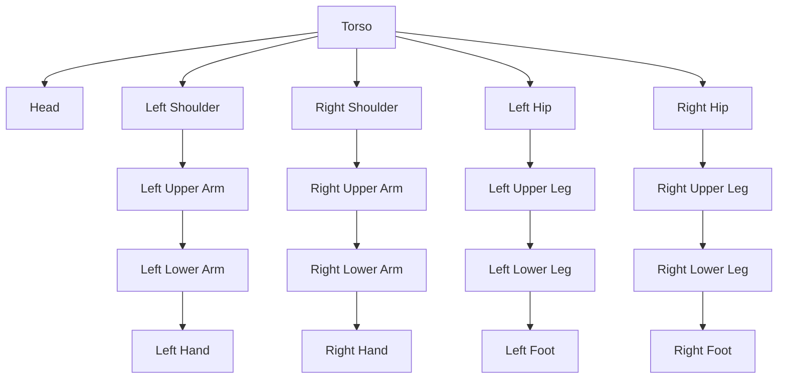

# Humanoid URDF - Links, Joints, Sensors

## Learning Objectives

By the end of this chapter, students will be able to:
- Define URDF and its role in representing humanoid robots
- Create humanoid robot models using URDF with proper links and joints
- Configure sensors using URDF for humanoid robots
- Validate and visualize humanoid URDF models in ROS 2
- Implement proper kinematic chains for humanoid robots

## Introduction to URDF for Humanoid Robots

Unified Robot Description Format (URDF) is an XML-based format used in ROS to describe robot models. For humanoid robots, URDF is essential for defining the complex structure that includes multiple limbs, a torso, and a head. Unlike simpler wheeled robots, humanoid robots require precise modeling of their anthropomorphic structure.

URDF defines the physical and visual properties of a robot, including:
- Kinematic structure (links and joints)
- Visual and collision properties
- Inertial properties
- Sensor configurations

## Link Elements in Humanoid Robots

Links are rigid, unmovable parts of the robot. In humanoid robots, links represent body parts such as:

- Torso/Body
- Head
- Upper arms
- Lower arms
- Hands
- Upper legs
- Lower legs
- Feet

### Link Definition Structure

```xml
<link name="link_name">
  <inertial>
    <origin xyz="0 0 0" rpy="0 0 0"/>
    <mass value="0.1"/>
    <inertia ixx="0.01" ixy="0.0" ixz="0.0" iyy="0.01" iyz="0.0" izz="0.01"/>
  </inertial>
  <visual>
    <origin xyz="0 0 0" rpy="0 0 0"/>
    <geometry>
      <box size="0.1 0.1 0.1"/>
    </geometry>
    <material name="blue">
      <color rgba="0 0 1 1"/>
    </material>
  </visual>
  <collision>
    <origin xyz="0 0 0" rpy="0 0 0"/>
    <geometry>
      <box size="0.1 0.1 0.1"/>
    </geometry>
  </collision>
</link>
```

## Joint Elements in Humanoid Robots

Joints connect the links of a humanoid robot and define how they can move relative to each other. Humanoid robots require many joints to achieve human-like mobility.

### Joint Types

1. **Fixed**: No movement (e.g., attaching a sensor to a link)
2. **Continuous**: Unlimited rotation around an axis (e.g., wheel)
3. **Revolute**: Limited rotation around an axis (e.g., elbow, knee)
4. **Prismatic**: Linear movement along an axis (e.g., linear actuator)

### Joint Definition Structure

```xml
<joint name="joint_name" type="revolute">
  <parent link="parent_link_name"/>
  <child link="child_link_name"/>
  <origin xyz="0 0 0" rpy="0 0 0"/>
  <axis xyz="0 0 1"/>
  <limit lower="-1.57" upper="1.57" effort="100" velocity="1"/>
</joint>
```

### Anthropomorphic Joint Configuration

For humanoid robots, key joint configurations include:

- **Hip joints**: Usually 3 DOF (flexion/extension, abduction/adduction, internal/external rotation)
- **Knee joints**: 1 DOF (flexion/extension)
- **Ankle joints**: 2 DOF (dorsiflexion/plantarflexion, inversion/eversion)
- **Shoulder joints**: 3 DOF (flexion/extension, abduction/adduction, internal/external rotation)
- **Elbow joints**: 1 DOF (flexion/extension)
- **Wrist joints**: 2 DOF (flexion/extension, radial/ulnar deviation)

## Sensor Integration in Humanoid URDF

Humanoid robots typically have multiple sensors integrated into their structure:

- **Cameras**: Usually placed in the head for vision
- **IMUs**: Distributed across the body for balance and orientation
- **Force/Torque sensors**: In feet and hands for manipulation and balance
- **LiDAR**: On head or torso for environment perception
- **Tactile sensors**: In hands and feet for contact information

### Sensor Definition in URDF

```xml
<gazebo reference="sensor_link">
  <sensor name="camera" type="camera">
    <always_on>true</always_on>
    <update_rate>30.0</update_rate>
    <camera name="head">
      <horizontal_fov>1.3962634</horizontal_fov>
      <image>
        <format>R8G8B8</format>
        <width>800</width>
        <height>600</height>
      </image>
      <clip>
        <near>0.1</near>
        <far>100</far>
      </clip>
    </camera>
  </sensor>
</gazebo>
```

## Complete Humanoid URDF Example

Here's a simplified URDF example for a basic humanoid robot:

```xml
<?xml version="1.0"?>
<robot name="simple_humanoid">
  <!-- Torso -->
  <link name="torso">
    <visual>
      <geometry>
        <box size="0.3 0.2 0.5"/>
      </geometry>
      <material name="grey">
        <color rgba="0.5 0.5 0.5 1"/>
      </material>
    </visual>
    <collision>
      <geometry>
        <box size="0.3 0.2 0.5"/>
      </geometry>
    </collision>
    <inertial>
      <mass value="10.0"/>
      <inertia ixx="1.0" ixy="0.0" ixz="0.0" iyy="1.0" iyz="0.0" izz="1.0"/>
    </inertial>
  </link>

  <!-- Head -->
  <link name="head">
    <visual>
      <geometry>
        <sphere radius="0.1"/>
      </geometry>
      <material name="skin">
        <color rgba="0.8 0.5 0.3 1"/>
      </material>
    </visual>
    <collision>
      <geometry>
        <sphere radius="0.1"/>
      </geometry>
    </collision>
    <inertial>
      <mass value="2.0"/>
      <inertia ixx="0.008" ixy="0.0" ixz="0.0" iyy="0.008" iyz="0.0" izz="0.008"/>
    </inertial>
  </link>

  <!-- Neck joint -->
  <joint name="neck_joint" type="revolute">
    <parent link="torso"/>
    <child link="head"/>
    <origin xyz="0 0 0.35" rpy="0 0 0"/>
    <axis xyz="0 1 0"/>
    <limit lower="-0.5" upper="0.5" effort="10" velocity="1"/>
  </joint>

  <!-- Left Shoulder -->
  <link name="left_upper_arm">
    <visual>
      <geometry>
        <cylinder length="0.3" radius="0.05"/>
      </geometry>
      <material name="blue">
        <color rgba="0 0 1 1"/>
      </material>
    </visual>
    <collision>
      <geometry>
        <cylinder length="0.3" radius="0.05"/>
      </geometry>
    </collision>
    <inertial>
      <mass value="1.0"/>
      <inertia ixx="0.0075" ixy="0.0" ixz="0.0" iyy="0.0025" iyz="0.0" izz="0.0075"/>
    </inertial>
  </link>

  <!-- Left shoulder joint -->
  <joint name="left_shoulder_joint" type="revolute">
    <parent link="torso"/>
    <child link="left_upper_arm"/>
    <origin xyz="0.2 0.1 0.1" rpy="0 0 0"/>
    <axis xyz="1 0 0"/>
    <limit lower="-1.57" upper="1.57" effort="10" velocity="1"/>
  </joint>

  <!-- Similar definitions for other limbs -->
</robot>
```

## URDF Validation and Visualization

Validating URDF models is crucial for humanoid robots:

### Checking Kinematic Chains
- Ensure all parts are connected to the base through valid joint chains
- Verify that there are no disconnected links
- Identify any loops in the kinematic structure

### Visualization in RViz
```bash
roslaunch urdf_tutorial display.launch model:='$(find your_package)/urdf/your_humanoid.urdf'
```

### Kinematic Analysis
Use ROS tools to analyze:
- Forward kinematics
- Inverse kinematics
- Jacobians for manipulation

## Best Practices for Humanoid URDF

### Naming Conventions
- Use consistent naming for limbs (e.g., left_leg_upper, right_leg_upper)
- Use clear prefixes (e.g., head_cam, torso_imu)
- Maintain consistency between URDF and TF frame names

### Model Accuracy
- Use realistic inertial properties
- Ensure collision geometry is appropriate for planning
- Validate mass properties and center of mass

### Performance Considerations
- Simplify collision geometry where possible
- Use appropriate mesh resolution
- Consider computational requirements for simulation

## Diagram: Humanoid Robot Kinematic Structure



## Common Challenges with Humanoid URDF

### Complexity Management
- Organize URDF with xacro macros for readability
- Modularize components (arms, legs) for easier editing
- Use includes for repeated elements

### Kinematic Solutions
- Handle redundant kinematic chains
- Ensure reachability for required tasks
- Validate joint limits prevent self-collision

### Simulation Accuracy
- Accurate inertial properties for dynamics
- Proper friction models for feet and hands
- Correct mass distribution for stability

## Exercises

1. Create URDF definitions for a simplified humanoid model with at least 20 DOF.
2. Define proper joint limits for a humanoid arm to prevent self-collision.
3. Add visual and collision properties to your humanoid URDF model.
4. Validate your URDF using the check_urdf command in ROS 2.

## Quiz

1. What does URDF stand for?
   - A) Unified Robot Description Format
   - B) Universal Robot Design Framework
   - C) Universal Robot Dynamics Format
   - D) Underactuated Robot Description Format

2. Which joint type would be most appropriate for an elbow joint?
   - A) Fixed
   - B) Continuous
   - C) Revolute
   - D) Prismatic

3. What is the primary purpose of the inertial properties in a URDF link?
   - A) Define visual appearance
   - B) Define physical properties for dynamics simulation
   - C) Define collision detection
   - D) Define sensor properties

## Reflection

Consider the challenges of modeling a full humanoid robot in URDF. How does the complexity of the model affect simulation performance? What trade-offs exist between model accuracy and computational efficiency? How would you approach modeling a 30+ DOF humanoid robot with multiple sensors?

How might you extend the basic URDF format to include additional information relevant to humanoid robots, such as actuator constraints or energy models? What are the limitations of URDF for complex humanoid robots and how are these typically addressed?