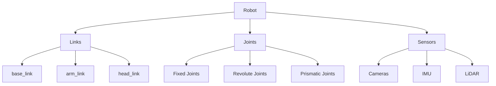
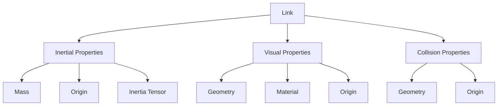

# Humanoid URDF - Links, Joints, Sensors

## Learning Objectives

By the end of this chapter, students will be able to:
- Define URDF and explain its role in robot description
- Create links with geometric, visual, and collision properties
- Define joints with appropriate constraints and kinematics
- Incorporate sensors into URDF models
- Understand the specific requirements for humanoid robot descriptions
- Validate and visualize URDF models

## Introduction to URDF

Unified Robot Description Format (URDF) is an XML-based format used to describe robot models in ROS. URDF stands for "Unified Robot Description Format" and it allows you to define the physical and visual properties of a robot, including its links, joints, sensors, and their relationships to each other.

URDF is fundamental to ROS-based robotics because it provides a standardized way to describe robot geometry, kinematics, dynamics, and other properties. It's used in simulation, visualization, control, and other robot applications.

## URDF Structure and Components

A URDF file defines a robot as a collection of rigid bodies (links) connected by joints and optionally includes sensors and other elements.

### Basic URDF Structure

```xml
<?xml version="1.0"?>
<robot name="my_robot">
  <!-- Links -->
  <link name="base_link">
    <!-- Link properties -->
  </link>

  <!-- Joints -->
  <joint name="joint_name" type="joint_type">
    <!-- Joint properties -->
  </joint>

  <!-- Sensors -->
  <sensor name="sensor_name" type="sensor_type">
    <!-- Sensor properties -->
  </sensor>
</robot>
```

## Diagrams

### URDF Structure Overview



The above diagram illustrates the basic components of a URDF file: Links, Joints, and Sensors.

### Link Structure in URDF



This diagram shows the internal structure of a URDF link with its three main components.

## Links in URDF

Links are the rigid bodies that make up the robot. Each link has properties related to geometry, visual appearance, and collision detection.

### Basic Link Structure

```xml
<link name="link_name">
  <!-- Inertial properties -->
  <inertial>
    <origin xyz="0 0 0" rpy="0 0 0"/>
    <mass value="1.0"/>
    <inertia ixx="1.0" ixy="0.0" ixz="0.0" iyy="1.0" iyz="0.0" izz="1.0"/>
  </inertial>

  <!-- Visual properties -->
  <visual>
    <origin xyz="0 0 0" rpy="0 0 0"/>
    <geometry>
      <box size="1 1 1"/>
    </geometry>
    <material name="blue">
      <color rgba="0 0 1 1"/>
    </material>
  </visual>

  <!-- Collision properties -->
  <collision>
    <origin xyz="0 0 0" rpy="0 0 0"/>
    <geometry>
      <box size="1 1 1"/>
    </geometry>
  </collision>
</link>
```

### Link Components

1. **Inertial**: Defines mass, center of mass, and inertia tensor
   - `mass`: Mass of the link in kg
   - `inertia`: 3x3 inertia matrix (only diagonal elements needed if using principal axes)
   - `origin`: Position and orientation of the inertial frame

2. **Visual**: Defines how the link appears in visualization tools
   - `geometry`: Shape (box, cylinder, sphere, mesh)
   - `material`: Color and texture information
   - `origin`: Position and orientation of the visual frame

3. **Collision**: Defines the collision geometry for physics simulation
   - `geometry`: Shape used for collision detection
   - `origin`: Position and orientation of the collision frame

## Joint Types in URDF

Joints define how links connect and move relative to each other. URDF supports several joint types:

### Joint Types

1. **Revolute**: Rotational joint with limited range
2. **Continuous**: Rotational joint without limits
3. **Prismatic**: Linear sliding joint with limits
4. **Fixed**: No movement between links
5. **Floating**: 6-DOF motion (not commonly used)
6. **Planar**: Motion parallel to a plane

### Joint Definition Structure

```xml
<joint name="joint_name" type="joint_type">
  <parent link="parent_link_name"/>
  <child link="child_link_name"/>
  <origin xyz="x y z" rpy="roll pitch yaw"/>
  <axis xyz="x y z"/>
  <limit lower="-1.57" upper="1.57" effort="100" velocity="3.0"/>
  <dynamics damping="0.5" friction="0.1"/>
</joint>
```

### Joint Components

- `parent` and `child`: Links that the joint connects
- `origin`: Position and orientation of the joint in the parent link frame
- `axis`: Axis of rotation or translation
- `limit`: Joint limits (for revolute and prismatic joints)
- `dynamics`: Joint friction and damping parameters

## Humanoid-Specific URDF Considerations

Humanoid robots have special requirements in their URDF descriptions due to their complex kinematic structure.

### Basic Humanoid Topology

A humanoid robot typically has:
1. **Torso/Body**: The central link
2. **Head**: Connected to the torso
3. **Arms**: Left and right arms with shoulder, elbow, and wrist joints
4. **Legs**: Left and right legs with hip, knee, and ankle joints

### Humanoid Joint Configuration

Humanoid joints need to match the degrees of freedom (DOF) of human joints:

- **Hip joints**: Typically 3 DOF (flexion/extension, abduction/adduction, rotation)
- **Knee joints**: 1 DOF (flexion/extension)
- **Ankle joints**: 2 DOF (flexion/extension, abduction/adduction)
- **Shoulder joints**: 3 DOF (flexion/extension, abduction/adduction, rotation)
- **Elbow joints**: 1 DOF (flexion/extension)
- **Wrist joints**: 2-3 DOF (flexion/extension, abduction/adduction, rotation)

### Example Humanoid Skeleton

```xml
<robot name="simple_humanoid">
  <!-- Torso -->
  <link name="base_link">
    <inertial>
      <mass value="10"/>
      <origin xyz="0 0 0.5"/>
      <inertia ixx="1" ixy="0" ixz="0" iyy="1" iyz="0" izz="1"/>
    </inertial>
    <visual>
      <geometry>
        <box size="0.5 0.3 1.0"/>
      </geometry>
    </visual>
    <collision>
      <geometry>
        <box size="0.5 0.3 1.0"/>
      </geometry>
    </collision>
  </link>

  <!-- Head -->
  <link name="head">
    <inertial>
      <mass value="2"/>
      <inertia ixx="0.1" ixy="0" ixz="0" iyy="0.1" iyz="0" izz="0.1"/>
    </inertial>
    <visual>
      <geometry>
        <sphere radius="0.15"/>
      </geometry>
    </visual>
  </link>

  <joint name="torso_to_head" type="fixed">
    <parent link="base_link"/>
    <child link="head"/>
    <origin xyz="0 0 1.0"/>
  </joint>
</robot>
```

## Sensors in URDF

URDF can also describe sensors attached to the robot.

### Sensor Definition Structure

```xml
<sensor name="camera" type="camera">
  <origin xyz="0.1 0 0.1" rpy="0 0 0"/>
  <parent link="head"/>
  <camera name="my_camera">
    <horizontal_fov>1.047</horizontal_fov>
    <image>
      <width>640</width>
      <height>480</height>
      <format>R8G8B8</format>
    </image>
    <clip>
      <near>0.1</near>
      <far>100</far>
    </clip>
  </camera>
</sensor>
```

### Common Sensor Types

1. **Camera**: Visual sensors with specific parameters
2. **IMU**: Inertial measurement units
3. **LiDAR**: Range sensors
4. **Force/Torque**: Sensors measuring forces and torques
5. **GPS**: Global positioning sensors

## Coordinate Frames in Humanoid URDF

Proper coordinate frame definition is crucial for humanoid robots:

### Standard Humanoid Frame Convention

- **Pelvis (or base) frame**: Usually at the center of the hip joint or center of mass
- **Z-axis**: Points upward (opposes gravity)
- **X-axis**: Points forward in the intended direction of movement
- **Y-axis**: Points to the left (right-hand rule)

### Joint Axis Directions

- **Hip flexion**: Rotation around lateral axis (positive rotation lifts leg forward)
- **Knee flexion**: Rotation around lateral axis (positive rotation flexes knee)
- **Ankle flexion**: Rotation around lateral axis (positive rotation points toes down)
- **Shoulder flexion**: Rotation around lateral axis (positive rotation raises arm forward)

## URDF Validation and Visualization

### Validation

Before using a URDF file, it's important to validate it:

1. **XML validation**: Check for valid XML syntax
2. **URDF validation**: Ensure the robot model is kinematically valid
3. **Simulation validation**: Test in a physics simulator

### Visualization Tools

- **RViz**: ROS visualization tool
- **Gazebo**: Physics simulator with visualization
- **Blender**: 3D modeling tool with URDF import
- **URDF Viewer**: Standalone tools for URDF visualization

## Xacro: URDF's XML Macro System

Xacro is an XML macro language that makes complex URDF files more manageable:

```xml
<?xml version="1.0"?>
<robot xmlns:xacro="http://www.ros.org/wiki/xacro" name="my_robot">
  <!-- Define properties -->
  <xacro:property name="M_PI" value="3.14159"/>

  <!-- Define macros -->
  <xacro:macro name="simple_link" params="name mass xyz:='0 0 0' rpy:='0 0 0'">
    <link name="${name}">
      <inertial>
        <mass value="${mass}"/>
        <origin xyz="${xyz}" rpy="${rpy}"/>
        <inertia ixx="1" ixy="0" ixz="0" iyy="1" iyz="0" izz="1"/>
      </inertial>
      <visual>
        <origin xyz="${xyz}" rpy="${rpy}"/>
        <geometry>
          <sphere radius="0.05"/>
        </geometry>
      </visual>
    </link>
  </xacro:macro>

  <!-- Use the macro -->
  <xacro:simple_link name="link1" mass="0.5" xyz="0 0 0.1"/>
</robot>
```

### Benefits of Xacro

- **Parameterization**: Use variables instead of hard-coded values
- **Macros**: Define reusable components
- **Conditionals**: Include elements based on conditions
- **Mathematical expressions**: Calculate values using expressions

## Advanced URDF Features

### Transmission Elements

Define how actuators connect to joints:

```xml
<transmission name="wheel_trans">
  <type>transmission_interface/SimpleTransmission</type>
  <joint name="wheel_joint">
    <hardwareInterface>hardware_interface/EffortJointInterface</hardwareInterface>
  </joint>
  <actuator name="wheel_motor">
    <hardwareInterface>hardware_interface/EffortJointInterface</hardwareInterface>
    <mechanicalReduction>1</mechanicalReduction>
  </actuator>
</transmission>
```

### Gazebo-Specific Extensions

Add simulation-specific properties:

```xml
<gazebo reference="link_name">
  <material>Gazebo/Blue</material>
  <mu1>0.2</mu1>
  <mu2>0.2</mu2>
</gazebo>
```

## Best Practices for Humanoid URDF

### Design Principles

1. **Realistic dimensions**: Use actual robot dimensions when available
2. **Accurate inertial properties**: Get mass and inertia values from CAD or measurement
3. **Proper joint limits**: Set realistic joint limits based on physical robot
4. **Consistent naming**: Use clear, consistent naming conventions

### Performance Considerations

1. **Simplified collision geometry**: Use simpler shapes for collision detection
2. **Appropriate mesh resolution**: Balance visual quality with performance
3. **Hierarchical structure**: Organize URDF sensibly for easy maintenance

### Validation Checklist

- [ ] Model has a single continuous chain (no loops)
- [ ] All joints connect existing links
- [ ] No orphaned links
- [ ] Joint limits are reasonable
- [ ] Inertial properties are physically plausible
- [ ] Visual and collision properties are defined

## Exercises

1. Create a simplified URDF model of a humanoid robot with trunk, head, 2 arms, and 2 legs, including at least one sensor.
2. Use Xacro to parameterize the dimensions of your humanoid model, allowing for easy scaling.
3. Define the proper joint configuration for a humanoid hip with 3 degrees of freedom.

## Quiz

1. What does URDF stand for?
   - A) Universal Robot Description Format
   - B) Unified Robot Description Format
   - C) Universal Robot Design Framework
   - D) Unified Robot Design Framework

2. Which joint type allows unlimited rotation?
   - A) Revolute
   - B) Prismatic
   - C) Fixed
   - D) Continuous

3. What is the purpose of the `<inertial>` tag in a URDF link?
   - A) To define how the link appears visually
   - B) To define the mass and inertial properties for physics simulation
   - C) To specify collision detection geometry
   - D) To set joint limits

## Reflection

Consider the importance of accurate robot modeling using URDF in the development of humanoid robots. How does a properly defined URDF model facilitate simulation, control, and real-world deployment? What are the potential consequences of errors in a URDF model when used in simulation or control systems? How might the approach to modeling differ between a research humanoid robot and a commercial one?