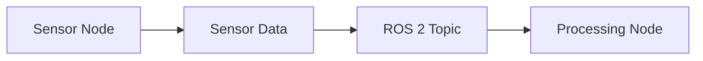
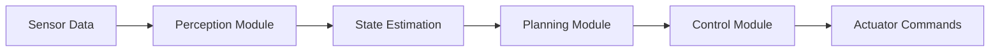
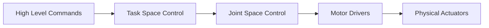
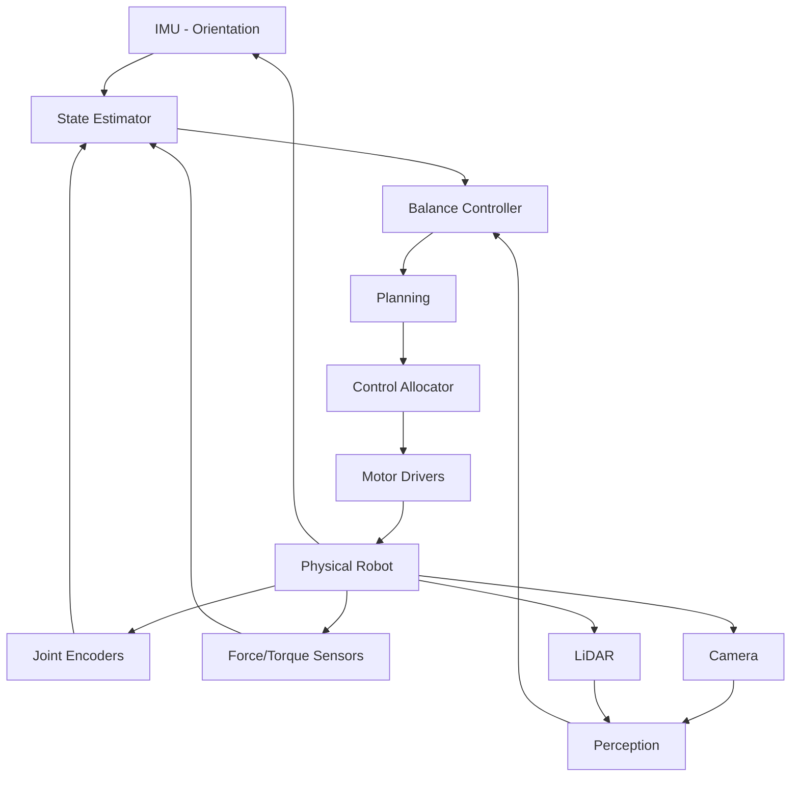
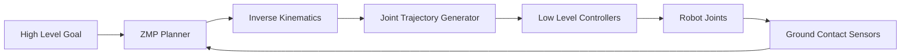

# Robot Data Flow - Sensor→Processing→Actuation

## Learning Objectives

By the end of this chapter, students will be able to:
- Explain the fundamental data flow patterns in robotic systems
- Describe the sensor→processing→actuation pipeline
- Implement data flow patterns using ROS 2 topics, services, and actions
- Analyze and optimize data flow for real-time performance
- Design robust data flow architectures for humanoid robots

## Introduction to Robot Data Flow

Robot data flow refers to the flow of information through a robotic system, from sensors gathering environmental data to processors interpreting that data and actuators responding to it. Understanding and designing effective data flow is critical for creating responsive, reliable robotic systems.

The basic robot data flow pipeline consists of three major components:
1. **Sensor Input**: Gathering data about the robot's state and environment
2. **Processing**: Interpreting sensor data and making decisions
3. **Actuation**: Executing physical actions based on processing results

## Sensor Data Acquisition

Sensors provide the robot with information about its internal state and external environment. Common sensor types include:

### Internal State Sensors
- Joint encoders: Position, velocity, and torque of joints
- IMUs: Orientation, angular velocity, and linear acceleration
- Force/torque sensors: Forces applied to robot limbs
- Battery monitors: Power level and consumption

### Environmental Sensors
- Cameras: Visual information
- LiDAR: 3D environment mapping
- Sonar/IR: Distance measurement
- Tactile sensors: Contact detection

### Sensor Data Flow Patterns

Sensors typically operate in a publish-subscribe pattern:



## Processing Layer

The processing layer interprets sensor data and makes decisions. This includes:

### Perception Processing
- Object recognition and tracking
- Environment mapping
- State estimation
- Sensor fusion

### Planning and Control
- Path planning
- Motion planning
- Control algorithms
- Behavioral decision-making

### Processing Data Flow Patterns

Processing typically involves transformation of data:



## Actuation Systems

Actuation converts processing decisions into physical actions. This includes:

### Motor Control
- Joint position control
- Joint torque control
- Force control
- Impedance control

### Actuator Data Flow

Actuator commands flow from high-level decisions to low-level control:



## ROS 2 Communication Patterns

ROS 2 provides several communication patterns for managing robot data flow:

### Topics (Publish-Subscribe)
- Asynchronous, one-way communication
- Sensor data typically published to topics
- Multiple nodes can subscribe to the same topic
- Real-time friendly with DDS implementation

### Services (Request-Response)
- Synchronous, two-way communication
- Used for blocking operations
- Request/response pattern
- Good for configuration and control commands

### Actions (Goal-Feedback-Result)
- Asynchronous with feedback
- Used for long-running operations
- Goal, feedback, and result pattern
- Ideal for navigation and manipulation tasks

## Real-Time Considerations

Real-time performance is critical in robotic systems:

### Timing Requirements
- Control loops require consistent timing
- Sensor fusion needs predictable delays
- Actuator commands must be timely

### Data Flow Optimization
- Minimize data copying
- Use efficient serialization
- Optimize computational complexity

### Priority-Based Execution
- Higher priority for safety-critical tasks
- Lower priority for non-critical tasks
- Proper thread and process scheduling

## Example: Humanoid Balance Control Data Flow

Let's examine the data flow for humanoid balance control:



## Middleware and Communication Middleware

ROS 2 uses DDS (Data Distribution Service) as its middleware, which provides:

### Quality of Service (QoS) Settings
- Reliability: Guaranteed delivery vs. best-effort
- Durability: Keeping data for late-joining subscribers
- Deadline: Maximum time between publications
- Lifespan: How long data persists after publication

### Example QoS Configuration

```python
from rclpy.qos import QoSProfile, QoSDurabilityPolicy, QoSReliabilityPolicy

# For sensor data: high frequency, best-effort delivery
sensor_qos = QoSProfile(
    depth=10,
    durability=QoSDurabilityPolicy.VOLATILE,
    reliability=QoSReliabilityPolicy.BEST_EFFORT
)

# For critical commands: guaranteed delivery
command_qos = QoSProfile(
    depth=10,
    durability=QoSDurabilityPolicy.VOLATILE,
    reliability=QoSReliabilityPolicy.RELIABLE
)
```

## Sensor Fusion in Data Flow

Sensor fusion combines data from multiple sensors to improve accuracy:

### Kalman Filtering
- Combines multiple sensor readings
- Estimates state with uncertainty
- Predicts future states

### Example Sensor Fusion Node

```python
import rclpy
from rclpy.node import Node
from sensor_msgs.msg import Imu, JointState
from nav_msgs.msg import Odometry

class SensorFusionNode(Node):
    def __init__(self):
        super().__init__('sensor_fusion_node')
        
        # Subscribe to multiple sensor topics
        self.imu_sub = self.create_subscription(
            Imu, 'imu/data', self.imu_callback, 10)
        self.joint_sub = self.create_subscription(
            JointState, 'joint_states', self.joint_callback, 10)
        self.odom_pub = self.create_publisher(
            Odometry, 'fused_odom', 10)
        
        # Initialize fusion algorithm
        self.initialize_fusion()
    
    def imu_callback(self, msg):
        # Process IMU data into fusion algorithm
        self.fuse_imu_data(msg)
        self.publish_fused_state()
    
    def joint_callback(self, msg):
        # Process joint data into fusion algorithm
        self.fuse_joint_data(msg)
        self.publish_fused_state()
```

## Control Architecture Patterns

Different control architectures affect data flow:

### Centralized Control
- All processing in one node
- Simple coordination
- Potential performance bottleneck

### Distributed Control
- Processing distributed across nodes
- Better performance and modularity
- More complex coordination

### Hierarchical Control
- Multiple control levels
- High-level planning, low-level execution
- Good for complex robots like humanoids

## Data Flow for Humanoid Locomotion

Humanoid locomotion requires complex data flow:

### Walking Pattern Generation


### Balance Control
- Continuously monitors robot state
- Adjusts control based on disturbances
- Maintains stability during movement

## Performance Monitoring and Logging

Monitoring data flow performance:

### Metrics to Track
- Message publish/subscribe rates
- End-to-end latency
- Processing time per node
- Memory and CPU usage

### Tools for Monitoring
- ros2 topic hz: Check message rates
- ros2 topic delay: Check message latency
- rqt_graph: Visualize node topology
- Custom logging for performance analysis

## Security Considerations in Data Flow

As robots become more connected:

### Data Integrity
- Verify sensor data authenticity
- Protect against malicious inputs
- Implement secure communication

### Access Control
- Limit access to critical topics
- Authenticate nodes joining the system
- Implement role-based permissions

## Common Data Flow Patterns

### Sensor Processing Pattern
```
Sensor → Filter → Process → Publish
```

### Control Loop Pattern
```
Sensor → State Estimation → Plan → Control → Actuator
```

### Feedback Control Pattern
```
Sensor → Process → Control → Actuator → Sensor (loop)
```

## Troubleshooting Data Flow Issues

### Common Problems
- Message delays or drops
- Node synchronization issues
- Network bandwidth constraints
- Memory leaks in long-running processes

### Debugging Strategies
- Use rqt_graph to visualize node connections
- Monitor message rates with ros2 topic hz
- Check memory and CPU usage
- Implement structured logging

## Exercises

1. Design a data flow architecture for a humanoid robot performing a simple walking task, identifying all the nodes and topics involved.
2. Implement a simple sensor fusion node that combines data from multiple sensors using a Kalman filter approach.
3. Create a performance monitor that tracks message rates and latencies between nodes.
4. Design a safety layer that monitors data flow and shuts down the robot if critical messages are not received within a timeout.

## Quiz

1. What are the three main components of the robot data flow pipeline?
   - A) Input, Output, Processing
   - B) Sensor, Processing, Actuation
   - C) Perception, Planning, Control
   - D) Hardware, Software, Network

2. Which ROS 2 communication pattern is best suited for long-running operations with feedback?
   - A) Topics
   - B) Services
   - C) Actions
   - D) Parameters

3. What does QoS stand for in ROS 2?
   - A) Quality of Service
   - B) Quick Operating System
   - C) Quantitative Observation System
   - D) Query and Output System

## Reflection

Consider how different applications might require different data flow patterns. How would the data flow for a humanoid robot performing delicate manipulation tasks differ from one performing robust navigation tasks? What are the trade-offs between centralized and distributed control architectures in terms of performance, reliability, and maintainability? How might the data flow architecture need to adapt as robots become more autonomous and intelligent?