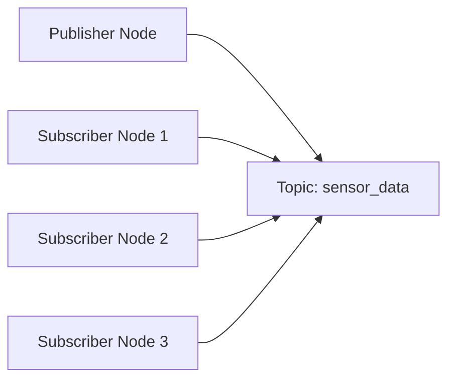
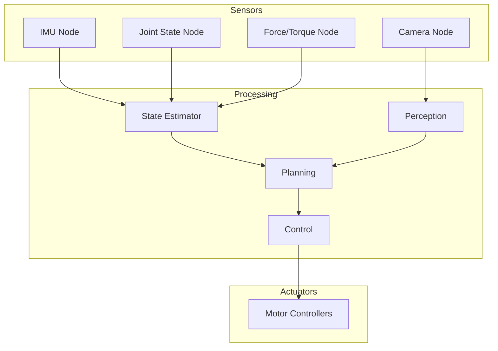

# ROS 2 Architecture - Nodes, Topics, Services, Actions

## Learning Objectives

By the end of this chapter, students will be able to:
- Explain the fundamental concepts of ROS 2 architecture
- Implement nodes, topics, services, and actions in ROS 2
- Design appropriate communication patterns for robotic applications
- Analyze and optimize ROS 2 communication for performance and reliability
- Apply ROS 2 architecture principles to humanoid robot systems

## Introduction to ROS 2 Architecture

ROS 2 (Robot Operating System 2) is a flexible framework for writing robot software. Unlike traditional ROS, ROS 2 is built on DDS (Data Distribution Service), which provides better support for real-time systems, multi-robot systems, and commercial products.

The core components of ROS 2 architecture include:
- **Nodes**: Processes that perform computation
- **Topics**: Named buses over which nodes exchange messages
- **Services**: Synchronous request/response communication
- **Actions**: Asynchronous goal/fetch/receive pattern for long-running tasks

## Nodes in ROS 2

Nodes are the basic execution units of a ROS 2 program. Each node runs a specific task or set of tasks within a robotic system.

### Node Structure

```python
import rclpy
from rclpy.node import Node

class MyNode(Node):
    def __init__(self):
        super().__init__('node_name')
        # Initialize publishers, subscribers, services, etc.
        self.get_logger().info('Node has been started')

def main(args=None):
    rclpy.init(args=args)
    node = MyNode()
    rclpy.spin(node)
    node.destroy_node()
    rclpy.shutdown()

if __name__ == '__main__':
    main()
```

### Node Lifecycle

In ROS 2, nodes can have different lifecycle states to manage complex applications:

- Unconfigured → Inactive → Active → Finalized
- This helps manage resource usage and system complexity

## Topics and Publishers/Subscribers

Topics provide a publish/subscribe communication pattern in ROS 2. This is ideal for sensor data, robot state information, and other continuously updated data streams.

### Creating a Publisher

```python
import rclpy
from rclpy.node import Node
from std_msgs.msg import String

class MinimalPublisher(Node):
    def __init__(self):
        super().__init__('minimal_publisher')
        self.publisher_ = self.create_publisher(String, 'topic', 10)
        timer_period = 0.5  # seconds
        self.timer = self.create_timer(timer_period, self.timer_callback)
        self.i = 0

    def timer_callback(self):
        msg = String()
        msg.data = 'Hello World: %d' % self.i
        self.publisher_.publish(msg)
        self.get_logger().info('Publishing: "%s"' % msg.data)
        self.i += 1
```

### Creating a Subscriber

```python
import rclpy
from rclpy.node import Node
from std_msgs.msg import String

class MinimalSubscriber(Node):
    def __init__(self):
        super().__init__('minimal_subscriber')
        self.subscription = self.create_subscription(
            String,
            'topic',
            self.listener_callback,
            10)
        self.subscription  # prevent unused variable warning

    def listener_callback(self, msg):
        self.get_logger().info('I heard: "%s"' % msg.data)
```

### Topic Communication Pattern



### Quality of Service (QoS) Settings

```python
from rclpy.qos import QoSProfile, QoSHistoryPolicy, QoSReliabilityPolicy

# Example QoS profile for sensor data
qos_profile = QoSProfile(
    history=QoSHistoryPolicy.KEEP_LAST,
    depth=10,
    reliability=QoSReliabilityPolicy.BEST_EFFORT,
    durability=QoSDurabilityPolicy.VOLATILE
)
```

## Services

Services provide a synchronous request/response communication pattern. This is useful for operations that require immediate responses, such as configuration changes or single calculations.

### Creating a Service Server

```python
from example_interfaces.srv import AddTwoInts
import rclpy
from rclpy.node import Node

class MinimalService(Node):
    def __init__(self):
        super().__init__('minimal_service')
        self.srv = self.create_service(AddTwoInts, 'add_two_ints', self.add_two_ints_callback)

    def add_two_ints_callback(self, request, response):
        response.sum = request.a + request.b
        self.get_logger().info('Incoming request\na: %d b: %d' % (request.a, request.b))
        return response
```

### Creating a Service Client

```python
from example_interfaces.srv import AddTwoInts
import rclpy
from rclpy.node import Node

class MinimalClientAsync(Node):
    def __init__(self):
        super().__init__('minimal_client_async')
        self.cli = self.create_client(AddTwoInts, 'add_two_ints')
        while not self.cli.wait_for_service(timeout_sec=1.0):
            self.get_logger().info('service not available, waiting again...')
        self.req = AddTwoInts.Request()

    def send_request(self, a, b):
        self.req.a = a
        self.req.b = b
        self.future = self.cli.call_async(self.req)
        rclpy.spin_until_future_complete(self, self.future)
        return self.future.result()
```

## Actions

Actions are used for long-running tasks that require feedback and the ability to cancel. This is perfect for navigation, manipulation, and other complex robotic behaviors.

### Action Structure

An action has three parts:
- **Goal**: The request to start a long-running task
- **Feedback**: Information sent back during execution
- **Result**: The final outcome of the task

### Creating an Action Server

```python
import rclpy
from rclpy.action import ActionServer
from rclpy.node import Node
from example_interfaces.action import Fibonacci

class FibonacciActionServer(Node):
    def __init__(self):
        super().__init__('fibonacci_action_server')
        self._action_server = ActionServer(
            self,
            Fibonacci,
            'fibonacci',
            self.execute_callback)

    def execute_callback(self, goal_handle):
        self.get_logger().info('Executing goal...')
        
        feedback_msg = Fibonacci.Feedback()
        feedback_msg.sequence = [0, 1]
        
        for i in range(1, goal_handle.request.order):
            if goal_handle.is_cancel_requested:
                goal_handle.canceled()
                self.get_logger().info('Goal canceled')
                return Fibonacci.Result()
            
            feedback_msg.sequence.append(
                feedback_msg.sequence[i] + feedback_msg.sequence[i-1])
            
            goal_handle.publish_feedback(feedback_msg)
            
        goal_handle.succeed()
        result = Fibonacci.Result()
        result.sequence = feedback_msg.sequence
        return result
```

### Creating an Action Client

```python
import rclpy
from rclpy.action import ActionClient
from rclpy.node import Node
from example_interfaces.action import Fibonacci

class FibonacciActionClient(Node):
    def __init__(self):
        super().__init__('fibonacci_action_client')
        self._action_client = ActionClient(
            self,
            Fibonacci,
            'fibonacci')

    def send_goal(self, order):
        goal_msg = Fibonacci.Goal()
        goal_msg.order = order

        self._action_client.wait_for_server()
        self._send_goal_future = self._action_client.send_goal_async(
            goal_msg,
            feedback_callback=self.feedback_callback)

        self._send_goal_future.add_done_callback(self.goal_response_callback)

    def goal_response_callback(self, future):
        goal_handle = future.result()
        if not goal_handle.accepted:
            self.get_logger().info('Goal rejected')
            return

        self.get_logger().info('Goal accepted')
        self._get_result_future = goal_handle.get_result_async()
        self._get_result_future.add_done_callback(self.get_result_callback)

    def feedback_callback(self, feedback_msg):
        feedback = feedback_msg.feedback
        self.get_logger().info('Received feedback: {0}'.format(feedback.sequence))
```

## Communication Pattern Selection

Choosing the right communication pattern is crucial for effective robotic system design:

### When to Use Topics (Publish/Subscribe)
- Sensor data streams
- Robot state broadcasting
- Event notifications
- Many-to-many communication

### When to Use Services
- Configuration requests
- Single calculations
- Synchronous operations
- One-to-one communication

### When to Use Actions
- Long-running tasks
- Tasks requiring progress feedback
- Operations that might need cancellation
- Complex robot behaviors

## Network Communication in ROS 2

ROS 2 uses DDS (Data Distribution Service) as its middleware, which handles network communication:

### DDS Implementation Options
- Fast DDS (default)
- Cyclone DDS
- RTI Connext DDS
- Eclipse Zenoh

### Network Configuration

```bash
# Setting the ROS domain ID to isolate networks
export ROS_DOMAIN_ID=1

# Setting the DDS discovery server
export RMW_IMPLEMENTATION=rmw_fastrtps_cpp
```

## Advanced Communication Patterns

### Latched Topics

Latched topics keep the last published message and send it to new subscribers:

```python
from rclpy.qos import QoSProfile, QoSDurabilityPolicy

latched_qos = QoSProfile(
    depth=1,
    durability=QoSDurabilityPolicy.TRANSIENT_LOCAL
)
```

### Message Filters

Message filters allow for synchronization of messages from multiple topics:

```python
from message_filters import ApproximateTimeSynchronizer, Subscriber

# Example: synchronizing camera image and depth data
image_sub = Subscriber(self, Image, 'camera/image')
depth_sub = Subscriber(self, Image, 'camera/depth')

ats = ApproximateTimeSynchronizer([image_sub, depth_sub], queue_size=5, slop=0.1)
ats.registerCallback(self.sync_callback)
```

## Performance Considerations

### Message Size
- Large messages can impact performance
- Consider compression for large data (e.g., images)
- Limit the frequency of large message publishing

### Network Bandwidth
- Monitor network usage in multi-robot systems
- Use QoS settings to optimize for bandwidth
- Consider data preprocessing on the publisher side

### CPU Usage
- Be mindful of callback execution time
- Use threading for CPU-intensive operations
- Monitor node performance with tools

## Debugging ROS 2 Communication

### Tools for Analysis
- `ros2 topic list`: List all topics
- `ros2 topic echo <topic_name>`: View topic messages
- `ros2 node list`: List all nodes
- `ros2 run rqt_graph rqt_graph`: Visualize the node graph

### Example Debugging Workflow

```bash
# List all available topics
ros2 topic list

# Check what messages are being published to a specific topic
ros2 topic echo /sensor_data

# Find the rate of messages on a topic
ros2 topic hz /sensor_data

# Check the type of messages on a topic
ros2 topic type /sensor_data

# Get information about a topic
ros2 topic info /sensor_data
```

## ROS 2 Architecture for Humanoid Robots

Humanoid robots have complex communication needs, requiring careful architecture design:

### Sensor Integration Architecture
- High-frequency sensor streams (IMU, joint encoders) via topics
- Camera data with appropriate QoS settings
- Sensor fusion nodes to combine multiple inputs

### Control Architecture
- Motion planning using services for configuration
- Walking pattern generation as actions
- Low-level control with high-frequency topics

### Diagram: Humanoid Robot Communication Architecture



## Best Practices

### Naming Conventions
- Use consistent, descriptive names
- Follow ROS 2 naming standards
- Use underscores instead of camelCase

### Error Handling
- Implement proper error handling in nodes
- Use logging effectively
- Handle network disconnections gracefully

### Resource Management
- Properly destroy nodes and subscriptions
- Monitor memory usage in long-running nodes
- Implement appropriate cleanup routines

## Exercises

1. Create a node that publishes joint states and another that subscribes to them to calculate the robot's center of mass.
2. Implement a service for changing robot operational modes (e.g., from walking to manipulation).
3. Design an action for humanoid walking that provides step-by-step feedback.
4. Create a node that visualizes the ROS 2 graph of your humanoid robot system.

## Quiz

1. What does DDS stand for in ROS 2?
   - A) Dynamic Data System
   - B) Data Distribution Service
   - C) Distributed Development System
   - D) Data Definition Service

2. Which communication pattern is best for long-running tasks with feedback?
   - A) Topics
   - B) Services
   - C) Actions
   - D) Parameters

3. What is the primary purpose of Quality of Service (QoS) settings in ROS 2?
   - A) To define the data types of messages
   - B) To control the network protocol used
   - C) To specify communication reliability and performance characteristics
   - D) To encrypt ROS 2 communications

## Reflection

Consider how the different communication patterns in ROS 2 affect the design of robotic systems. How does the choice between topics, services, and actions impact the reliability, performance, and maintainability of a humanoid robot system? What are the trade-offs between synchronous and asynchronous communication patterns in safety-critical robotic applications?