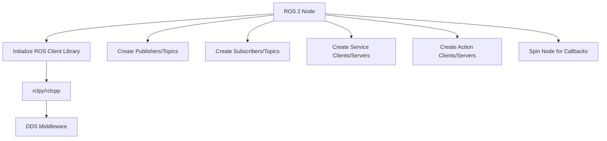
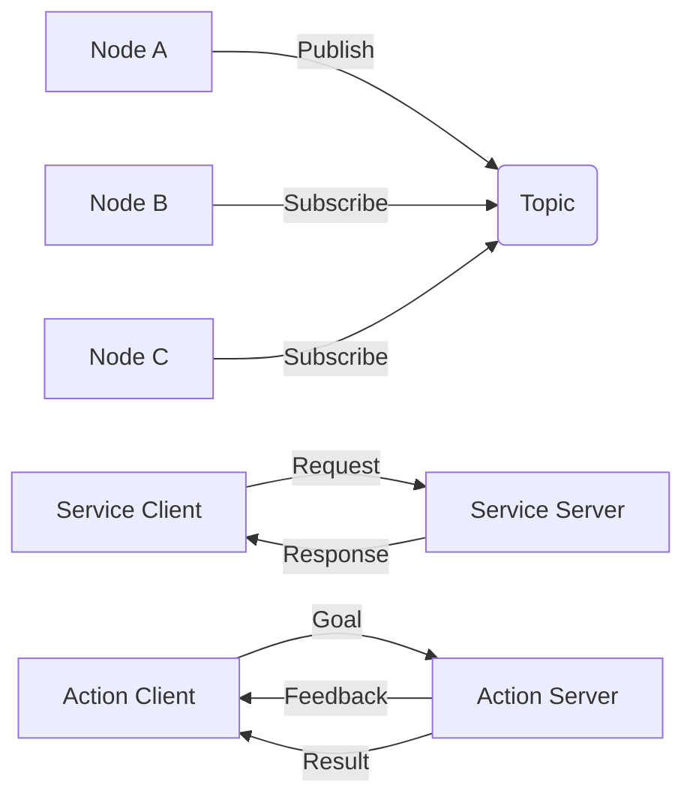

# ROS 2 Architecture - Nodes, Topics, Services, Actions

## Learning Objectives

By the end of this chapter, students will be able to:
- Explain the fundamental concepts of ROS 2 architecture
- Identify and describe the roles of nodes, topics, services, and actions
- Understand how these components interact in a robot system
- Differentiate between topics, services, and actions based on communication patterns
- Design simple distributed systems using ROS 2 concepts

## Introduction to ROS 2 Architecture

Robot Operating System 2 (ROS 2) is a flexible framework for writing robot software that provides libraries and tools to help create robot applications. Unlike traditional robot programming approaches that require monolithic systems, ROS 2 promotes a distributed architecture where different software components run as separate processes and communicate using standardized interfaces.

ROS 2 is middleware that provides a publish-subscribe communication model, service calls, and action interfaces to enable communication between processes. It also handles message serialization, discovery, and transport of messages between nodes.

### Key Principles of ROS 2

- **Distributed Computing**: Components run as separate processes that can be distributed across multiple machines
- **Message-Based Communication**: All communication happens through messages with standardized interfaces
- **Language Independence**: Nodes can be written in multiple languages (C++, Python, etc.) and communicate seamlessly
- **Modularity**: Components can be developed, tested, and deployed independently
- **Reusability**: Components can be reused across different robot platforms

## Nodes

Nodes are the fundamental execution units in ROS 2. A node is essentially a process that performs computation, and each node in a ROS system performs a specific function in the robot ecosystem.

### Characteristics of Nodes

- **Process-based**: Each node runs as a separate process, allowing for isolation and fault tolerance
- **Single Responsibility**: Each node should have a well-defined, specific function
- **Communication Interface**: Nodes communicate with other nodes through topics, services, and actions
- **Node Names**: Each node has a unique name within the ROS graph for identification
- **Namespace**: Nodes can be organized into namespaces for better organization

### Node Implementation

When creating a node, you need to:
- Initialize the ROS client library
- Create publishers and subscribers
- Create service clients and servers
- Create action clients and servers
- Spin the node to process callbacks

## Diagrams

### ROS 2 Node Architecture

The above diagram shows the structure of a ROS 2 node and its communication interfaces.

### Communication Patterns Overview

This diagram illustrates the different communication patterns in ROS 2: topics (publish/subscribe), services (request/response), and actions (goal/feedback/result).

## Topics and Publish-Subscribe Communication

Topics implement a publish-subscribe communication pattern where nodes can publish messages to a topic and other nodes can subscribe to that topic to receive messages.

### Characteristics of Topics

- **Asynchronous**: Publishers and subscribers don't need to run simultaneously
- **Many-to-Many**: Multiple publishers can publish to a topic, and multiple subscribers can listen to the same topic
- **Unidirectional**: Communication flows from publishers to subscribers
- **Typed**: Each topic has a specific message type that defines the structure of messages
- **Decoupled**: Publishers and subscribers are decoupled in time and space

### Quality of Service (QoS)

ROS 2 provides Quality of Service profiles that allow customization of communication behavior:
- **Reliability**: Reliable vs. best-effort delivery
- **Durability**: Whether messages persist for late-joining subscribers
- **History**: How many messages to keep in the queue
- **Deadline**: Maximum time between consecutive messages
- **Liveliness**: How to detect if a publisher is still active

## Services

Services implement a request-response communication pattern. A client sends a request and waits for a response from a server. This is synchronous communication.

### Characteristics of Services

- **Synchronous**: Client waits for response before continuing
- **One-to-One**: One client communicates with one server at a time
- **Bidirectional**: Request goes from client to server, response goes from server to client
- **Typed**: Both request and response have specific message types
- **Stateless**: Each service call is independent

### When to Use Services

- When you need a specific response to a request
- For operations that have a definite start and end
- When you need to guarantee that the operation was completed
- For configuration parameters or one-time commands

## Actions

Actions are used for long-running tasks that may take a significant amount of time to complete. They combine the features of topics and services.

### Characteristics of Actions

- **Goal/Result/Feedback**: Actions have a goal (request), result (response), and feedback (ongoing updates)
- **Interruption**: Actions can be canceled or preempted while running
- **Asynchronous**: Client doesn't block while action is executing
- **State Tracking**: Provides information about the current state of the action
- **Multiple Phases**: Goal → Running → Success/Aborted/Canceled/Exception

### Action States

- **Pending**: Goal accepted but not started
- **Active**: Goal is being processed
- **Succeeded**: Goal completed successfully
- **Aborted**: Goal execution failed
- **Canceled**: Goal was canceled during execution
- **Rejected**: Goal was rejected by the server

### When to Use Actions

- For long-running operations (navigation, manipulation, etc.)
- When you need feedback during execution
- When operations may be interrupted or canceled
- When you need to track the progress of a task

## Communication Patterns Comparison

| Pattern | Type | Synchronous | Use Case |
|---------|------|-------------|----------|
| Topics | Publish-Subscribe | No | Continuous data streams (sensors, state) |
| Services | Request-Response | Yes | One-time operations with immediate response |
| Actions | Goal-Based | No | Long-running operations with progress tracking |

## ROS 2 Middleware Infrastructure

### DDS (Data Distribution Service)

ROS 2 uses DDS as its underlying middleware. DDS is a vendor-neutral standard for real-time distributed systems that handles:
- Discovery: How nodes find each other
- Data modeling: How information is structured
- Quality of Service: How communication is configured
- Security: How communication is protected
- Interaction patterns: How nodes communicate

### ROS 2 Client Libraries (RCL)

ROS 2 provides client libraries that wrap DDS to provide a user-friendly API:
- **rclcpp**: C++ client library
- **rclpy**: Python client library
- ROS 2 implementations in other languages

## Design Patterns in ROS 2

### Node Composition

- **Standalone Nodes**: Each function runs in a separate process for maximum isolation
- **Node Composition**: Multiple nodes can be combined into a single process to reduce communication overhead

### Parameter Server

- **Dynamic Configuration**: Nodes can have parameters that can be changed at runtime
- **Centralized Management**: Parameters can be managed and updated centrally
- **Node-specific**: Each node has its own parameter namespace

### Lifecycle Nodes

- **Managed Lifecycle**: Nodes can have defined lifecycle states (unconfigured, inactive, active, finalized)
- **State Transitions**: Explicit transitions between states with callbacks
- **Managed Execution**: Lifecycle can be managed by a lifecycle manager

## Best Practices

### Naming Conventions

- Use descriptive names for nodes, topics, services, and actions
- Organize with namespaces (e.g., `/arm/joint_states`, `/base/velocity`)
- Use consistent naming patterns across your system

### Message Design

- Keep messages small and efficient
- Use appropriate data types for the information being conveyed
- Include timestamps when temporal information is important
- Document the meaning of each field in the message

### Error Handling

- Implement proper error handling in all communication patterns
- Use appropriate Quality of Service settings for your use case
- Monitor node health and communication status
- Handle disconnections and reconnections gracefully

## Exercises

1. Design a simple robot system with at least 4 nodes and identify the communication patterns between them.
2. Explain when you would use topics vs. services vs. actions for controlling a robotic arm.
3. Identify the QoS settings that would be most appropriate for different types of robot communication (e.g., sensor data, high-priority commands).

## Quiz

1. What is a ROS 2 node?
   - A) A hardware component in a robot
   - B) A process that performs computation and communicates with other processes
   - C) A type of message in ROS 2
   - D) A network protocol

2. Which communication pattern is synchronous?
   - A) Topics
   - B) Services
   - C) Actions
   - D) Publishers

3. What makes actions different from services?
   - A) Actions are faster than services
   - B) Actions are asynchronous and can provide feedback and be interrupted
   - C) Actions can only be used with Python
   - D) There is no difference between actions and services

## Reflection

Consider how the distributed architecture of ROS 2 enables more robust and maintainable robot systems compared to monolithic approaches. How might the communication patterns (topics, services, actions) be used in humanoid robotics specifically? What advantages does this approach provide for developing complex physical AI systems?