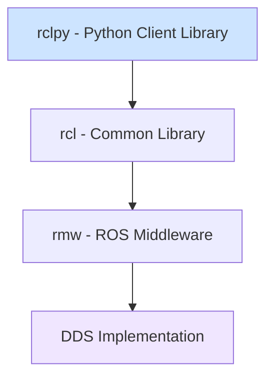
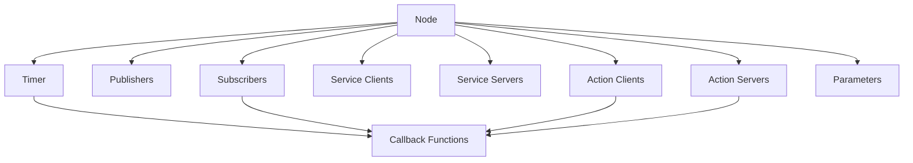

# ROS 2 with Python - rclpy Usage

## Learning Objectives

By the end of this chapter, students will be able to:
- Set up a Python environment for ROS 2 development
- Create ROS 2 nodes using the rclpy client library
- Implement publishers and subscribers in Python
- Create service clients and servers in Python
- Create action clients and servers in Python
- Implement parameter usage in Python nodes
- Debug and test Python-based ROS 2 nodes

## Introduction to rclpy

rclpy is the Python client library for ROS 2, providing Python bindings for the ROS 2 middleware. It allows developers to create ROS 2 nodes, publishers, subscribers, services, and actions using Python. Python is an excellent choice for ROS 2 development due to its ease of use, extensive libraries, and rapid prototyping capabilities.

The rclpy library provides a Pythonic interface to ROS 2 concepts while maintaining compatibility with other ROS 2 client libraries like rclcpp (C++).

## Diagrams

### rclpy Architecture



### Basic Node Structure



## Setting Up Python for ROS 2

### Prerequisites

Before developing with rclpy, ensure you have:
- A working ROS 2 installation (Humble Hawksbill or newer)
- Python 3.8 or higher
- pip for package management

### ROS 2 Environment Setup

```bash
# Source the ROS 2 setup script
source /opt/ros/humble/setup.bash  # or your ROS 2 distribution name

# Create a workspace
mkdir -p ~/ros2_workspace/src
cd ~/ros2_workspace

# Source workspace (if you have custom packages)
source install/setup.bash
```

## Creating Your First ROS 2 Node with rclpy

A ROS 2 node is a process that performs computation. Here's a basic example of creating a node:

```python title="minimal_publisher.py"
import rclpy
from rclpy.node import Node
from std_msgs.msg import String


class MinimalPublisher(Node):
    def __init__(self):
        super().__init__('minimal_publisher')
        self.publisher_ = self.create_publisher(String, 'topic', 10)
        timer_period = 0.5  # seconds
        self.timer = self.create_timer(timer_period, self.timer_callback)
        self.i = 0

    def timer_callback(self):
        msg = String()
        msg.data = f'Hello World: {self.i}'
        self.publisher_.publish(msg)
        self.get_logger().info(f'Publishing: "{msg.data}"')
        self.i += 1


def main(args=None):
    rclpy.init(args=args)

    minimal_publisher = MinimalPublisher()

    rclpy.spin(minimal_publisher)

    minimal_publisher.destroy_node()
    rclpy.shutdown()


if __name__ == '__main__':
    main()
```

### Code Explanation

1. **Import statements**: Import rclpy and the necessary message types
2. **Node class**: Create a class that inherits from `rclpy.node.Node`
3. **Initialization**: Call `super().__init__()` with a unique node name
4. **Create publisher**: Use `create_publisher()` to create a publisher
5. **Create timer**: Use `create_timer()` to create a periodic callback
6. **Timer callback**: Function called periodically to publish messages
7. **Main function**: Initialize, run, and cleanup

## Publishers and Subscribers

### Publishing Messages

Publishers send messages to topics. The publisher we created earlier demonstrates the basic usage:

```python
# Create a publisher with message type String, topic name 'topic', and QoS history depth 10
self.publisher_ = self.create_publisher(String, 'topic', 10)

# In the callback, create and publish a message
msg = String()
msg.data = "Hello World"
self.publisher_.publish(msg)
```

### Subscribing to Messages

Subscribers receive messages from topics:

```python title="minimal_subscriber.py"
import rclpy
from rclpy.node import Node
from std_msgs.msg import String


class MinimalSubscriber(Node):
    def __init__(self):
        super().__init__('minimal_subscriber')
        self.subscription = self.create_subscription(
            String,
            'topic',
            self.listener_callback,
            10)
        self.subscription  # prevent unused variable warning

    def listener_callback(self, msg):
        self.get_logger().info(f'I heard: "{msg.data}"')


def main(args=None):
    rclpy.init(args=args)

    minimal_subscriber = MinimalSubscriber()

    rclpy.spin(minimal_subscriber)

    minimal_subscriber.destroy_node()
    rclpy.shutdown()


if __name__ == '__main__':
    main()
```

### Quality of Service (QoS) in Python

QoS settings can be specified when creating publishers and subscribers:

```python
from rclpy.qos import QoSProfile, ReliabilityPolicy, DurabilityPolicy

# Create a custom QoS profile
qos_profile = QoSProfile(
    depth=10,
    reliability=ReliabilityPolicy.RELIABLE,
    durability=DurabilityPolicy.VOLATILE
)

# Use the QoS profile when creating publisher/subscriber
publisher = self.create_publisher(String, 'topic', qos_profile)
```

## Services in rclpy

Services implement a request-response pattern for synchronous communication.

### Service Server

```python title="add_two_ints_server.py"
from example_interfaces.srv import AddTwoInts
import rclpy
from rclpy.node import Node


class MinimalService(Node):
    def __init__(self):
        super().__init__('minimal_service')
        self.srv = self.create_service(AddTwoInts, 'add_two_ints', self.add_two_ints_callback)

    def add_two_ints_callback(self, request, response):
        response.sum = request.a + request.b
        self.get_logger().info(f'Returning {request.a} + {request.b} = {response.sum}')
        return response


def main(args=None):
    rclpy.init(args=args)

    minimal_service = MinimalService()

    rclpy.spin(minimal_service)

    rclpy.shutdown()


if __name__ == '__main__':
    main()
```

### Service Client

```python title="add_two_ints_client.py"
from example_interfaces.srv import AddTwoInts
import rclpy
from rclpy.node import Node


class MinimalClient(Node):
    def __init__(self):
        super().__init__('minimal_client')
        self.cli = self.create_client(AddTwoInts, 'add_two_ints')
        while not self.cli.wait_for_service(timeout_sec=1.0):
            self.get_logger().info('service not available, waiting again...')
        self.req = AddTwoInts.Request()

    def send_request(self, a, b):
        self.req.a = a
        self.req.b = b
        self.future = self.cli.call_async(self.req)
        rclpy.spin_until_future_complete(self, self.future)
        return self.future.result()


def main(args=None):
    rclpy.init(args=args)

    minimal_client = MinimalClient()
    response = minimal_client.send_request(1, 2)
    minimal_client.get_logger().info(
        f'Result of add_two_ints: {response.sum}')

    minimal_client.destroy_node()
    rclpy.shutdown()


if __name__ == '__main__':
    main()
```

## Actions in rclpy

Actions are used for long-running tasks with feedback and the ability to cancel.

### Action Server

```python title="fibonacci_action_server.py"
from rclpy.action import ActionServer, CancelResponse, GoalResponse
from rclpy.callback_groups import ReentrantCallbackGroup
from rclpy.executors import MultiThreadedExecutor
from rclpy.node import Node
from example_interfaces.action import Fibonacci


class FibonacciActionServer(Node):
    def __init__(self):
        super().__init__('fibonacci_action_server')
        self._action_server = ActionServer(
            self,
            Fibonacci,
            'fibonacci',
            execute_callback=self.execute_callback,
            callback_group=ReentrantCallbackGroup(),
            goal_callback=self.goal_callback,
            cancel_callback=self.cancel_callback)

    def destroy(self):
        self._action_server.destroy()
        super().destroy_node()

    def goal_callback(self, goal_request):
        self.get_logger().info('Received goal request')
        return GoalResponse.ACCEPT

    def cancel_callback(self, goal_handle):
        self.get_logger().info('Received cancel request')
        return CancelResponse.ACCEPT

    def execute_callback(self, goal_handle):
        self.get_logger().info('Executing goal...')

        feedback_msg = Fibonacci.Feedback()
        feedback_msg.sequence = [0, 1]

        for i in range(1, goal_handle.request.order):
            if goal_handle.is_cancel_requested:
                goal_handle.canceled()
                self.get_logger().info('Goal canceled')
                return Fibonacci.Result()

            feedback_msg.sequence.append(
                feedback_msg.sequence[i] + feedback_msg.sequence[i-1])

            self.get_logger().info(f'Publishing feedback: {feedback_msg.sequence}')
            goal_handle.publish_feedback(feedback_msg)

        goal_handle.succeed()
        result = Fibonacci.Result()
        result.sequence = feedback_msg.sequence
        self.get_logger().info(f'Returning result: {result.sequence}')

        return result


def main(args=None):
    rclpy.init(args=args)

    fibonacci_action_server = FibonacciActionServer()

    executor = MultiThreadedExecutor()
    rclpy.spin(fibonacci_action_server, executor=executor)

    fibonacci_action_server.destroy()
    rclpy.shutdown()


if __name__ == '__main__':
    main()
```

### Action Client

```python title="fibonacci_action_client.py"
from rclpy.action import ActionClient
from rclpy.node import Node
from example_interfaces.action import Fibonacci


class FibonacciActionClient(Node):
    def __init__(self):
        super().__init__('fibonacci_action_client')
        self._action_client = ActionClient(
            self,
            Fibonacci,
            'fibonacci')

    def send_goal(self, order):
        goal_msg = Fibonacci.Goal()
        goal_msg.order = order

        self._action_client.wait_for_server()

        self._send_goal_future = self._action_client.send_goal_async(
            goal_msg,
            feedback_callback=self.feedback_callback)

        self._send_goal_future.add_done_callback(self.goal_response_callback)

    def goal_response_callback(self, future):
        goal_handle = future.result()
        if not goal_handle.accepted:
            self.get_logger().info('Goal rejected :(')
            return

        self.get_logger().info('Goal accepted :)')

        self._get_result_future = goal_handle.get_result_async()
        self._get_result_future.add_done_callback(self.get_result_callback)

    def get_result_callback(self, future):
        result = future.result().result
        self.get_logger().info(f'Result: {result.sequence}')
        rclpy.shutdown()

    def feedback_callback(self, feedback_msg):
        feedback = feedback_msg.feedback
        self.get_logger().info(f'Received feedback: {feedback.sequence}')


def main(args=None):
    rclpy.init(args=args)

    action_client = FibonacciActionClient()
    action_client.send_goal(10)

    rclpy.spin(action_client)


if __name__ == '__main__':
    main()
```

## Parameters in rclpy

Parameters allow nodes to be configured at runtime:

```python title="parameter_node.py"
import rclpy
from rclpy.node import Node


class ParameterNode(Node):
    def __init__(self):
        super().__init__('parameter_node')

        # Declare parameters with default values
        self.declare_parameter('my_parameter', 'default_value')
        self.declare_parameter('integer_param', 42)
        self.declare_parameter('double_param', 3.14)
        self.declare_parameter('boolean_param', True)

        # Get parameter values
        my_param = self.get_parameter('my_parameter').value
        self.get_logger().info(f'My parameter: {my_param}')

        # Set a callback for parameter changes
        self.add_on_set_parameters_callback(self.parameter_callback)

    def parameter_callback(self, params):
        for param in params:
            self.get_logger().info(f'Parameter {param.name} changed to {param.value}')
        return SetParametersResult(successful=True)


def main(args=None):
    rclpy.init(args=args)

    parameter_node = ParameterNode()

    rclpy.spin(parameter_node)

    parameter_node.destroy_node()
    rclpy.shutdown()


if __name__ == '__main__':
    main()
```

## Working with Custom Message Types

To use custom message types, you need to define them in a package and install them:

1. Create a package with `.msg` files in the `msg/` directory
2. Add the message definition to `CMakeLists.txt` or `setup.py`
3. Build the package: `colcon build`
4. Source the setup files: `source install/setup.bash`

```bash
# Example custom message definition in msg/Num.msg
int64 num
```

```python
# Use the custom message
from my_package.msg import Num

# Create and use the message
msg = Num()
msg.num = 42
publisher.publish(msg)
```

## Debugging rclpy Nodes

### Logging

Use the built-in logging capabilities:

```python
# Different log levels
self.get_logger().debug('This is a debug message')
self.get_logger().info('This is an info message')
self.get_logger().warn('This is a warning message')
self.get_logger().error('This is an error message')
self.get_logger().fatal('This is a fatal message')
```

### Common Debugging Techniques

1. **Print/Log statements**: Add logging to track execution flow
2. **ROS 2 tools**: Use `ros2 topic echo`, `ros2 service call`, etc.
3. **Python debugger**: Use `pdb` for interactive debugging:

```python
import pdb
pdb.set_trace()  # Set breakpoint
```

## Best Practices for rclpy Development

### Code Organization

- Use proper Python package structure
- Separate different components into different files
- Use meaningful names for nodes, topics, and services
- Follow Python naming conventions (PEP 8)

### Error Handling

- Handle exceptions appropriately
- Check for service availability before making calls
- Handle node shutdown gracefully
- Validate input parameters

### Performance Considerations

- Minimize data copying in callbacks
- Use appropriate QoS settings for your use case
- Be aware of callback execution times
- Consider threading for CPU-intensive operations

### Testing

- Use `launch` system for integration testing
- Write unit tests for individual components
- Test with realistic message rates
- Test error conditions and recovery

## Exercises

1. Create a publisher that publishes the current time to a topic every second, and a subscriber that prints the received time.
2. Implement a service server that converts temperatures between Celsius and Fahrenheit, and a client that uses this service.
3. Design and implement a custom message type for exchanging robot pose information (position and orientation).

## Quiz

1. What is rclpy?
   - A) A C++ client library for ROS 2
   - B) A Python client library for ROS 2
   - C) A communication protocol for robots
   - D) A visualization tool for ROS 2

2. How do you create a publisher in rclpy?
   - A) `self.create_publisher(message_type, topic_name, queue_size)`
   - B) `rclpy.create_publisher(node, message_type, topic_name)`
   - C) `Publisher(message_type, topic_name)`
   - D) `self.publisher(message_type, topic_name, queue_size)`

3. What is the purpose of Quality of Service (QoS) settings in ROS 2?
   - A) To limit the amount of memory used by nodes
   - B) To configure communication behavior like reliability and durability
   - C) To specify the programming language used
   - D) To determine which nodes can communicate with each other

## Reflection

Consider the advantages and disadvantages of using Python versus C++ for ROS 2 development. When would you choose one over the other? What types of robot applications might benefit from Python's ease of use versus C++'s performance? How does rclpy facilitate rapid prototyping in robotics development?