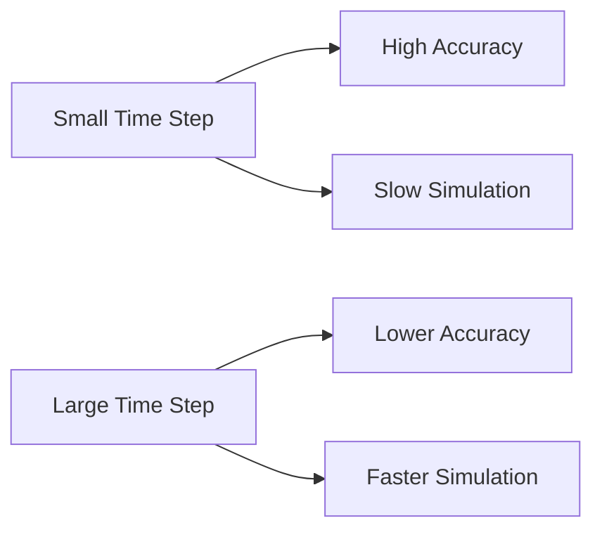

# Gazebo Physics, Collisions, Environment Design

## Learning Objectives

By the end of this chapter, students will be able to:
- Configure Gazebo physics properties for realistic simulation
- Design collision geometries for robotic systems
- Create complex environments for robot testing
- Optimize simulation performance
- Integrate custom sensors and actuators with physics simulation

## Introduction to Gazebo Physics

Gazebo is a 3D simulation environment that provides physics simulation, sensor simulation, and rendering capabilities for robotics development. Understanding Gazebo's physics engine is crucial for creating realistic robotic simulations.

Gazebo uses physics engines like ODE (Open Dynamics Engine), Bullet, and DART to simulate:
- Rigid body dynamics
- Contact simulation
- Collision detection
- Friction models

## Physics Configuration in Gazebo

### World File Physics Definition

The physics engine is configured in the world file with properties like:

```xml
<sdf version='1.6'>
  <world name='default'>
    <!-- Physics properties -->
    <physics type='ode'>
      <max_step_size>0.001</max_step_size>
      <real_time_factor>1</real_time_factor>
      <real_time_update_rate>1000</real_time_update_rate>
      <gravity>0 0 -9.8</gravity>
    </physics>
    
    <!-- Rest of world definition -->
  </world>
</sdf>
```

### Physics Engine Parameters

#### Time Step Configuration
- `max_step_size`: The maximum time step size for the physics update (smaller = more accurate but slower)
- `real_time_update_rate`: Rate at which the simulation runs in real time
- `real_time_factor`: Ratio of simulation time to real time (1.0 = real-time)

#### Gravity Settings
- Default gravity is 0 0 -9.8 (m/s²) for Earth-like gravity
- Can be modified for different environments (Moon, Mars, zero-G)

### Physics Performance vs. Accuracy Trade-offs



## Collision Detection in Gazebo

### Collision Geometry

Collision geometry defines the shape used for collision detection. It can differ from visual geometry for performance reasons:

```xml
<link name="collision_link">
  <collision name="collision">
    <origin xyz="0 0 0" rpy="0 0 0"/>
    <geometry>
      <!-- Can use simpler geometry than visual -->
      <box size="0.1 0.1 0.1"/>
    </geometry>
    <surface>
      <friction>
        <ode>
          <mu>1.0</mu>
          <mu2>1.0</mu2>
        </ode>
      </friction>
    </surface>
  </collision>
</link>
```

### Types of Collision Geometries

1. **Box**: Rectangular parallelepiped
2. **Sphere**: Spherical collision geometry
3. **Cylinder**: Cylindrical collision geometry
4. **Capsule**: Capsule-shaped collision geometry
5. **Mesh**: Complex geometry based on mesh file
6. **Plane**: Infinite plane for ground surfaces

### Advanced Collision Properties

#### Surface Properties
```xml
<surface>
  <friction>
    <ode>
      <mu>1.0</mu>      <!-- Primary friction coefficient -->
      <mu2>1.0</mu2>    <!-- Secondary friction coefficient -->
      <fdir1>0 0 1</fdir1>  <!-- Friction direction -->
    </ode>
    <torsional>
      <coefficient>1.0</coefficient>
      <use_patch_radius>false</use_patch_radius>
      <surface_radius>0.01</surface_radius>
    </torsional>
  </friction>
  <bounce>
    <restitution_coefficient>0.1</restitution_coefficient>
    <threshold>100000</threshold>
  </bounce>
  <contact>
    <ode>
      <soft_cfm>0.0001</soft_cfm>
      <soft_erp>0.2</soft_erp>
      <kp>10000000</kp>
      <kd>10</kd>
      <max_vel>100</max_vel>
      <min_depth>0.001</min_depth>
    </ode>
  </contact>
</surface>
```

## Environment Design in Gazebo

### Creating Static Environments

Static environments provide the setting for robot operation:

```xml
<sdf version="1.6">
  <world name="indoor_world">
    <!-- Lighting -->
    <include>
      <uri>model://sun</uri>
    </include>
    
    <!-- Ground plane -->
    <include>
      <uri>model://ground_plane</uri>
    </include>
    
    <!-- Objects in the environment -->
    <model name="table">
      <pose>1 0 0 0 0 0</pose>
      <link name="table_base">
        <collision name="collision">
          <geometry>
            <box size="1 0.8 0.8"/>
          </geometry>
        </collision>
        <visual name="visual">
          <geometry>
            <box size="1 0.8 0.8"/>
          </geometry>
          <material>
            <ambient>0.8 0.6 0.4 1</ambient>
            <diffuse>0.8 0.6 0.4 1</diffuse>
          </material>
        </visual>
      </link>
    </model>
  </world>
</sdf>
```

### Building Complex Environments

#### Using Building Editor
Gazebo provides a building editor tool for creating architectural environments:
- Rooms and corridors
- Doors and windows
- Furniture and fixtures
- Textures and materials

#### Spawn Models Dynamically
```bash
# Spawn a model at runtime
gz model -spawn -file=model://cylinder -model-name=cylinder_model -x 1 -y 2 -z 0
```

### Procedural Environment Generation

For complex scenarios, environments can be generated programmatically:

```python
import random

def generate_random_obstacles(num_obstacles, min_x, max_x, min_y, max_y):
    """Generate random obstacles in a given area"""
    for i in range(num_obstacles):
        x = random.uniform(min_x, max_x)
        y = random.uniform(min_y, max_y)
        
        # Create an SDF snippet for an obstacle
        obstacle_sdf = f"""
        <model name='obstacle_{i}'>
          <pose>{x} {y} 0 0 0 0</pose>
          <link name='link'>
            <collision name='collision'>
              <geometry>
                <box size='0.5 0.5 1.0'/>
              </geometry>
            </collision>
            <visual name='visual'>
              <geometry>
                <box size='0.5 0.5 1.0'/>
              </geometry>
            </visual>
            <inertial>
              <mass>1.0</mass>
              <inertia>
                <ixx>1.0</ixx>
                <ixy>0.0</ixy>
                <ixz>0.0</ixz>
                <iyy>1.0</iyy>
                <iyz>0.0</iyz>
                <izz>1.0</izz>
              </inertia>
            </inertial>
          </link>
        </model>
        """
        return obstacle_sdf
```

## Optimizing Physics Simulation

### Performance Optimization Strategies

#### Simplify Collision Geometry
```xml
<!-- Instead of complex mesh -->
<collision name="collision">
  <geometry>
    <mesh><uri>complex_model.dae</uri></mesh>
  </geometry>
</collision>

<!-- Use simpler shapes -->
<collision name="collision">
  <geometry>
    <box size="0.5 0.2 0.3"/>
  </geometry>
</collision>
```

#### Adjust Physics Parameters
- Larger time steps for faster simulation
- Adjust contact parameters for stability
- Use appropriate solver parameters

### Stability and Accuracy

#### ODE Solver Parameters
```xml
<physics type="ode">
  <max_step_size>0.001</max_step_size>
  <real_time_factor>1</real_time_factor>
  <real_time_update_rate>1000</real_time_update_rate>
  <ode>
    <solver>
      <type>quick</type>  <!-- or 'world' -->
      <iters>10</iters>   <!-- Number of iterations -->
      <sor>1.3</sor>      <!-- Successive over-relaxation parameter -->
    </solver>
    <constraints>
      <cfm>0.000001</cfm>  <!-- Constraint Force Mixing -->
      <erp>0.2</erp>      <!-- Error Reduction Parameter -->
      <contact_max_correcting_vel>100.0</contact_max_correcting_vel>
      <contact_surface_layer>0.001</contact_surface_layer>
    </constraints>
  </ode>
</physics>
```

## Humanoid Robot Simulation Considerations

### Balance and Stability

Simulating humanoid robots requires special attention to:
- Accurate inertial properties
- Appropriate friction coefficients
- Proper center of mass placement

#### Inertial Properties for Humanoid Links
```xml
<inertial>
  <mass>2.5</mass>
  <inertia>
    <ixx>0.01</ixx>
    <ixy>0.0</ixy>
    <ixz>0.0</ixz>
    <iyy>0.02</iyy>
    <iyz>0.0</iyz>
    <izz>0.015</izz>
  </inertia>
</inertial>
```

### Contact Sensing for Humanoid Robots

```xml
<gazebo reference="left_foot">
  <sensor name="left_foot_contact" type="contact">
    <always_on>true</always_on>
    <update_rate>30</update_rate>
    <contact>
      <collision>left_foot_collision</collision>
    </contact>
  </sensor>
</gazebo>
```

## Sensor Simulation

### Physics-Based Sensor Simulation

Sensors interact with the physics simulation to provide realistic data:

#### Camera Sensors
```xml
<gazebo reference="camera_link">
  <sensor name="camera" type="camera">
    <update_rate>30</update_rate>
    <camera name="head">
      <horizontal_fov>1.3962634</horizontal_fov>
      <image>
        <width>800</width>
        <height>600</height>
        <format>R8G8B8</format>
      </image>
      <clip>
        <near>0.1</near>
        <far>100</far>
      </clip>
    </camera>
  </sensor>
</gazebo>
```

#### LiDAR Sensors
```xml
<gazebo reference="lidar_link">
  <sensor name="lidar" type="ray">
    <ray>
      <scan>
        <horizontal>
          <samples>360</samples>
          <resolution>1.0</resolution>
          <min_angle>-3.14159</min_angle>
          <max_angle>3.14159</max_angle>
        </horizontal>
      </scan>
      <range>
        <min>0.1</min>
        <max>30.0</max>
        <resolution>0.01</resolution>
      </range>
    </ray>
    <plugin name="lidar_controller" filename="libgazebo_ros_ray_sensor.so">
      <ros>
        <namespace>/lidar</namespace>
        <remapping>~/out:=scan</remapping>
      </ros>
      <output_type>sensor_msgs/LaserScan</output_type>
    </plugin>
  </sensor>
</gazebo>
```

## Advanced Simulation Techniques

### Multi-Physics Simulation

Gazebo can simulate additional physical phenomena:

#### Fluid Simulation
For underwater robots or fluid interactions:
- Buoyancy effects
- Drag forces
- Pressure differentials

#### Thermal Simulation
Future versions may include thermal properties:
- Heat dissipation
- Temperature effects on materials

### Realistic Material Properties

```xml
<gazebo reference="wheel_link">
  <material>
    <gazebo>
      <ambient>0.8 0.8 0.8 1</ambient>
      <diffuse>0.8 0.8 0.8 1</diffuse>
      <specular>0.1 0.1 0.1 1</specular>
    </gazebo>
  </material>
  <max_contacts>10</max_contacts>
  <surface>
    <friction>
      <ode>
        <mu>1.5</mu>
        <mu2>1.5</mu2>
      </ode>
    </friction>
  </surface>
</gazebo>
```

## Debugging Physics Issues

### Common Physics Simulation Problems

#### Robot Falling Through Ground
- Check collision geometry definition
- Verify surface properties
- Check for overlapping collision geometries

#### Jittery Movement
- Reduce time step
- Adjust solver parameters
- Check inertial properties

#### Robot Not Responding to Control
- Verify joint transmission configuration
- Check controller connection
- Validate control commands

### Diagnostic Tools

#### Visualize Contacts
Enable contact visualization in Gazebo to see collision points.

#### Physics Statistics
Monitor simulation performance:
```bash
gz stats
```

#### Debug Topics
Subscribe to physics-related topics:
```bash
rostopic echo /gazebo/link_states
rostopic echo /gazebo/model_states
```

## Simulation Scenarios for Humanoid Robots

### Walking Simulation
- Flat ground walking
- Stair climbing and descending
- Sloped terrain navigation

### Manipulation Simulation
- Object grasping
- Tool use
- Delicate object handling

### Complex Environment Simulation
- Crowded spaces
- Dynamic obstacles
- Multi-room navigation

## Integration with ROS 2

### Gazebo ROS 2 Packages

Gazebo integrates seamlessly with ROS 2 through dedicated packages:
- `gazebo_ros_pkgs`: Core ROS 2 integration
- `ros_gz_bridge`: Bridge between ROS 2 and Gazebo messages
- `gazebo_dev`: Development tools

### Launching Simulation with ROS 2

```python
from launch import LaunchDescription
from launch_ros.actions import Node
from launch.actions import ExecuteProcess
from ament_index_python.packages import get_package_share_directory
import os

def generate_launch_description():
    pkg_dir = get_package_share_directory('your_robot_gazebo')
    
    return LaunchDescription([
        # Launch Gazebo
        ExecuteProcess(
            cmd=['gazebo', '--verbose', '-s', 'libgazebo_ros_factory.so', 
                 os.path.join(pkg_dir, 'worlds', 'your_world.world')],
            output='screen'
        ),
        
        # Robot state publisher
        Node(
            package='robot_state_publisher',
            executable='robot_state_publisher',
            name='robot_state_publisher',
            parameters=[{'use_sim_time': True}]
        ),
        
        # Spawn robot in Gazebo
        Node(
            package='gazebo_ros',
            executable='spawn_entity.py',
            arguments=['-entity', 'your_robot', 
                      '-file', os.path.join(pkg_dir, 'models', 'your_robot.urdf')],
            output='screen'
        )
    ])
```

## Exercises

1. Create a simple environment with a robot navigating around obstacles using Gazebo.
2. Configure physics properties for a humanoid robot to ensure stable walking simulation.
3. Implement contact sensors on robot feet to detect ground contact during walking.
4. Design a complex multi-room environment for humanoid robot navigation.

## Quiz

1. What does ODE stand for in Gazebo physics?
   - A) Open Dynamics Engine
   - B) Operational Dynamics Engine
   - C) Object Detection Engine
   - D) Open Data Environment

2. Which of these is NOT a collision geometry type in Gazebo?
   - A) Box
   - B) Sphere
   - C) Pyramid
   - D) Mesh

3. What parameter controls the maximum simulation time step in Gazebo?
   - A) real_time_factor
   - B) real_time_update_rate
   - C) max_step_size
   - D) gravity

## Reflection

Consider the trade-offs between simulation accuracy and performance in robotics development. How do physics simulation parameters impact the realism of humanoid robot behaviors? What challenges might arise when transferring controllers developed in simulation to real robots? How might environmental complexity affect both simulation performance and controller robustness?