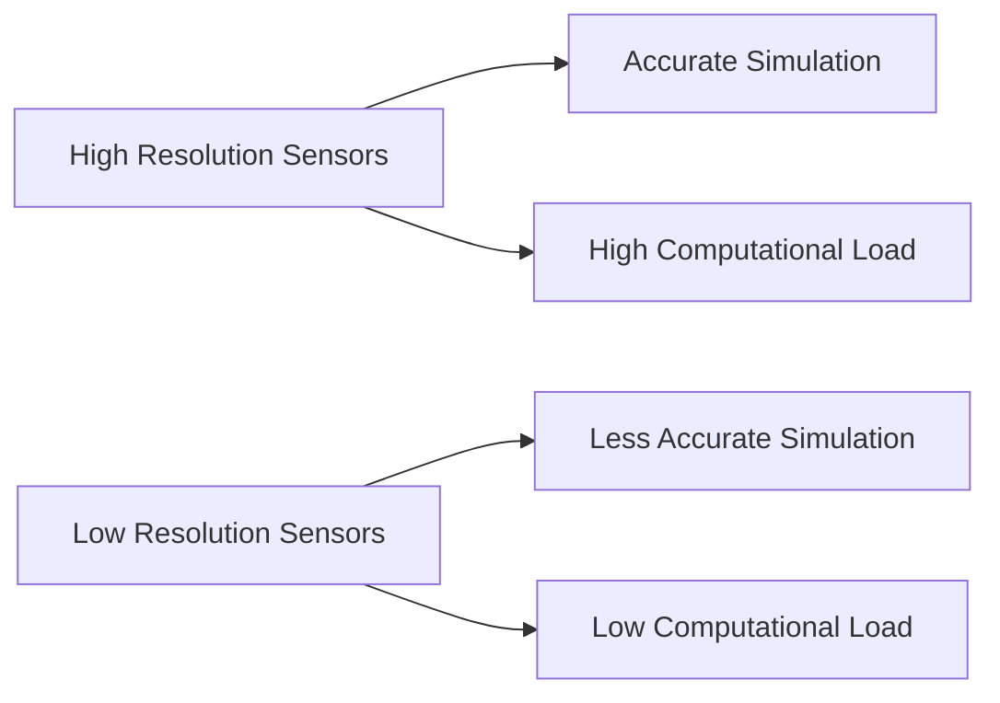

# Sensor Simulation (LiDAR, Depth, IMU)

## Learning Objectives

By the end of this chapter, students will be able to:
- Configure and simulate LiDAR sensors in Gazebo
- Implement depth camera simulation for 3D perception
- Setup and utilize IMU sensors in simulation
- Integrate simulated sensors with ROS 2
- Optimize sensor simulation for performance and accuracy
- Validate sensor data against real-world sensors

## Introduction to Sensor Simulation

Sensor simulation is a critical component of robotics simulation, allowing developers to:
- Test perception algorithms without real hardware
- Develop robots in virtual environments
- Evaluate sensor placement and configuration
- Train machine learning models with synthetic data
- Debug robot behaviors in controlled scenarios

Gazebo provides realistic simulation of various sensor types with appropriate noise models and physical properties.

## LiDAR Simulation in Gazebo

### Ray Sensor Model

LiDAR sensors in Gazebo use the ray sensor model, which simulates the time-of-flight principle:

```xml
<gazebo reference="lidar_link">
  <sensor name="lidar" type="ray">
    <ray>
      <scan>
        <horizontal>
          <samples>360</samples>
          <resolution>1.0</resolution>
          <min_angle>-3.14159</min_angle>  <!-- -π radians -->
          <max_angle>3.14159</max_angle>    <!-- π radians -->
        </horizontal>
      </scan>
      <range>
        <min>0.1</min>
        <max>30.0</max>
        <resolution>0.01</resolution>
      </range>
    </ray>
    <plugin name="lidar_controller" filename="libgazebo_ros_ray_sensor.so">
      <ros>
        <namespace>/lidar</namespace>
        <remapping>~/out:=scan</remapping>
      </ros>
      <output_type>sensor_msgs/LaserScan</output_type>
    </plugin>
  </sensor>
</gazebo>
```

### Multi-Beam LiDAR Configuration

For 3D LiDAR like the Velodyne series:

```xml
<gazebo reference="velodyne_link">
  <sensor name="velodyne" type="ray">
    <ray>
      <scan>
        <horizontal>
          <samples>1800</samples>
          <resolution>1</resolution>
          <min_angle>-3.14159</min_angle>
          <max_angle>3.14159</max_angle>
        </horizontal>
        <vertical>
          <samples>32</samples>
          <resolution>1</resolution>
          <min_angle>-0.2618</min_angle>  <!-- -15 degrees -->
          <max_angle>0.2618</max_angle>   <!-- 15 degrees -->
        </vertical>
      </scan>
      <range>
        <min>0.1</min>
        <max>100</max>
        <resolution>0.01</resolution>
      </range>
    </ray>
    <plugin name="velodyne_driver" filename="libgazebo_ros_velodyne_gpu.so">
      <ros>
        <namespace>/velodyne</namespace>
        <remapping>~/out:=points</remapping>
      </ros>
      <min_range>0.1</min_range>
      <max_range>100</max_range>
      <update_rate>10</update_rate>
      <frame_name>velodyne</frame_name>
    </plugin>
  </sensor>
</gazebo>
```

### LiDAR Sensor Properties

#### Accuracy Factors
- **Angular resolution**: Determines how precisely the LiDAR can distinguish between close objects
- **Range accuracy**: How accurately distance measurements are simulated
- **Noise models**: Realistic sensor noise simulation

#### Performance Considerations
- More beam samples = higher accuracy but lower performance
- Maximum range affects simulation complexity
- Update rate affects computational requirements

### Noise Models for LiDAR

Realistic noise simulation is crucial for robust algorithm development:

```xml
<gazebo reference="lidar_link">
  <sensor name="lidar" type="ray">
    <!-- ... previous configuration ... -->
    <always_on>true</always_on>
    <update_rate>10</update_rate>
    <noise>
      <type>gaussian</type>
      <mean>0.0</mean>
      <stddev>0.01</stddev> <!-- 1cm standard deviation -->
    </noise>
  </sensor>
</gazebo>
```

## Depth Camera Simulation

### Depth Camera Configuration

Depth cameras (RGB-D) simulate both color and depth information:

```xml
<gazebo reference="camera_link">
  <sensor name="depth_camera" type="depth">
    <always_on>true</always_on>
    <update_rate>30</update_rate>
    <camera>
      <horizontal_fov>1.047</horizontal_fov> <!-- 60 degrees -->
      <image>
        <width>640</width>
        <height>480</height>
        <format>R8G8B8</format>
      </image>
      <clip>
        <near>0.1</near>
        <far>10</far>
      </clip>
    </camera>
    <plugin name="camera_controller" filename="libgazebo_ros_openni_kinect.so">
      <ros>
        <namespace>/camera</namespace>
        <remapping>image_raw:=image_rect_color</remapping>
        <remapping>depth/image_raw:=depth/image_rect_raw</remapping>
      </ros>
      <frame_name>camera_depth_optical_frame</frame_name>
      <baseline>0.1</baseline>
      <distortion_k1>0.0</distortion_k1>
      <distortion_k2>0.0</distortion_k2>
      <distortion_k3>0.0</distortion_k3>
      <distortion_t1>0.0</distortion_t1>
      <distortion_t2>0.0</distortion_t2>
    </plugin>
  </sensor>
</gazebo>
```

### Depth Camera Properties

#### Field of View
- Horizontal and vertical field of view affects the observable area
- Wider FOV captures more scene but with less detail
- Narrower FOV provides more detail but smaller field

#### Resolution
- Higher resolution images provide more detail but require more processing power
- Consider the target application when choosing resolution

#### Depth Range
- Near and far clipping planes define the range of depth measurements
- Depth accuracy typically decreases with distance

### Point Cloud Generation

Depth cameras can generate point clouds for 3D processing:

```xml
<gazebo reference="camera_link">
  <sensor name="rgbd_camera" type="depth">
    <!-- Camera configuration -->
    <camera>
      <horizontal_fov>1.047</horizontal_fov>
      <image>
        <width>640</width>
        <height>480</height>
        <format>R8G8B8</format>
      </image>
      <clip>
        <near>0.1</near>
        <far>10</far>
      </clip>
    </camera>
    
    <!-- Point cloud generation -->
    <point_cloud>
      <output_type>sensor_msgs/PointCloud2</output_type>
      <update_rate>30</update_rate>
    </point_cloud>
  </sensor>
</gazebo>
```

## IMU Simulation

### IMU Sensor Configuration

IMUs provide orientation, angular velocity, and linear acceleration:

```xml
<gazebo reference="imu_link">
  <sensor name="imu_sensor" type="imu">
    <always_on>true</always_on>
    <update_rate>100</update_rate>
    <imu>
      <!-- Noise parameters for realistic simulation -->
      <angular_velocity>
        <x>
          <noise type="gaussian">
            <mean>0.0</mean>
            <stddev>2e-4</stddev>
            <bias_mean>0.0000075</bias_mean>
            <bias_stddev>0.0000008</bias_stddev>
          </noise>
        </x>
        <y>
          <noise type="gaussian">
            <mean>0.0</mean>
            <stddev>2e-4</stddev>
            <bias_mean>0.0000075</bias_mean>
            <bias_stddev>0.0000008</bias_stddev>
          </noise>
        </y>
        <z>
          <noise type="gaussian">
            <mean>0.0</mean>
            <stddev>2e-4</stddev>
            <bias_mean>0.0000075</bias_mean>
            <bias_stddev>0.0000008</bias_stddev>
          </noise>
        </z>
      </angular_velocity>
      <linear_acceleration>
        <x>
          <noise type="gaussian">
            <mean>0.0</mean>
            <stddev>1.7e-2</stddev>
            <bias_mean>0.1</bias_mean>
            <bias_stddev>0.001</bias_stddev>
          </noise>
        </x>
        <y>
          <noise type="gaussian">
            <mean>0.0</mean>
            <stddev>1.7e-2</stddev>
            <bias_mean>0.1</bias_mean>
            <bias_stddev>0.001</bias_stddev>
          </noise>
        </y>
        <z>
          <noise type="gaussian">
            <mean>0.0</mean>
            <stddev>1.7e-2</stddev>
            <bias_mean>0.1</bias_mean>
            <bias_stddev>0.001</bias_stddev>
          </noise>
        </z>
      </linear_acceleration>
    </imu>
    <plugin name="imu_plugin" filename="libgazebo_ros_imu.so">
      <ros>
        <namespace>/imu</namespace>
        <remapping>~/out:=data</remapping>
      </ros>
      <frame_name>imu_link</frame_name>
      <initial_orientation_as_reference>false</initial_orientation_as_reference>
    </plugin>
  </sensor>
</gazebo>
```

### IMU Sensor Properties

#### Update Rate
- IMUs typically require high update rates (100-1000 Hz)
- Affects the accuracy of orientation estimation
- Consider computational requirements when setting update rates

#### Noise Models
Realistic noise is crucial for:
- Orientation estimation algorithms
- Control system stability
- Sensor fusion validation

### Types of IMU Sensors

#### Accelerometer Simulation
- Measures linear acceleration
- Affected by gravity and motion
- Key for tilt detection

#### Gyroscope Simulation
- Measures angular velocity
- Key for rotation detection
- Drift modeling is important

#### Magnetometer Simulation
- Measures magnetic field
- Used for heading determination
- Affected by magnetic interference

## Sensor Fusion in Simulation

### Combining Multiple Sensors

Gazebo simulation supports multiple sensors that can be fused for better perception:

```xml
<link name="sensor_hub">
  <!-- IMU for orientation and motion -->
  <gazebo reference="sensor_hub">
    <sensor name="body_imu" type="imu">
      <!-- IMU configuration -->
    </sensor>
  </gazebo>
  
  <!-- LiDAR for environment mapping -->
  <gazebo reference="lidar_mount">
    <sensor name="navigation_lidar" type="ray">
      <!-- LiDAR configuration -->
    </sensor>
  </gazebo>
  
  <!-- Camera for visual information -->
  <gazebo reference="camera_mount">
    <sensor name="navigation_camera" type="camera">
      <!-- Camera configuration -->
    </sensor>
  </gazebo>
</link>
```

### Simultaneous Localization and Mapping (SLAM)

Multiple sensors can be used together for SLAM in simulation:

```python
import rclpy
from rclpy.node import Node
from sensor_msgs.msg import LaserScan, Imu, Image
from geometry_msgs.msg import PoseWithCovarianceStamped
from tf2_ros import TransformBroadcaster
import tf2_geometry_msgs

class SensorFusionSLAMNode(Node):
    def __init__(self):
        super().__init__('sensor_fusion_slam')
        
        # Subscriptions to multiple sensors
        self.lidar_sub = self.create_subscription(
            LaserScan, '/lidar/scan', self.lidar_callback, 10)
        self.imu_sub = self.create_subscription(
            Imu, '/imu/data', self.imu_callback, 10)
        self.camera_sub = self.create_subscription(
            Image, '/camera/image_raw', self.camera_callback, 10)
        
        # Publisher for estimated pose
        self.pose_pub = self.create_publisher(
            PoseWithCovarianceStamped, '/slam/pose', 10)
        
        # Initialize SLAM algorithm
        self.initialize_slam()
        
    def initialize_slam(self):
        # Initialize your SLAM algorithm here
        self.get_logger().info('SLAM initialized')
    
    def lidar_callback(self, msg):
        # Process LiDAR data for mapping
        self.process_lidar_data(msg)
        
    def imu_callback(self, msg):
        # Process IMU data for orientation
        self.process_imu_data(msg)
        
    def camera_callback(self, msg):
        # Process camera data for visual odometry
        self.process_camera_data(msg)
```

## Performance Optimization for Sensor Simulation

### Computational Efficiency

#### LiDAR Optimization
- Reduce beam count for less critical applications
- Limit maximum range to reduce simulation complexity
- Use appropriate update rates (not always maximum)

#### Camera Optimization
- Reduce resolution for less detailed applications
- Limit frame rate to required level
- Use compressed formats where possible

#### IMU Optimization
- Use appropriate update rates (typically 100-200 Hz is sufficient)
- Simplify noise models if computation is too intensive

### Quality vs. Performance Trade-offs



## Humanoid Robot Sensor Integration

### Sensor Placement for Humanoid Robots

#### Head Sensors
- Cameras for vision-based navigation
- IMUs for head orientation
- Microphones for speech recognition

#### Body Sensors
- Multiple IMUs for full-body pose estimation
- Force/torque sensors in feet for balance
- LiDAR for navigation and obstacle detection

#### Hand Sensors
- Tactile sensors for manipulation
- Force sensors for grip control
- Cameras for hand-eye coordination

### Balance and Locomotion Sensors

For humanoid robots, sensors are critical for:

#### Balance Control
- IMUs for orientation
- Force/torque sensors in feet
- Joint position sensors

#### Terrain Adaptation
- LiDAR for terrain mapping
- Depth cameras for step detection
- Tactile sensors for contact detection

## Sensor Validation and Calibration

### Validating Simulated Sensors

#### Comparison with Real Sensors
- Collect data from both simulated and real sensors
- Compare noise characteristics
- Validate sensor models against real performance

#### Cross-Validation Techniques
- Use multiple sensors to validate each other
- Simulate known environments to verify sensor behavior
- Test edge cases that may not be safe to test on real hardware

### Sensor Calibration in Simulation

Simulated sensors can be "calibrated" by:
- Adjusting noise parameters to match real sensors
- Fine-tuning sensor positions and orientations
- Validating measurement accuracy

## Troubleshooting Sensor Simulation

### Common Issues

#### No Data Being Published
- Check that simulation is running
- Verify sensor plugin is loaded
- Check topic names and remappings

#### Incorrect Data Values
- Verify sensor configuration parameters
- Check coordinate frame transformations
- Validate noise model parameters

#### Performance Issues
- Reduce sensor update rates
- Simplify sensor models
- Optimize Gazebo physics parameters

### Debugging Tools

#### Gazebo Sensor Diagnostics
```bash
# Check sensor status in Gazebo
gz topic -e /gazebo/sensor_status

# Monitor sensor topics
rostopic echo /sensor_topic_name
```

#### Visualization
- Use RViz to visualize sensor data
- Verify sensor orientations with TF frames
- Plot sensor data to identify anomalies

## Advanced Sensor Simulation Techniques

### Custom Sensor Models

For specialized sensors, custom plugins can be created:

```cpp
#include <gazebo/common/Plugin.hh>
#include <gazebo/sensors/Sensor.hh>

class CustomSensorPlugin : public SensorPlugin {
public:
    CustomSensorPlugin() {}
    
    virtual void Load(gazebo::sensors::SensorPtr _sensor, sdf::ElementPtr _sdf) {
        // Load sensor parameters from SDF
        this->sensor_ = std::dynamic_pointer_cast<gazebo::sensors::CameraSensor>(_sensor);
        
        // Initialize ROS 2 interface
        // Subscribe to simulation events
        // Set up data processing pipeline
    }
    
private:
    gazebo::sensors::SensorPtr sensor_;
};
```

### Physics-Based Sensor Simulation

Advanced simulation may include:
- Material-specific sensor responses
- Environmental effects (weather, lighting)
- Sensor degradation over time
- Multi-modal sensor interactions

## Integration with ROS 2

### ROS 2 Sensor Message Types

#### LiDAR Data
- `sensor_msgs/LaserScan`: 2D range data
- `sensor_msgs/PointCloud2`: 3D point cloud data

#### Camera Data
- `sensor_msgs/Image`: Raw image data
- `sensor_msgs/CameraInfo`: Camera intrinsic parameters

#### IMU Data
- `sensor_msgs/Imu`: Combined IMU data
- `sensor_msgs/MagneticField`: Magnetometer data

### Sensor Processing Pipeline

```python
from sensor_msgs.msg import Imu, LaserScan, Image
from tf2_ros import Buffer, TransformListener
import rclpy
from rclpy.node import Node
import numpy as np

class SensorProcessorNode(Node):
    def __init__(self):
        super().__init__('sensor_processor')
        
        # Initialize sensor subscribers
        self.imu_sub = self.create_subscription(
            Imu, 'imu/data', self.imu_callback, 10)
        self.lidar_sub = self.create_subscription(
            LaserScan, 'lidar/scan', self.lidar_callback, 10)
        self.camera_sub = self.create_subscription(
            Image, 'camera/image_raw', self.camera_callback, 10)
        
        # Initialize TF buffer
        self.tf_buffer = Buffer()
        self.tf_listener = TransformListener(self.tf_buffer, self)
        
        # Initialize processing modules
        self.initialize_perception_modules()
        
    def imu_callback(self, msg):
        # Process IMU data for state estimation
        self.orientation_estimator.update(msg.orientation)
        self.angular_velocity = [msg.angular_velocity.x, 
                                 msg.angular_velocity.y, 
                                 msg.angular_velocity.z]
        
    def lidar_callback(self, msg):
        # Convert LaserScan to usable format
        ranges = np.array(msg.ranges)
        # Process LiDAR data for obstacle detection
        obstacles = self.detect_obstacles(ranges)
        
    def camera_callback(self, msg):
        # Convert Image message to OpenCV format
        # Process image for visual perception
        pass
```

## Exercises

1. Create a Gazebo simulation with a robot equipped with LiDAR, depth camera, and IMU sensors.
2. Implement a sensor fusion system that combines IMU and LiDAR data for improved localization.
3. Configure noise parameters for a depth camera to match a real sensor's specifications.
4. Design a system that uses multiple IMUs on a humanoid robot for full-body pose estimation.

## Quiz

1. What ROS message type is typically used for LiDAR data?
   - A) sensor_msgs/PointCloud
   - B) sensor_msgs/LaserScan
   - C) sensor_msgs/Range
   - D) geometry_msgs/Point

2. What is the typical update rate for IMU sensors?
   - A) 10-20 Hz
   - B) 50-60 Hz
   - C) 100-1000 Hz
   - D) 1000-10000 Hz

3. What does the "resolution" parameter in LiDAR configuration control?
   - A) Image pixel count
   - B) Distance measurement accuracy
   - C) Angular resolution of beams
   - D) Data transmission rate

## Reflection

Consider how sensor simulation can accelerate robot development while acknowledging its limitations. What are the key differences between simulated and real sensors that might affect algorithm performance? How might you design your robot's sensor suite to be robust to these differences? How does the combination of multiple sensors in simulation help validate perception and control algorithms before deployment on real hardware?