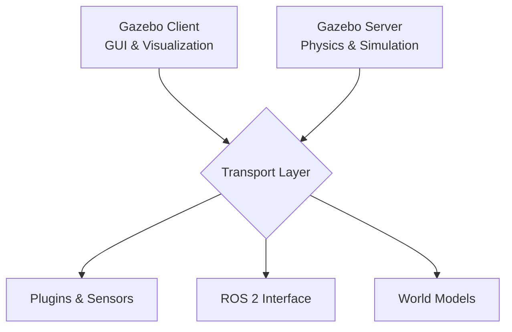
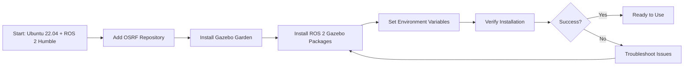
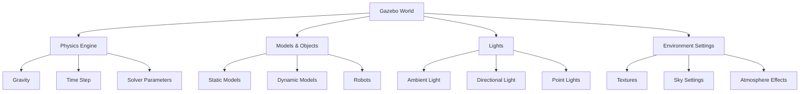

# Weeks 6-7: Robot Simulation with Gazebo

## Learning Objectives

By the end of this chapter, students will be able to:
- Install and configure Gazebo for robotics simulation
- Understand the relationship between URDF and SDF formats
- Configure physics simulation parameters for humanoid robots
- Simulate various sensors (LiDAR, cameras, IMU) in Gazebo
- Develop simulation scenarios for humanoid robot behavior

## Gazebo Simulation Environment Setup

Gazebo is a powerful physics simulation environment that provides realistic rendering, physics simulation, and sensor simulation capabilities for robotics development. It's widely used in the robotics community for testing algorithms and validating robot behaviors before deploying to physical platforms.

For humanoid robotics, Gazebo is particularly valuable due to its accurate physics simulation capabilities, which are essential for testing complex multi-body dynamics, balance control, and interaction with environments designed for humans.

## Section 1: Gazebo Simulation Environment Setup

### Gazebo Architecture

Gazebo operates on a client-server architecture:

- **Gazebo Server**: Handles the physics simulation, sensor simulation, and maintains the state of the world
- **Gazebo Client**: Provides the graphical user interface for visualization and interaction
- **Communication**: Server and client communicate via transport mechanisms using message passing



### Installation Process Visualization



### Gazebo World Components



### Installation and Setup

#### Prerequisites

Before installing Gazebo, ensure you have:
- Ubuntu 22.04 LTS or later
- ROS 2 Humble Hawksbill installed
- Sufficient hardware resources (recommended: 4GB+ RAM, dedicated GPU)

#### Installation Steps

1. **Add the OSRF repository:**
   ```bash
   sudo apt update && sudo apt install wget
   wget https://packages.osrfoundation.org/gazebo.gpg -O /tmp/gazebo.gpg
   sudo cp /tmp/gazebo.gpg /usr/share/keyrings/
   echo "deb [arch=amd64 signed-by=/usr/share/keyrings/gazebo.gpg] http://packages.osrfoundation.org/gazebo/ubuntu-stable jammy main" | sudo tee /etc/apt/sources.list.d/gazebo.list > /dev/null
   sudo apt update
   ```

2. **Install Gazebo Garden:**
   ```bash
   sudo apt install gz-garden
   ```

3. **Install ROS 2 Gazebo packages (ros-gz bridge):**
   ```bash
   sudo apt install ros-humble-gazebo-ros-pkgs ros-humble-gazebo-ros2-control
   ```

4. **Set up environment variables:**
   Add these lines to your `~/.bashrc`:
   ```bash
   export GZ_VERSION=garden
   export GZ_SIM_SYSTEM_PLUGIN_PATH=/usr/lib/x86_64-linux-gnu/gz-sim-${GZ_VERSION}
   export GZ_SIM_RESOURCE_PATH=/usr/share/gz-sim-${GZ_VERSION}
   export GZ_SIM_SYSTEM_PLUGIN_PATH=/usr/lib/x86_64-linux-gnu/gz-sim-${GZ_VERSION}
   ```

5. **Reload your environment:**
   ```bash
   source ~/.bashrc
   ```

### Verification

Test the installation by launching Gazebo:
```bash
gz sim
```

If Gazebo launches successfully with the default empty world, the installation was successful.

### Basic Gazebo Concepts

#### World Files

Gazebo worlds are defined using SDF (Simulation Description Format) files with `.sdf` or `.world` extensions. These files define:
- The physics engine parameters
- The world environment (terrain, lighting, etc.)
- Initial robot poses
- Static objects and obstacles

#### Models

Gazebo models represent physical objects in the simulation. Models include:
- Visual representation
- Collision geometry
- Physics properties
- Sensors
- Plugins

#### Sensors

Gazebo can simulate various sensors:
- Cameras (RGB, depth, stereo)
- LiDAR (2D and 3D)
- IMU (Inertial Measurement Units)
- Force/torque sensors
- GPS
- Contact sensors

## Section 2: URDF and SDF Robot Description Formats

### Introduction to URDF and SDF

Unified Robot Description Format (URDF) and Simulation Description Format (SDF) are both XML-based formats used to describe robots, but they serve different purposes and have different capabilities. URDF is primarily used in ROS for robot description, while SDF is used in Gazebo for simulation. Understanding both formats and their relationship is crucial for effective robot simulation.

URDF is tightly integrated with ROS and is excellent for describing robot kinematics and basic visual/collision properties. SDF, used by Gazebo and Ignition, extends these capabilities with simulation-specific parameters like physics, sensors, and plugins.

### URDF vs SDF: Key Differences

| Feature | URDF | SDF |
|---------|------|-----|
| Primary use | ROS robot description | Gazebo/Ignition simulation |
| Physics parameters | Limited | Extensive |
| Sensors | No native support | Full support |
| Plugins | No native support | Full support |
| Multi-robot worlds | No | Yes |
| Materials | Basic | Advanced |

### URDF Structure

```xml
<robot name="my_robot">
  <link name="base_link">
    <visual>
      <geometry>
        <box size="1 1 1"/>
      </geometry>
    </visual>
    <collision>
      <geometry>
        <box size="1 1 1"/>
      </geometry>
    </collision>
    <inertial>
      <mass value="1.0"/>
      <inertia ixx="1.0" ixy="0.0" ixz="0.0" iyy="1.0" iyz="0.0" izz="1.0"/>
    </inertial>
  </link>

  <joint name="joint1" type="revolute">
    <parent link="base_link"/>
    <child link="link2"/>
    <axis xyz="0 0 1"/>
    <limit lower="-1.57" upper="1.57" effort="100" velocity="1"/>
  </joint>
</robot>
```

### SDF Structure

```xml
<sdf version="1.7">
  <model name="my_model">
    <link name="base_link">
      <visual name="visual">
        <geometry>
          <box>
            <size>1 1 1</size>
          </box>
        </geometry>
      </visual>
      <collision name="collision">
        <geometry>
          <box>
            <size>1 1 1</size>
          </box>
        </geometry>
      </collision>
      <inertial>
        <mass>1.0</mass>
        <inertia>
          <ixx>1.0</ixx>
          <ixy>0.0</ixy>
          <ixz>0.0</ixz>
          <iyy>1.0</iyy>
          <iyz>0.0</iyz>
          <izz>1.0</izz>
        </inertia>
      </inertial>
    </link>

    <joint name="joint1" type="revolute">
      <parent>base_link</parent>
      <child>link2</child>
      <axis>
        <xyz>0 0 1</xyz>
      </axis>
    </joint>
  </model>
</sdf>
```

### Converting URDF to SDF

Gazebo can automatically convert URDF to SDF, but sometimes manual intervention is needed. The conversion process uses the `gz sdf` tool:

```bash
# Convert URDF to SDF
gz sdf -p robot.urdf > robot.sdf

# Or using the older tool
ign sdf -p robot.urdf > robot.sdf
```

### Adding Gazebo-Specific Extensions to URDF

To include Gazebo-specific elements in a URDF, use the `<gazebo>` tags. These tags are ignored by ROS tools but processed by Gazebo.

```xml
<robot name="my_robot_with_gazebo_extensions">
  <!-- Standard URDF elements -->
  <link name="chassis">
    <visual>
      <geometry>
        <box size="1 0.5 0.25"/>
      </geometry>
    </visual>
    <collision>
      <geometry>
        <box size="1 0.5 0.25"/>
      </geometry>
    </collision>
    <inertial>
      <mass value="5.0"/>
      <inertia ixx="0.1" ixy="0" ixz="0" iyy="0.2" iyz="0" izz="0.3"/>
    </inertial>
  </link>

  <!-- Gazebo-specific extensions -->
  <gazebo reference="chassis">
    <material>Gazebo/Blue</material>
    <mu1>0.2</mu1>
    <mu2>0.2</mu2>
  </gazebo>
</robot>
```

## Section 3: Physics Simulation & Sensor Simulation

### Physics Simulation Fundamentals

Physics simulation in Gazebo is the cornerstone of effective robotics development, allowing for testing and validation of robot behaviors in a safe, cost-effective environment. For humanoid robots, accurate physics simulation is particularly important due to the complex multi-body dynamics, balance control requirements, and interaction with environments designed for humans.

In Gazebo, physics simulation is handled by the Ignition Physics library, which supports multiple backend physics engines including DART, Bullet, and ODE. Each engine has its own strengths and trade-offs in terms of accuracy, stability, and computational efficiency.

### Core Physics Concepts

#### Time Step Configuration

The time step determines how frequently the physics engine updates the simulation:

- **Smaller time steps**: More accurate simulation, higher computational cost
- **Larger time steps**: Less accurate but faster simulation
- **Recommendation for humanoid robots**: 0.001s to 0.005s for balance and control tasks

```xml
<physics type="ode">
  <max_step_size>0.001</max_step_size>
  <real_time_update_rate>1000</real_time_update_rate>
</physics>
```

#### Real Time Factor (RTF)

RTF determines how fast the simulation runs compared to real time:

- **RTF = 1.0**: Simulation runs at real-time speed
- **RTF > 1.0**: Simulation runs faster than real time
- **RTF < 1.0**: Simulation runs slower than real time

#### Solver Parameters

The physics solver handles constraint resolution:

```xml
<physics type="ode">
  <ode>
    <solver>
      <type>quick</type>  <!-- or "world" -->
      <iters>10</iters>   <!-- Number of iterations for constraint resolution -->
      <sor>1.3</sor>      <!-- Successive Over-Relaxation parameter -->
    </solver>
    <constraints>
      <cfm>0.0</cfm>      <!-- Constraint Force Mixing -->
      <erp>0.2</erp>      <!-- Error Reduction Parameter -->
      <contact_max_correcting_vel>100.0</contact_max_correcting_vel>
      <contact_surface_layer>0.001</contact_surface_layer>
    </constraints>
  </ode>
</physics>
```

### Sensor Simulation Fundamentals

Gazebo supports several types of sensors that are essential for humanoid robotics:

1. **Inertial Sensors** (IMU, accelerometers, gyroscopes)
2. **Vision Sensors** (cameras, depth cameras, stereo cameras)
3. **Range Sensors** (LiDAR, sonar)
4. **Force/Torque Sensors** (in joints, in feet)
5. **Proprioceptive Sensors** (joint encoders, joint effort)

### Adding Noise Models

Realistic sensor noise is critical for robust algorithm development:

```xml
<sensor name="imu_sensor" type="imu">
  <always_on>1</always_on>
  <update_rate>100</update_rate>
  <imu>
    <angular_velocity>
      <x>
        <noise type="gaussian">
          <mean>0.0</mean>
          <stddev>0.001</stddev>
        </noise>
      </x>
      <y>
        <noise type="gaussian">
          <mean>0.0</mean>
          <stddev>0.001</stddev>
        </noise>
      </y>
      <z>
        <noise type="gaussian">
          <mean>0.0</mean>
          <stddev>0.001</stddev>
        </noise>
      </z>
    </angular_velocity>
    <linear_acceleration>
      <x>
        <noise type="gaussian">
          <mean>0.0</mean>
          <stddev>0.017</stddev>
        </noise>
      </x>
      <y>
        <noise type="gaussian">
          <mean>0.0</mean>
          <stddev>0.017</stddev>
        </noise>
      </y>
      <z>
        <noise type="gaussian">
          <mean>0.0</mean>
          <stddev>0.017</stddev>
        </noise>
      </z>
    </linear_acceleration>
  </imu>
</sensor>
```

### LiDAR Sensor Simulation

LiDAR (Light Detection and Ranging) sensors are essential for humanoid robots for tasks such as mapping, localization, and obstacle detection.

```xml
<sensor name="lidar_2d" type="ray">
  <ray>
    <scan>
      <horizontal>
        <samples>720</samples>  <!-- Higher resolution for better perception -->
        <resolution>1</resolution>
        <min_angle>-3.14159</min_angle>  <!-- 180 degree FoV -->
        <max_angle>3.14159</max_angle>
      </horizontal>
    </scan>
    <range>
      <min>0.1</min>  <!-- Minimum range -->
      <max>30.0</max>  <!-- Maximum range -->
      <resolution>0.01</resolution>  <!-- Resolution of sensor -->
    </range>
  </ray>
  <plugin name="lidar_2d_controller" filename="libgazebo_ros_ray_sensor.so">
    <ros>
      <namespace>/lidar</namespace>
      <remapping>~/out:=scan</remapping>
    </ros>
    <output_type>sensor_msgs/LaserScan</output_type>
    <frame_name>lidar_2d_frame</frame_name>
  </plugin>
  <always_on>true</always_on>
  <update_rate>10</update_rate>  <!-- Update rate in Hz -->
  <visualize>true</visualize>
</sensor>
```

### Depth Camera Simulation

Depth cameras are crucial for humanoid robots for obstacle detection, manipulation planning, and 3D reconstruction.

```xml
<sensor name="depth_camera" type="depth">
  <update_rate>30</update_rate>
  <camera name="head_camera">
    <horizontal_fov>1.047</horizontal_fov>  <!-- ~60 degrees -->
    <image>
      <format>R8G8B8</format>  <!-- Color format -->
      <width>640</width>
      <height>480</height>
    </image>
    <depth_camera>
      <output>depths</output>
    </depth_camera>
    <clip>
      <near>0.1</near>   <!-- Near clip plane -->
      <far>10.0</far>    <!-- Far clip plane -->
    </clip>
  </camera>
  <plugin name="depth_camera_controller" filename="libgazebo_ros_openni_kinect.so">
    <ros>
      <namespace>/camera</namespace>
      <remapping>rgb/image_raw:=image_color</remapping>
      <remapping>depth/image_raw:=image_depth</remapping>
      <remapping>depth/camera_info:=camera_info</remapping>
    </ros>
    <camera_name>depth_camera</camera_name>
    <frame_name>camera_depth_optical_frame</frame_name>
    <baseline>0.2</baseline>
    <distortion_k1>0.0</distortion_k1>
    <distortion_k2>0.0</distortion_k2>
    <distortion_k3>0.0</distortion_k3>
    <distortion_t1>0.0</distortion_t1>
    <distortion_t2>0.0</distortion_t2>
    <point_cloud_cutoff>0.5</point_cloud_cutoff>
    <point_cloud_cutoff_max>3.0</point_cloud_cutoff_max>
    <Cx_prime>0</Cx_prime>
    <Cx>0.5</Cx>
    <Cy>0.5</Cy>
    <focal_length>0</focal_length>
    <hack_baseline>0</hack_baseline>
  </plugin>
  <always_on>true</always_on>
  <visualize>true</visualize>
</sensor>
```

### IMU Simulation

Inertial Measurement Units (IMUs) are critical for humanoid robots to maintain balance and determine orientation in space.

```xml
<sensor name="imu_sensor" type="imu">
  <always_on>true</always_on>
  <update_rate>100</update_rate>  <!-- 100Hz update rate -->
  <visualize>false</visualize>
  <topic>imu/data</topic>

  <plugin name="imu_plugin" filename="libgazebo_ros_imu_sensor.so">
    <ros>
      <namespace>/imu</namespace>
      <remapping>~/out:=data</remapping>
    </ros>
    <initial_orientation_as_reference>false</initial_orientation_as_reference>
    <frame_name>imu_link</frame_name>
  </plugin>

  <imu>
    <!-- Angular velocity noise -->
    <angular_velocity>
      <x>
        <noise type="gaussian">
          <mean>0.0</mean>
          <stddev>0.0017</stddev>  <!-- ~0.1 deg/s (ADIS16448 spec) -->
          <bias_mean>0.0</bias_mean>
          <bias_stddev>0.0012</bias_stddev>  <!-- ~0.07 deg/s bias drift -->
        </noise>
      </x>
      <y>
        <noise type="gaussian">
          <mean>0.0</mean>
          <stddev>0.0017</stddev>
          <bias_mean>0.0</bias_mean>
          <bias_stddev>0.0012</bias_stddev>
        </noise>
      </y>
      <z>
        <noise type="gaussian">
          <mean>0.0</mean>
          <stddev>0.0017</stddev>
          <bias_mean>0.0</bias_mean>
          <bias_stddev>0.0012</bias_stddev>
        </noise>
      </z>
    </angular_velocity>

    <!-- Linear acceleration noise -->
    <linear_acceleration>
      <x>
        <noise type="gaussian">
          <mean>0.0</mean>
          <stddev>0.017</stddev>  <!-- ~0.0017g (ADIS16448 spec) -->
          <bias_mean>0.0</bias_mean>
          <bias_stddev>0.0098</bias_stddev>  <!-- ~0.001g bias drift -->
        </noise>
      </x>
      <y>
        <noise type="gaussian">
          <mean>0.0</mean>
          <stddev>0.017</stddev>
          <bias_mean>0.0</bias_mean>
          <bias_stddev>0.0098</bias_stddev>
        </noise>
      </y>
      <z>
        <noise type="gaussian">
          <mean>0.0</mean>
          <stddev>0.017</stddev>
          <bias_mean>0.0</bias_mean>
          <bias_stddev>0.0098</bias_stddev>
        </noise>
      </z>
    </linear_acceleration>
  </imu>
</sensor>
```

## Section 4: Gazebo Physics, Collisions, Environment Design

### Physics Simulation Fundamentals

Physics simulation in Gazebo is the cornerstone of effective robotics development, allowing for testing and validation of robot behaviors in a safe, cost-effective environment. For humanoid robots, accurate physics simulation is particularly important due to the complex multi-body dynamics, balance control requirements, and interaction with environments designed for humans.

In Gazebo, physics simulation is handled by the Ignition Physics library, which supports multiple backend physics engines including DART, Bullet, and ODE. Each engine has its own strengths and trade-offs in terms of accuracy, stability, and computational efficiency.

### Core Physics Concepts

#### Time Step Configuration

The time step determines how frequently the physics engine updates the simulation:

- **Smaller time steps**: More accurate simulation, higher computational cost
- **Larger time steps**: Less accurate but faster simulation
- **Recommendation for humanoid robots**: 0.001s to 0.005s for balance and control tasks

```xml
<physics type="ode">
  <max_step_size>0.001</max_step_size>
  <real_time_update_rate>1000</real_time_update_rate>
</physics>
```

#### Real Time Factor (RTF)

RTF determines how fast the simulation runs compared to real time:

- **RTF = 1.0**: Simulation runs at real-time speed
- **RTF > 1.0**: Simulation runs faster than real time
- **RTF < 1.0**: Simulation runs slower than real time

#### Solver Parameters

The physics solver handles constraint resolution:

```xml
<physics type="ode">
  <ode>
    <solver>
      <type>quick</type>  <!-- or "world" -->
      <iters>10</iters>   <!-- Number of iterations for constraint resolution -->
      <sor>1.3</sor>      <!-- Successive Over-Relaxation parameter -->
    </solver>
    <constraints>
      <cfm>0.0</cfm>      <!-- Constraint Force Mixing -->
      <erp>0.2</erp>      <!-- Error Reduction Parameter -->
      <contact_max_correcting_vel>100.0</contact_max_correcting_vel>
      <contact_surface_layer>0.001</contact_surface_layer>
    </constraints>
  </ode>
</physics>
```

### Collision Modeling for Humanoids

#### Collision Geometry Selection

Choosing appropriate collision geometries is crucial for humanoid simulation:

1. **Primitive Shapes**: Boxes, spheres, and cylinders for basic collision detection
2. **Convex Hulls**: For more accurate approximations of complex shapes
3. **Triangle Meshes**: For detailed collision in critical areas

#### Multi-Collision Links

For better simulation accuracy, use multiple collision elements per link:

```xml
<link name="upper_arm">
  <collision name="upper_arm_collision_main">
    <geometry>
      <capsule>
        <radius>0.05</radius>
        <length>0.2</length>
      </capsule>
    </geometry>
  </collision>

  <collision name="upper_arm_collision_elbow">
    <pose>0.0 0.0 -0.1 0 0 0</pose>
    <geometry>
      <sphere>
        <radius>0.06</radius>
      </sphere>
    </geometry>
  </collision>
</link>
```

#### Contact Stabilization

Stabilizing contacts is essential for humanoid balance:

```xml
<collision name="foot_collision">
  <surface>
    <contact>
      <ode>
        <max_vel>100.0</max_vel>
        <min_depth>0.001</min_depth>
        <soft_cfm>0.001</soft_cfm>
        <soft_erp>0.99</soft_erp>
      </ode>
    </contact>
    <friction>
      <ode>
        <mu>0.8</mu>
        <mu2>0.8</mu2>
        <fdir1>0 0 0</fdir1>
        <slip1>0.0</slip1>
        <slip2>0.0</slip2>
      </ode>
    </friction>
  </surface>
</collision>
```

### Environment Design for Humanoid Robots

#### Creating Human-Scale Environments

Humanoid robots need environments designed for human dimensions:

```xml
<sdf version="1.7">
  <world name="humanoid_environment">
    <!-- Physics -->
    <physics type="dart">
      <max_step_size>0.001</max_step_size>
      <real_time_update_rate>1000</real_time_update_rate>
    </physics>

    <!-- Main floor -->
    <model name="floor">
      <static>true</static>
      <link name="floor_link">
        <collision name="floor_collision">
          <geometry>
            <plane>
              <normal>0 0 1</normal>
              <size>10 10</size>
            </plane>
          </geometry>
        </collision>
        <visual name="floor_visual">
          <geometry>
            <plane>
              <normal>0 0 1</normal>
              <size>10 10</size>
            </plane>
          </geometry>
          <material>
            <ambient>0.7 0.7 0.7 1</ambient>
            <diffuse>0.8 0.8 0.8 1</diffuse>
            <specular>0.1 0.1 0.1 1</specular>
          </material>
        </visual>
      </link>
    </model>

    <!-- Doorway for navigation -->
    <model name="doorway">
      <pose>0 0 0 0 0 0</pose>
      <link name="doorway_frame">
        <collision name="left_jamb">
          <geometry>
            <box>
              <size>0.2 0.1 2.0</size>
            </box>
          </geometry>
        </collision>
        <visual name="left_jamb_visual">
          <geometry>
            <box>
              <size>0.2 0.1 2.0</size>
            </box>
          </geometry>
        </visual>
      </link>

      <link name="doorway_top">
        <pose>0 0.6 1.0 0 0 0</pose>
        <collision name="top_jamb">
          <geometry>
            <box>
              <size>0.2 1.2 0.2</size>
            </box>
          </geometry>
        </collision>
        <visual name="top_jamb_visual">
          <geometry>
            <box>
              <size>0.2 1.2 0.2</size>
            </box>
          </geometry>
        </visual>
      </link>
    </model>
  </world>
</sdf>
```

#### Furniture and Obstacles

Humanoid robots interact with furniture designed for humans:

```xml
<sdf version="1.7">
  <model name="chair">
    <link name="seat">
      <pose>0 0 0.45 0 0 0</pose>
      <collision>
        <geometry>
          <box>
            <size>0.4 0.4 0.02</size>
          </box>
        </geometry>
      </collision>
      <visual>
        <geometry>
          <box>
            <size>0.4 0.4 0.02</size>
        </geometry>
      </visual>
    </link>

    <link name="back_rest">
      <pose>0 -0.15 0.7 0 0 0</pose>
      <collision>
        <geometry>
          <box>
            <size>0.4 0.02 0.4</size>
          </box>
        </geometry>
      </collision>
      <visual>
        <geometry>
          <box>
            <size>0.4 0.02 0.4</size>
          </geometry>
      </visual>
    </link>

    <link name="leg_front_left">
      <pose>-0.15 -0.15 0.23 0 0 0</pose>
      <collision>
        <geometry>
          <cylinder>
            <radius>0.02</radius>
            <length>0.46</length>
          </cylinder>
        </geometry>
      </collision>
    </link>

    <!-- Additional legs... -->
  </model>
</sdf>
```

## Section 5: Sensor Simulation (LiDAR, Depth, IMU)

### Sensor Simulation Fundamentals

Gazebo supports several types of sensors that are essential for humanoid robotics:

1. **Inertial Sensors** (IMU, accelerometers, gyroscopes)
2. **Vision Sensors** (cameras, depth cameras, stereo cameras)
3. **Range Sensors** (LiDAR, sonar)
4. **Force/Torque Sensors** (in joints, in feet)
5. **Proprioceptive Sensors** (joint encoders, joint effort)

### Adding Noise Models

Realistic sensor noise is critical for robust algorithm development:

```xml
<sensor name="imu_sensor" type="imu">
  <always_on>1</always_on>
  <update_rate>100</update_rate>
  <imu>
    <angular_velocity>
      <x>
        <noise type="gaussian">
          <mean>0.0</mean>
          <stddev>0.001</stddev>
        </noise>
      </x>
      <y>
        <noise type="gaussian">
          <mean>0.0</mean>
          <stddev>0.001</stddev>
        </noise>
      </y>
      <z>
        <noise type="gaussian">
          <mean>0.0</mean>
          <stddev>0.001</stddev>
        </noise>
      </z>
    </angular_velocity>
    <linear_acceleration>
      <x>
        <noise type="gaussian">
          <mean>0.0</mean>
          <stddev>0.017</stddev>
        </noise>
      </x>
      <y>
        <noise type="gaussian">
          <mean>0.0</mean>
          <stddev>0.017</stddev>
        </noise>
      </y>
      <z>
        <noise type="gaussian">
          <mean>0.0</mean>
          <stddev>0.017</stddev>
        </noise>
      </z>
    </linear_acceleration>
  </imu>
</sensor>
```

### LiDAR Simulation in Detail

LiDAR sensors are critical for humanoid navigation and mapping. For humanoid robots, we typically use 2D LiDAR sensors mounted on the robot to detect obstacles and map the environment:

```xml
<sensor name="front_lidar" type="ray">
  <pose>0.2 0 0.5 0 0 0</pose>  <!-- Mount the LiDAR on the front of the robot -->
  <ray>
    <scan>
      <horizontal>
        <samples>360</samples>  <!-- 360 samples = 1 degree resolution -->
        <resolution>1</resolution>
        <min_angle>-3.14159</min_angle>  <!-- Full 360 degree scan -->
        <max_angle>3.14159</max_angle>
      </horizontal>
    </scan>
    <range>
      <min>0.1</min>
      <max>10.0</max>  <!-- 10 meter range is sufficient for humanoid navigation -->
      <resolution>0.01</resolution>
    </range>
  </ray>
  <plugin name="front_lidar_controller" filename="libgazebo_ros_ray_sensor.so">
    <ros>
      <namespace>/lidar</namespace>
      <remapping>~/out:=scan</remapping>
    </ros>
    <output_type>sensor_msgs/LaserScan</output_type>
    <frame_name>front_lidar_frame</frame_name>
  </plugin>
  <always_on>true</always_on>
  <update_rate>10</update_rate>
  <visualize>false</visualize>
</sensor>
```

### Depth Camera Simulation for 3D Perception

For humanoid robots, depth cameras provide crucial 3D perception capabilities:

```xml
<sensor name="head_camera" type="depth">
  <pose>0 0 0.8 0 0 0</pose>  <!-- Mount on robot head -->
  <camera name="head_camera">
    <horizontal_fov>1.047</horizontal_fov>  <!-- 60 degrees -->
    <image>
      <format>R8G8B8</format>
      <width>640</width>
      <height>480</height>
    </image>
    <clip>
      <near>0.1</near>
      <far>10</far>
    </clip>
  </camera>
  <plugin name="head_camera_controller" filename="libgazebo_ros_openni_kinect.so">
    <ros>
      <namespace>/camera</namespace>
    </ros>
    <frame_name>camera_depth_optical_frame</frame_name>
  </plugin>
  <always_on>true</always_on>
  <update_rate>30</update_rate>
  <visualize>true</visualize>
</sensor>
```

### IMU Simulation for Humanoid Balance

IMU sensors are critical for humanoid balance and orientation estimation:

```xml
<sensor name="torso_imu" type="imu">
  <pose>0 0 0.5 0 0 0</pose>  <!-- Mount near robot's center of mass -->
  <plugin name="imu_controller" filename="libgazebo_ros_imu.so">
    <ros>
      <namespace>/imu</namespace>
    </ros>
    <frame_name>imu_link</frame_name>
  </plugin>
  <always_on>true</always_on>
  <update_rate>100</update_rate>
  <imu>
    <angular_velocity>
      <x>
        <noise type="gaussian">
          <mean>0.0</mean>
          <stddev>0.0003</stddev>
          <bias_mean>0.0000075</bias_mean>
          <bias_stddev>0.0000008</bias_stddev>
        </noise>
      </x>
      <y>
        <noise type="gaussian">
          <mean>0.0</mean>
          <stddev>0.0003</stddev>
          <bias_mean>0.0000075</bias_mean>
          <bias_stddev>0.0000008</bias_stddev>
        </noise>
      </y>
      <z>
        <noise type="gaussian">
          <mean>0.0</mean>
          <stddev>0.0003</stddev>
          <bias_mean>0.0000075</bias_mean>
          <bias_stddev>0.0000008</bias_stddev>
        </noise>
      </z>
    </angular_velocity>
    <linear_acceleration>
      <x>
        <noise type="gaussian">
          <mean>0.0</mean>
          <stddev>0.017</stddev>
          <bias_mean>0.1</bias_mean>
          <bias_stddev>0.001</bias_stddev>
        </noise>
      </x>
      <y>
        <noise type="gaussian">
          <mean>0.0</mean>
          <stddev>0.017</stddev>
          <bias_mean>0.1</bias_mean>
          <bias_stddev>0.001</bias_stddev>
        </noise>
      </y>
      <z>
        <noise type="gaussian">
          <mean>0.0</mean>
          <stddev>0.017</stddev>
          <bias_mean>0.1</bias_mean>
          <bias_stddev>0.001</bias_stddev>
        </noise>
      </z>
    </linear_acceleration>
  </imu>
</sensor>
```

## Section 6: Unity Integration for Robot Visualization

While Gazebo provides excellent physics simulation capabilities, Unity offers advanced visualization and rendering capabilities that can complement robotics development. Unity can be integrated with ROS 2 through the Unity Robotics Package.

### Setting Up Unity for Robotics

Unity can be used for:
- High-quality visualization of robot models
- VR/AR interfaces for robot teleoperation
- Creating training environments for machine learning
- Developing user interfaces for robot monitoring

### Basic Unity-ROS 2 Integration

```csharp
using UnityEngine;
using Unity.Robotics.ROSTCPConnector;
using RosMessageTypes.Sensor;

public class IMUReceiver : MonoBehaviour
{
    private ROSConnection ros;
    private ImuMsg imuData;

    // Start is called before the first frame update
    void Start()
    {
        ros = ROSConnection.GetOrCreateInstance();
        ros.Subscribe<ImuMsg>("/imu/data", IMUCallback);
    }

    void IMUCallback(ImuMsg msg)
    {
        this.imuData = msg;
        
        // Update robot orientation based on IMU data
        transform.rotation = new Quaternion(
            (float)msg.orientation.x,
            (float)msg.orientation.y,
            (float)msg.orientation.z,
            (float)msg.orientation.w
        );
    }
}
```

### Unity for Robot Visualization

Unity's rendering capabilities make it ideal for:
- Creating photorealistic simulation environments
- Developing intuitive user interfaces
- Visualizing complex sensor data
- Creating training environments for deep learning

## Section 7: Simulation Best Practices

### Performance Optimization

When running complex humanoid robot simulations, performance becomes a critical concern:

1. **Reducing visual complexity**: Use simpler visual meshes than collision meshes
2. **Optimizing physics parameters**: Balance accuracy with performance
3. **Limiting update rates**: Use appropriate update rates for different sensors
4. **Using simpler collision shapes**: Approximate complex geometries with primitives

### Debugging Techniques

Effective debugging in simulation includes:
- Visualizing sensor data in real-time
- Recording and replaying simulation sessions
- Checking for joint limits and collisions
- Monitoring robot states through ROS 2 tools

```bash
# Monitor robot states
ros2 topic echo /joint_states

# Visualize with RViz2
rviz2

# Check TF frames
ros2 run tf2_tools view_frames
```

### Validation Techniques

To ensure simulation accuracy:
- Compare simulation results with real robot behavior
- Use simulation parameters based on real robot specifications
- Validate physics parameters against real-world measurements
- Implement hardware-in-the-loop testing when possible

## Exercises

1. **Setup Gazebo**: Install Gazebo Garden with ROS 2 Humble packages and verify the installation by launching the simulator.

2. **Create a Simple Robot Model**: Design a simple humanoid robot model in URDF with at least 6 degrees of freedom and convert it to SDF.

3. **Physics Configuration**: Configure physics parameters for a humanoid robot with appropriate time steps and solver parameters for stable walking simulation.

4. **Sensor Integration**: Add LiDAR, IMU, and depth camera sensors to your robot model with realistic noise models.

5. **Environment Design**: Create a simple indoor environment with furniture appropriate for humanoid navigation.

6. **Simulation Scenario**: Design a simulation scenario where the humanoid robot navigates through an obstacle course and collects sensor data.

## Quiz

1. What is the recommended time step for humanoid robot simulation in Gazebo for balance control?
   - A) 0.1 seconds
   - B) 0.01 seconds
   - C) 0.001 seconds
   - D) 0.0001 seconds

2. Which physics engine is particularly well-suited for articulated systems like humanoid robots?
   - A) ODE
   - B) Bullet
   - C) DART
   - D) PhysX

3. What does SDF stand for in the context of Gazebo?
   - A) Simulation Description Format
   - B) Standard Development Framework
   - C) System Definition File
   - D) Sensor Data Format

4. What is the main advantage of using URDF in ROS-based robotics projects?
   - A) Better physics simulation
   - B) Tight integration with ROS tools and ecosystem
   - C) More complex sensor modeling
   - D) Better visualization capabilities

5. Which of these is NOT a typical sensor simulated in Gazebo for humanoid robots?
   - A) LiDAR
   - B) IMU
   - C) GPS
   - D) Odometer

## Reflection

Consider how simulation can accelerate robot development while acknowledging its limitations. What are the main differences between simulated and real robots that might affect the performance of your control algorithms? How would you design your simulation environment to be as realistic as possible while maintaining computational efficiency? What validation methods would you use to ensure that behaviors that work in simulation will transfer successfully to real hardware?