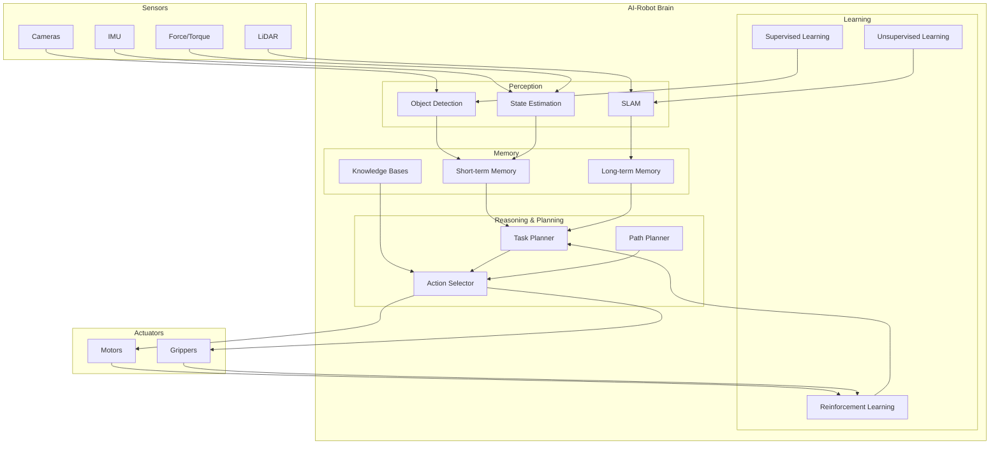

# AI-Robot Brain Overview

## Learning Objectives

By the end of this chapter, students will be able to:
- Explain the concept of AI-robot integration and cognitive robotics
- Identify the key components of AI that enable robot intelligence
- Understand how AI enhances robotic perception, planning, and control
- Describe the role of AI in autonomous robot behavior
- Analyze the challenges and opportunities in AI-robot brain integration

## Introduction to AI-Robot Integration

The AI-robot brain represents the integration of artificial intelligence techniques with robotic systems to create autonomous machines capable of perception, reasoning, learning, and decision-making. This integration enables robots to operate independently in complex, unstructured environments without continuous human guidance.

Traditional robots followed pre-programmed behaviors, but AI-robot brains allow for adaptive, context-aware, and learning behaviors. The AI-robot brain is essentially the "cognitive system" that processes sensory information, makes decisions, and controls the robot's actions.

### The Cognitive Loop

AI-robot brains operate on a fundamental cognitive loop:

1. **Perception**: Sense and interpret the environment
2. **Understanding**: Process and extract meaning from sensory data
3. **Reasoning**: Make decisions based on current state and goals
4. **Action**: Execute motor commands to achieve goals
5. **Learning**: Adapt behavior based on outcomes and experience

## The AI-Robot Brain Architecture

### Cognitive Architecture Components

The AI-robot brain typically consists of several interconnected modules:

#### Perception Module
- Processes sensor data (LiDAR, cameras, IMU, etc.)
- Detects and recognizes objects and features
- Creates environmental representations (maps, 3D models)
- Estimates state (position, velocity, orientation)

#### Memory and Knowledge Systems
- Short-term memory for immediate decision-making
- Long-term memory for spatial maps and learned behaviors
- Knowledge bases with information about objects, actions, and procedures
- Episodic memory for learning from experiences

#### Reasoning and Planning Module
- High-level task planning
- Path planning and navigation
- Action selection based on current goals
- Multi-step reasoning for complex tasks

#### Learning Module
- Reinforcement learning for behavior optimization
- Supervised learning for perception tasks
- Unsupervised learning for pattern recognition
- Transfer learning between tasks and environments

### Diagram: AI-Robot Brain Architecture



## AI Technologies in Robot Brains

### Machine Learning for Robotics

Machine learning provides the foundation for many AI-robot brain capabilities:

#### Supervised Learning
- Object recognition and classification
- Sensor fusion and calibration
- Predictive modeling for robot dynamics
- Human intent recognition

#### Unsupervised Learning
- Anomaly detection and novelty recognition
- Clustering similar behaviors or environments
- Dimensionality reduction for complex sensor data
- Self-organizing maps for spatial representation

#### Reinforcement Learning
- Learning optimal control policies
- Adaptive behavior for changing environments
- Skill acquisition through trial and error
- Multi-agent coordination strategies

### Deep Learning in Robotics

Deep learning has revolutionized robotics with end-to-end learning approaches:

#### Convolutional Neural Networks (CNNs)
- Visual perception and object recognition
- Scene understanding
- Depth estimation from images
- Visual-inertial odometry

#### Recurrent Neural Networks (RNNs)
- Temporal sequence modeling
- Predictive state estimation
- Language understanding for human-robot interaction
- Skill learning and execution

#### Deep Reinforcement Learning
- End-to-end control learning
- Navigation in complex environments
- Manipulation skill acquisition
- Multi-task learning

### Classical AI Approaches

While deep learning is powerful, classical AI approaches remain important:

#### Symbolic AI
- Knowledge representation and reasoning
- Planning with symbolic world models
- Rule-based behavior for safety-critical applications
- Explainable AI for human-robot interaction

#### Probabilistic Reasoning
- Handling uncertainty in sensor data
- Bayesian inference for state estimation
- Decision-making under uncertainty
- Sensor fusion with uncertainty quantification

## AI-Enabled Robotic Capabilities

### Perception and Understanding

AI-robot brains excel at interpreting complex sensory information:

#### Multi-Modal Perception
- Fusing information from multiple sensors
- Cross-modal learning and association
- Robust perception in challenging conditions
- Attention mechanisms for processing efficiency

#### Semantic Understanding
- Understanding object affordances and functions
- Recognizing activity patterns
- Scene understanding and interpretation
- Social signal recognition in human environments

### Planning and Decision Making

AI enables robots to make complex decisions:

#### Hierarchical Planning
- Long-term goal decomposition
- Short-term action execution
- Replanning when conditions change
- Multi-objective optimization

#### Learning from Demonstration
- Imitation learning from human demonstrations
- Learning from expert or human behavior
- Skill transfer between robots
- Few-shot learning for new tasks

### Adaptive Behavior

The AI-robot brain allows for adaptive behavior:

#### Online Learning
- Adapting to changing environments
- Learning from ongoing interactions
- Continuous improvement of performance
- Handling novel situations

#### Social Adaptation
- Learning human preferences and styles
- Adapting communication to different users
- Cultural and social norm learning
- Collaborative behavior adjustment

## NVIDIA Isaac Platform for AI-Robot Brains

NVIDIA Isaac provides specialized tools and libraries for AI-robot brain development:

### Isaac SDK Components

#### Isaac Sim
- High-fidelity physics simulation
- Synthetic data generation
- Virtual sensor simulation
- Behavior training in virtual environments

#### Isaac ROS
- GPU-accelerated perception pipelines
- Simultaneous localization and mapping (SLAM)
- 3D perception and understanding
- Edge AI inference acceleration

#### Isaac Navigation
- Autonomous navigation capabilities
- Path planning and obstacle avoidance
- Multi-robot coordination
- Fleet management tools

### AI-Robot Brain Development with Isaac

```python
import isaac_ros
from isaac_ros.perceptor import ObjectDetector
from isaac_ros.navigation import PathPlanner
from isaac_ros.manipulator import SkillExecutor

class IsaacAIBrain:
    def __init__(self):
        # Initialize perception module
        self.detector = ObjectDetector()
        
        # Initialize navigation module
        self.planner = PathPlanner()
        
        # Initialize manipulation module
        self.skill_executor = SkillExecutor()
        
        # Initialize memory system
        self.semantic_map = isaac_ros.SemanticMap()
        
    def perceive_environment(self, sensor_data):
        # Process sensor data to understand environment
        objects = self.detector.detect(sensor_data['camera'])
        pose = sensor_data['lidar']
        return {
            'objects': objects,
            'pose': pose,
            'spatial_relations': self.understand_spatial_relations(objects, pose)
        }
    
    def decide_action(self, environment_state, goals):
        # Make decisions based on environment and goals
        if goals['navigation']:
            path = self.planner.plan_path(
                environment_state['pose'], 
                goals['destination'],
                environment_state['objects']
            )
            return {'type': 'navigate', 'path': path}
        elif goals['manipulation']:
            skill = self.skill_executor.select_skill(
                goals['object'], 
                environment_state['objects']
            )
            return {'type': 'manipulate', 'skill': skill}
    
    def learn_from_interaction(self, state, action, outcome):
        # Learn from interaction outcomes
        self.skill_executor.update_skill_model(state, action, outcome)
```

## Challenges in AI-Robot Brain Development

### Real-Time Processing

AI-robot brains must operate in real-time with strict latency requirements:

#### Computation Optimization
- Model compression and quantization
- Edge AI acceleration
- Efficient inference algorithms
- Asynchronous processing where possible

#### Resource Management
- Balancing computation and power consumption
- Managing memory usage for large models
- Prioritizing critical computations
- Dynamic resource allocation

### Safety and Reliability

AI-robot brains must operate safely:

#### Verification and Validation
- Testing AI models in diverse scenarios
- Ensuring robustness to unexpected inputs
- Safety validation for learned behaviors
- Fail-safe mechanisms for AI failures

#### Explainability
- Understanding AI decision-making
- Providing human-understandable explanations
- Debugging AI behavior issues
- Building trust in AI-robot systems

### Learning Efficiency

AI-robot brains need to learn efficiently:

#### Sample Efficiency
- Learning with minimal training data
- Transfer learning between tasks
- Simulation-to-real transfer
- Learning from few demonstrations

#### Catastrophic Forgetting
- Preserving learned skills while learning new ones
- Managing multiple task learning
- Balancing specialization and generalization

## Applications of AI-Robot Brains

### Service Robotics
- Autonomous delivery robots
- Cleaning and maintenance robots
- Reception and assistance robots
- Healthcare support robots

### Industrial Robotics
- Adaptive manufacturing robots
- Quality inspection systems
- Collaborative robots (cobots)
- Predictive maintenance systems

### Exploration Robotics
- Autonomous planetary rovers
- Deep-sea exploration robots
- Disaster response robots
- Search and rescue robots

### Humanoid Robots
- Social interaction and companionship
- Physical assistance for the elderly
- Educational and research platforms
- Entertainment and customer service

## Future Directions

### Advanced AI Integration
- More sophisticated reasoning capabilities
- Commonsense knowledge integration
- Intuitive physics understanding
- Metacognitive capabilities (thinking about thinking)

### Human-Robot Collaboration
- Natural language interaction
- Intention recognition
- Collaborative learning
- Shared autonomy systems

### Collective Intelligence
- Multi-robot intelligence systems
- Distributed learning and reasoning
- Swarm intelligence applications
- Heterogeneous robot team coordination

## Exercises

1. Design an AI-robot brain architecture for a household assistant robot.
2. Implement a simple perception module that combines camera and LiDAR data.
3. Create a decision-making system that handles multiple concurrent goals.
4. Design a learning system that allows a robot to improve its performance over time.

## Quiz

1. What are the four main components of the AI-robot cognitive loop?
   - A) Sense, Plan, Act, Learn
   - B) Perceive, Understand, Reason, Act
   - C) Detect, Process, Control, Remember
   - D) Input, Compute, Output, Store

2. Which type of learning is most appropriate for teaching robots new skills through human demonstration?
   - A) Unsupervised learning
   - B) Reinforcement learning
   - C) Imitation learning
   - D) Supervised learning

3. What is a key challenge in developing AI-robot brains?
   - A) Ensuring real-time processing with safety
   - B) Reducing the size of robots
   - C) Making robots more expensive
   - D) Eliminating all sensors

## Reflection

Consider the implications of increasingly intelligent robot brains on society. How might the integration of AI enhance robot capabilities while maintaining safety and reliability? What ethical considerations arise as robots become more autonomous? How can we design AI-robot brains that are both capable and trustworthy? What are the potential applications of such systems, and how might they impact human work and life?