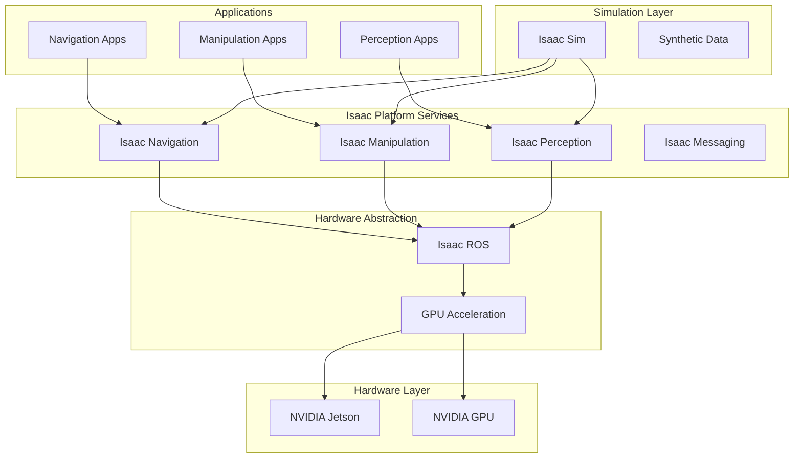

# NVIDIA Isaac Architecture

## Learning Objectives

By the end of this chapter, students will be able to:
- Understand the components and architecture of NVIDIA Isaac platform
- Implement robotics applications using Isaac Sim and Isaac ROS
- Configure and optimize Isaac platform for specific robotics tasks
- Integrate AI models with Isaac platform components
- Leverage GPU acceleration for robotics applications

## Introduction to NVIDIA Isaac Platform

NVIDIA Isaac is a comprehensive platform for developing, simulating, and deploying AI-powered robotics applications. It combines simulation, perception, navigation, and manipulation capabilities with GPU acceleration to enable sophisticated robotics solutions.

The Isaac platform consists of several integrated components:
- Isaac Sim: High-fidelity simulation environment
- Isaac ROS: GPU-accelerated ROS packages
- Isaac Navigation: Autonomous navigation stack
- Isaac Manipulation: Robotic manipulation capabilities
- Isaac Examples: Reference implementations and tutorials

## Isaac Platform Architecture

### High-Level Architecture Overview

The Isaac platform follows a modular architecture that separates different functionality layers:



### Isaac Platform Components

#### Isaac Sim
- High-fidelity physics simulation environment
- Synthetic data generation for AI training
- Virtual sensor simulation including cameras, LiDAR, and IMU
- Photorealistic rendering for perception testing

#### Isaac ROS
- GPU-accelerated ROS packages
- Optimized perception and navigation algorithms
- Hardware abstraction for NVIDIA platforms
- Integration with popular ROS tools

#### Isaac Navigation
- Autonomous navigation stack
- Path planning and obstacle avoidance
- Localization and mapping (SLAM)
- Multi-robot coordination capabilities

#### Isaac Manipulation
- Robotic manipulation pipelines
- Grasp planning and execution
- Motion planning for robotic arms
- Force control and compliant motion

## Isaac Sim Architecture

### Simulation Environment

Isaac Sim is built on NVIDIA Omniverse and provides a highly realistic simulation environment:

```python
# Example Isaac Sim application structure
from omni.isaac.kit import SimulationApp
import omni.isaac.core.utils.prims as prim_utils
from omni.isaac.core import World
from omni.isaac.core.robots import Robot
from omni.isaac.core.objects import DynamicCuboid

# Start the simulation application
config = {
    "headless": False,
    "rendering": True,
    "simulation_dt": 1.0/60.0,
    "stage_units_in_meters": 1.0
}
simulation_app = SimulationApp(config)

# Create world
world = World(stage_units_in_meters=1.0)

# Add robot to simulation
robot = Robot(prim_path="/World/Robot", name="my_robot")
world.scene.add(robot)

# Add objects
object = DynamicCuboid(
    prim_path="/World/Object",
    name="my_object",
    position=[0.5, 0.0, 0.5],
    size=0.1,
    color=[0.5, 0.0, 0.0]
)
world.scene.add(object)

# Simulation loop
for i in range(1000):
    world.step(render=True)
    
simulation_app.close()
```

### Physics Simulation

Isaac Sim provides multi-physics simulation capabilities:

#### Physics Engine Integration
- NVIDIA PhysX for rigid body dynamics
- Custom collision detection for robotics
- Flexible joints and constraints
- Contact sensors and force feedback

#### Material Properties
- Realistic friction and damping parameters
- Deformable object simulation
- Fluid dynamics for advanced applications

### Sensor Simulation

Isaac Sim includes comprehensive sensor simulation:

#### Camera Simulation
- RGB, depth, and semantic segmentation
- Multiple camera configurations
- Realistic lens distortion models
- High-dynamic range imaging

#### LiDAR Simulation
- 2D and 3D LiDAR simulation
- Multiple beam configurations
- Realistic noise and accuracy modeling
- Performance optimization for multiple sensors

#### IMU and Force Sensor Simulation
- Accelerometer and gyroscope simulation
- Magnetometer simulation
- Force/torque sensor simulation
- Realistic noise modeling

## Isaac ROS Architecture

### GPU-Accelerated Perception

Isaac ROS provides GPU-accelerated versions of common ROS packages:

```xml
<!-- Example launch file for Isaac ROS pipeline -->
<launch>
    <node pkg="isaac_ros_point_cloud_utils" exec="isaac_ros_pointcloud_to_flatscan" name="pointcloud_to_flatscan">
        <param name="min_range" value="0.1"/>
        <param name="max_range" value="10.0"/>
        <param name="angle_min" value="-2.35619449"/>
        <param name="angle_max" value="2.35619449"/>
        <param name="scan_height" value="1"/>
    </node>
    
    <node pkg="isaac_ros_image_pipeline" exec="isaac_ros_image_flip" name="image_flip"/>
    
    <node pkg="isaac_ros_detectnet" exec="isaac_ros_detectnet" name="detectnet">
        <param name="model_name" value="ssd_mobilenet_v1_coco"/>
        <param name="input_topic" value="/camera/image_rect_color"/>
        <param name="tensorrt_engine_file_path" value="$(var model_path)/ssd_mobilenet_v1_coco.trt"/>
    </node>
</launch>
```

### Isaac ROS Packages

#### Perception Packages
- `isaac_ros_detectnet`: Object detection with NVIDIA DetectNet
- `isaac_ros_segmentation`: Semantic segmentation
- `isaac_ros_point_cloud_utils`: Point cloud processing
- `isaac_ros_image_pipeline`: Image processing utilities

#### Navigation Packages
- `isaac_ros_occupancy_grid_localizer`: Map-based localization
- `isaac_ros_omnidirectional_view_frustum`: 3D view frustum culling
- `isaac_ros_pointcloud_map_localization`: Point cloud map localization

#### Message Bridge
- `isaac_ros_bridge`: ROS to Omniverse bridge
- Message conversion between ROS and Omniverse formats
- Real-time communication between robots and simulator

### Hardware Abstraction

Isaac ROS provides hardware abstraction for NVIDIA platforms:

#### Jetson Integration
- Hardware-specific optimizations
- Power management features
- Real-time performance enhancements
- Edge AI inference acceleration

#### GPU Integration
- CUDA acceleration for perception tasks
- TensorRT optimization for neural networks
- Memory management for GPU processing
- Multi-GPU support for complex applications

## Isaac Navigation Architecture

### Autonomous Navigation Stack

Isaac Navigation provides a complete navigation stack:

```python
# Example Isaac Navigation node
from rclpy.node import Node
from nav_msgs.msg import Odometry, OccupancyGrid
from geometry_msgs.msg import PoseStamped
from sensor_msgs.msg import LaserScan
from nav2_msgs.action import NavigateToPose
import rclpy.action

class IsaacNavigationNode(Node):
    def __init__(self):
        super().__init__('isaac_navigation')
        
        # Publishers and subscribers
        self.odom_sub = self.create_subscription(Odometry, 'odom', self.odom_callback, 10)
        self.scan_sub = self.create_subscription(LaserScan, 'scan', self.scan_callback, 10)
        self.map_sub = self.create_subscription(OccupancyGrid, 'map', self.map_callback, 10)
        
        # Action server for navigation
        self.nav_action_server = rclpy.action.ActionServer(
            self, NavigateToPose, 'navigate_to_pose', self.navigate_to_pose_callback)
        
        # Initialize navigation components
        self.local_planner = self.initialize_local_planner()
        self.global_planner = self.initialize_global_planner()
        self.costmap = self.initialize_costmap()
        
    def navigate_to_pose_callback(self, goal_handle):
        goal = goal_handle.request.pose
        self.get_logger().info(f'Navigating to pose: {goal}')
        
        # Plan path to goal
        path = self.global_planner.plan_path(self.current_pose, goal)
        if path:
            # Execute navigation
            result = self.execute_navigation(path)
            goal_handle.succeed()
            return result
        else:
            self.get_logger().error('Failed to find path to goal')
            goal_handle.abort()
            return NavigateToPose.Result()
```

### Navigation Components

#### Global Planner
- A* or Dijkstra path planning
- Static and dynamic obstacle handling
- Topological and grid-based planning
- Multi-goal navigation support

#### Local Planner
- Dynamic obstacle avoidance
- Kinematic constraints handling
- Recovery behaviors
- Velocity and acceleration limits

#### Costmap Management
- Static map integration
- Dynamic obstacle inflation
- Sensor data incorporation
- Multi-layer costmap management

### SLAM Integration

Isaac Navigation includes SLAM capabilities:

#### Isaac Simultaneous Localization and Mapping
- GPU-accelerated SLAM algorithms
- LiDAR-based mapping
- Visual-inertial SLAM options
- Multi-session map building and merging

## Isaac Manipulation Architecture

### Manipulation Stack

Isaac Manipulation provides comprehensive manipulation capabilities:

```python
# Example Isaac Manipulation node
from rclpy.node import Node
from moveit_msgs.msg import MoveItErrorCodes
from geometry_msgs.msg import Pose
from std_msgs.msg import String
import moveit_commander

class IsaacManipulationNode(Node):
    def __init__(self):
        super().__init__('isaac_manipulation')
        
        # Initialize MoveIt commander
        moveit_commander.roscpp_initialize()
        self.robot = moveit_commander.RobotCommander()
        self.scene = moveit_commander.PlanningSceneInterface()
        self.arm_group = moveit_commander.MoveGroupCommander("arm")
        self.gripper_group = moveit_commander.MoveGroupCommander("gripper")
        
        # Publishers
        self.command_pub = self.create_publisher(String, 'manipulation_command', 10)
        
        # Service servers for manipulation tasks
        self.grasp_service = self.create_service(Grasp, 'grasp_object', self.grasp_callback)
        self.place_service = self.create_service(Place, 'place_object', self.place_callback)
        
    def grasp_callback(self, request, response):
        # Plan and execute grasp
        target_pose = request.object_pose
        approach_pose = self.calculate_approach_pose(target_pose)
        
        # Move to approach pose
        self.arm_group.set_pose_target(approach_pose)
        plan = self.arm_group.plan()
        if self.arm_group.execute(plan):
            # Close gripper
            self.gripper_group.set_joint_value_target([0.0, 0.0])
            self.gripper_group.go()
            response.success = True
        else:
            response.success = False
            
        return response
```

### Manipulation Components

#### Motion Planning
- Inverse kinematics solvers
- Collision detection and avoidance
- Trajectory optimization
- Multi-arm coordination

#### Grasp Planning
- Grasp pose generation
- Force optimization
- Object property consideration
- Adaptive grasp techniques

#### Force Control
- Compliance control
- Force feedback integration
- Contact-based manipulation
- Delicate object handling

## Isaac Development Workflows

### Development Process

The Isaac development process typically follows this flow:

#### 1. Simulation-First Approach
- Develop and test in Isaac Sim
- Validate algorithms in virtual environment
- Generate synthetic training data
- Iterate quickly without hardware risks

#### 2. AI Model Integration
- Train models on synthetic data
- Optimize for deployment
- Integrate with Isaac perception stack
- Validate in simulation

#### 3. Hardware Deployment
- Transfer to physical robot
- Fine-tune parameters
- Perform real-world validation
- Collect real data for improvement

### Development Tools

#### Isaac Apps
- Isaac Sim applications for specific tasks
- Example applications for reference
- Custom application development
- Simulation scenarios and benchmarks

#### Isaac Extensions
- Modular extensions for specific functionality
- UI extensions for visualization
- Custom sensor and actuator models
- Domain-specific tools

## Best Practices for Isaac Development

### Performance Optimization

#### GPU Utilization
- Use GPU-accelerated packages when available
- Optimize neural network inference
- Minimize data transfers between CPU and GPU
- Profile and optimize bottlenecks

#### Memory Management
- Efficient data structures
- Reuse memory allocations
- Manage pipeline buffers
- Monitor memory usage

### Design Patterns

#### Modular Architecture
- Separate perception, planning, and control
- Use ROS topics and services appropriately
- Implement reusable components
- Follow ROS and Isaac conventions

#### Simulation-to-Real Transfer
- Use domain randomization in simulation
- Include realistic noise models
- Validate on real hardware regularly
- Collect real-world data for model update

## Integration with Other Technologies

### ROS 2 Ecosystem
- Seamless integration with standard ROS 2 packages
- Support for common message types
- Compatibility with ROS 2 tools
- Extension of ROS 2 capabilities

### AI Framework Integration
- Support for CUDA and TensorRT
- Integration with popular ML frameworks
- Custom AI model deployment
- Synthetic data generation for training

### Third-Party Hardware
- Support for various sensors and actuators
- Hardware abstraction layers
- Calibration and configuration tools
- Performance optimization for supported hardware

## Troubleshooting Isaac Applications

### Common Issues

#### Simulation Issues
- Physics instability and jitter
- Performance bottlenecks
- Sensor simulation inaccuracies
- Model loading failures

#### Deployment Issues
- Hardware incompatibilities
- GPU memory limitations
- Network communication problems
- Timing and synchronization issues

### Debugging Strategies

#### Isaac Tools
- Isaac Sim debugging tools
- Performance profiling utilities
- Visualization and inspection tools
- Log analysis and monitoring

#### ROS 2 Tools
- Use of ROS 2 introspection tools
- Message monitoring and visualization
- Parameter and configuration checks
- Service and action testing

## Exercises

1. Create a simple Isaac Sim application that loads a robot model and runs a basic simulation.
2. Implement an Isaac ROS pipeline that performs object detection using a camera.
3. Configure Isaac Navigation for a simple mobile robot to navigate to specified goals.
4. Set up Isaac Manipulation for a robotic arm to pick and place objects.

## Quiz

1. Which Isaac component provides high-fidelity simulation?
   - A) Isaac ROS
   - B) Isaac Sim
   - C) Isaac Navigation
   - D) Isaac Manipulation

2. What is the primary purpose of Isaac ROS?
   - A) To provide simulation capabilities
   - B) To offer GPU-accelerated ROS packages
   - C) To manage navigation tasks
   - D) To handle manipulation tasks

3. Which Isaac component handles autonomous navigation?
   - A) Isaac Sim
   - B) Isaac ROS
   - C) Isaac Navigation
   - D) Isaac Manipulation

## Reflection

Consider how the NVIDIA Isaac platform addresses the challenges of developing AI-powered robots. How does the integration of simulation and real-world deployment capabilities accelerate development? What role does GPU acceleration play in enabling sophisticated perception and decision-making? How might Isaac's architecture influence the design of future robotics systems?